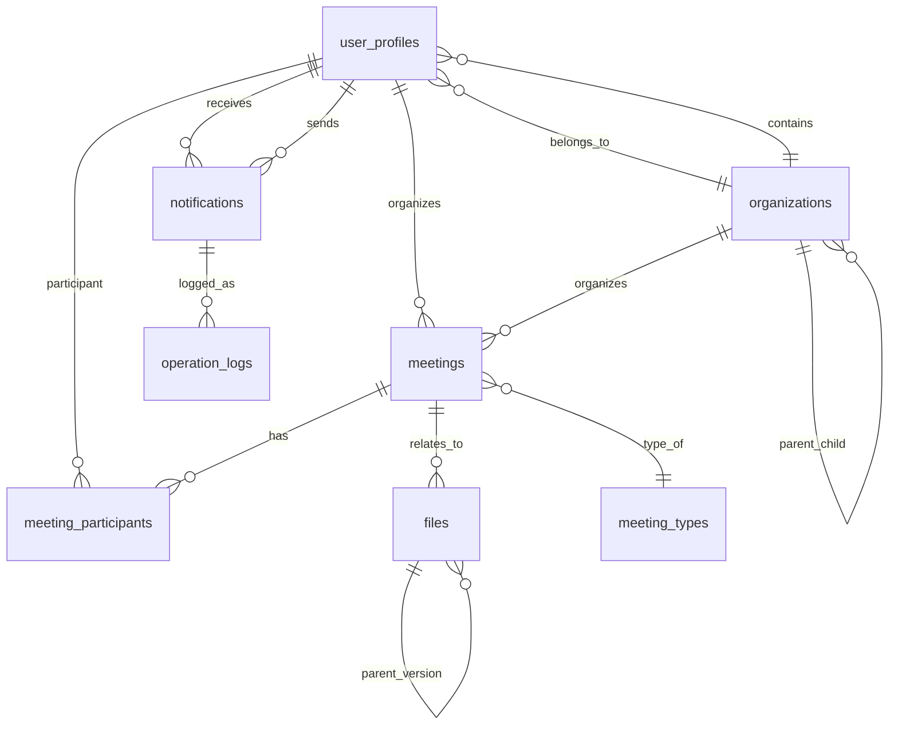

# 党组织生活会议管理系统 - 进阶版操作手册

**版本**: v2.0  
**更新时间**: 2025年12月1日  
**适用范围**: 系统管理员、技术维护人员、开发者  

---

## 目录

1. [系统概述](#1-系统概述)
2. [系统架构](#2-系统架构)
3. [部署指南](#3-部署指南)
4. [配置详解](#4-配置详解)
5. [数据库详解](#5-数据库详解)
6. [API接口文档](#6-api接口文档)
7. [权限管理](#7-权限管理)
8. [自定义开发](#8-自定义开发)
9. [监控与维护](#9-监控与维护)
10. [故障处理](#10-故障处理)
11. [性能优化](#11-性能优化)
12. [扩展指南](#12-扩展指南)

---

## 1. 系统概述

### 1.1 项目背景

党组织生活会议管理系统是一个基于现代Web技术栈开发的综合性党组织管理平台，主要服务于高校党组织的信息化管理需求。系统采用React + TypeScript + Supabase技术栈，实现了会议管理、用户管理、文件管理、通知系统等核心功能。

### 1.2 系统特点

- **现代化技术栈**: 基于React 18 + TypeScript + Vite 6.0构建
- **云原生架构**: 使用Supabase提供后端即服务(BaaS)
- **实时数据同步**: 利用Supabase的实时功能
- **响应式设计**: 支持桌面端和移动端访问
- **模块化设计**: 组件化开发，便于维护和扩展
- **安全认证**: 基于JWT的token认证机制

### 1.3 部署信息

- **生产环境URL**: https://7k9dj00ru9y1.space.minimaxi.com
- **Supabase项目**: https://lfmpvxczahvcselayyho.supabase.co
- **项目源码**: party-meeting-system/
- **Edge Functions**: supabase/functions/

### 1.4 技术架构图

```
┌─────────────────┐    ┌─────────────────┐    ┌─────────────────┐
│   Frontend      │    │   Supabase      │    │   Edge Functions │
│                 │    │                 │    │                 │
│ React 18.3      │◄──►│ PostgreSQL DB   │◄──►│ Deno Runtime    │
│ TypeScript      │    │ Authentication  │    │ API Endpoints   │
│ Vite 6.0        │    │ Storage         │    │ Business Logic  │
│ Tailwind CSS    │    │ Realtime        │    │                 │
└─────────────────┘    └─────────────────┘    └─────────────────┘
```

---

## 2. 系统架构

### 2.1 整体架构

系统采用经典的MVC架构模式，前后端分离设计：

#### 前端层 (Frontend Layer)
- **框架**: React 18.3 + TypeScript
- **构建工具**: Vite 6.0
- **样式方案**: Tailwind CSS
- **状态管理**: React Context API + Zustand
- **UI组件**: Radix UI组件库
- **数据获取**: TanStack React Query

#### 后端层 (Backend Layer)
- **BaaS平台**: Supabase
- **数据库**: PostgreSQL
- **认证服务**: Supabase Auth
- **文件存储**: Supabase Storage
- **实时通信**: Supabase Realtime
- **边缘函数**: Deno Edge Functions

### 2.2 目录结构详解

```
party-meeting-system/
├── src/
│   ├── components/              # 组件库
│   │   ├── common/             # 通用组件
│   │   │   ├── Button.tsx      # 按钮组件
│   │   │   ├── LoadingSpinner.tsx  # 加载动画
│   │   │   ├── Toast.tsx       # 消息提示
│   │   │   ├── ConfirmDialog.tsx   # 确认对话框
│   │   │   └── EmptyState.tsx      # 空状态组件
│   │   └── meetings/           # 会议相关组件
│   │       ├── MeetingList.tsx      # 会议列表
│   │       ├── MeetingForm.tsx      # 会议表单
│   │       └── FileUpload.tsx       # 文件上传
│   ├── contexts/               # React Context
│   │   ├── AuthContext.tsx     # 认证上下文
│   │   └── UIContext.tsx       # UI状态管理
│   ├── hooks/                  # 自定义Hooks
│   │   └── use-mobile.tsx      # 移动端检测
│   ├── lib/                    # 工具库
│   │   ├── supabase.ts         # Supabase客户端
│   │   └── utils.ts            # 工具函数
│   ├── pages/                  # 页面组件
│   │   ├── LoginPage.tsx       # 登录页面
│   │   ├── DashboardPage.tsx   # 仪表板
│   │   ├── UserManagementPage.tsx   # 用户管理
│   │   ├── MeetingsPage.tsx    # 会议管理
│   │   ├── RecordsPage.tsx     # 会议记录
│   │   ├── NotificationsPage.tsx    # 通知管理
│   │   ├── DatabaseManagementPage.tsx # 数据库管理
│   │   ├── BatchMessagingPage.tsx    # 批量消息
│   │   ├── PrivateMessagingPage.tsx  # 私人消息
│   │   └── StatisticsPage.tsx  # 统计分析
│   ├── App.tsx                 # 主应用组件
│   └── main.tsx               # 应用入口
├── supabase/
│   └── functions/             # Edge Functions
│       ├── create-super-admin/   # 创建超级管理员
│       ├── create-party-member/  # 添加党员
│       ├── create-admin-test/    # 创建测试管理员
│       ├── send-notification/    # 发送通知
│       ├── file-upload/         # 文件上传
│       ├── generate-statistics/ # 生成统计
│       └── batch-fix-party-members/ # 批量修复
├── dist/                      # 构建输出目录
├── public/                    # 静态资源
├── docs/                      # 文档目录
├── package.json               # 项目依赖
├── vite.config.ts            # Vite配置
├── tailwind.config.js        # Tailwind配置
├── tsconfig.json             # TypeScript配置
├── postcss.config.js         # PostCSS配置
└── eslint.config.js          # ESLint配置
```

### 2.3 核心模块说明

#### 2.3.1 认证模块 (Authentication)
- **位置**: `src/contexts/AuthContext.tsx`
- **功能**: 用户登录、登出、权限验证
- **关键接口**:
  ```typescript
  interface AuthContextType {
    user: User | null
    profile: Profile | null
    session: Session | null
    loading: boolean
    signIn: (email: string, password: string) => Promise<{ error: Error | null }>
    signOut: () => Promise<void>
    isAdmin: boolean
    isSuperAdmin: boolean
  }
  ```

#### 2.3.2 数据库客户端 (Database Client)
- **位置**: `src/lib/supabase.ts`
- **配置**:
  ```typescript
  const supabaseUrl = 'https://lfmpvxczahvcselayyho.supabase.co'
  const supabaseAnonKey = 'eyJhbGciOiJIUzI1NiIsInR5cCI6IkpXVCJ9...'
  export const supabase = createClient(supabaseUrl, supabaseAnonKey)
  ```

#### 2.3.3 UI组件库 (UI Components)
- **基础组件**: Button, LoadingSpinner, Toast, ConfirmDialog
- **业务组件**: MeetingList, MeetingForm, FileUpload
- **设计系统**: 基于Radix UI + Tailwind CSS

#### 2.3.4 Edge Functions
- **运行时**: Deno
- **作用**: 处理业务逻辑、API接口、数据验证
- **部署**: Supabase平台托管

---

## 3. 部署指南

### 3.1 系统要求

#### 开发环境要求
- **Node.js**: >= 18.0.0
- **包管理器**: pnpm >= 8.0.0
- **操作系统**: macOS, Windows, Linux
- **浏览器**: Chrome 90+, Firefox 88+, Safari 14+

#### 生产环境要求
- **前端**: 静态文件托管 (CDN推荐)
- **后端**: Supabase云服务
- **数据库**: PostgreSQL (Supabase提供)
- **存储**: Supabase Storage
- **网络**: 支持HTTPS

### 3.2 环境准备

#### 3.2.1 安装必要工具

```bash
# 安装Node.js (使用nvm管理版本)
curl -o- https://raw.githubusercontent.com/nvm-sh/nvm/v0.39.0/install.sh | bash
nvm install 18
nvm use 18

# 安装pnpm
npm install -g pnpm

# 验证安装
node --version  # should output v18.x.x
pnpm --version  # should output >= 8.0.0
```

#### 3.2.2 克隆项目

```bash
# 克隆项目
git clone <repository-url>
cd party-meeting-system

# 安装依赖
pnpm install --prefer-offline

# 验证项目结构
ls -la
```

### 3.3 Supabase项目配置

#### 3.3.1 创建Supabase项目

1. 访问 [Supabase Dashboard](https://supabase.com/dashboard)
2. 点击 "New Project"
3. 填写项目信息：
   - **Name**: party-meeting-system
   - **Database Password**: 生成强密码并保存
   - **Region**: 选择就近区域
4. 等待项目初始化完成

#### 3.3.2 获取项目配置信息

项目创建完成后，在项目设置页面获取：

```bash
# 项目URL
Project URL: https://your-project-id.supabase.co

# API Keys
anon key: eyJhbGciOiJIUzI1NiIsInR5cCI6IkpXVCJ9...
service_role key: eyJhbGciOiJIUzI1NiIsInR5cCI6IkpXVCJ9...
```

#### 3.3.3 环境变量配置

创建 `.env` 文件：

```bash
# .env
VITE_SUPABASE_URL=https://your-project-id.supabase.co
VITE_SUPABASE_ANON_KEY=your-anon-key-here

# Edge Functions环境变量 (在Supabase Dashboard配置)
SUPABASE_SERVICE_ROLE_KEY=your-service-role-key
SUPABASE_URL=https://your-project-id.supabase.co
```

### 3.4 数据库初始化

#### 3.4.1 执行数据库脚本

在Supabase Dashboard的SQL Editor中，按顺序执行以下脚本：

**步骤1: 创建基础表**
```sql
-- 01_create_base_tables.sql
-- 创建用户档案表
CREATE TABLE user_profiles (
    id UUID DEFAULT gen_random_uuid() PRIMARY KEY,
    user_id UUID REFERENCES auth.users(id) ON DELETE CASCADE,
    org_id UUID,
    full_name TEXT NOT NULL,
    phone TEXT,
    gender TEXT,
    join_party_date DATE,
    party_branch TEXT,
    position TEXT,
    role TEXT DEFAULT 'member' CHECK (role IN ('super_admin', 'admin', 'member')),
    status TEXT DEFAULT 'active' CHECK (status IN ('active', 'inactive')),
    created_at TIMESTAMP WITH TIME ZONE DEFAULT now(),
    updated_at TIMESTAMP WITH TIME ZONE DEFAULT now()
);

-- 创建组织表
CREATE TABLE organizations (
    id UUID DEFAULT gen_random_uuid() PRIMARY KEY,
    name TEXT NOT NULL,
    parent_id UUID REFERENCES organizations(id),
    level INTEGER DEFAULT 1,
    created_at TIMESTAMP WITH TIME ZONE DEFAULT now()
);
```

**步骤2: 创建会议相关表**
```sql
-- 02_create_meeting_tables.sql
-- 会议类型表
CREATE TABLE meeting_types (
    id UUID DEFAULT gen_random_uuid() PRIMARY KEY,
    name TEXT NOT NULL,
    code TEXT UNIQUE NOT NULL,
    description TEXT,
    created_at TIMESTAMP WITH TIME ZONE DEFAULT now()
);

-- 会议记录表
CREATE TABLE meetings (
    id UUID DEFAULT gen_random_uuid() PRIMARY KEY,
    title TEXT NOT NULL,
    meeting_type_id UUID REFERENCES meeting_types(id),
    organizer_id UUID REFERENCES user_profiles(id),
    start_time TIMESTAMP WITH TIME ZONE NOT NULL,
    end_time TIMESTAMP WITH TIME ZONE,
    location TEXT,
    description TEXT,
    status TEXT DEFAULT 'scheduled' CHECK (status IN ('scheduled', 'in_progress', 'completed', 'cancelled')),
    created_at TIMESTAMP WITH TIME ZONE DEFAULT now(),
    updated_at TIMESTAMP WITH TIME ZONE DEFAULT now()
);

-- 会议参与者表
CREATE TABLE meeting_participants (
    id UUID DEFAULT gen_random_uuid() PRIMARY KEY,
    meeting_id UUID REFERENCES meetings(id) ON DELETE CASCADE,
    user_id UUID REFERENCES user_profiles(id),
    status TEXT DEFAULT 'invited' CHECK (status IN ('invited', 'confirmed', 'declined', 'attended', 'absent')),
    joined_at TIMESTAMP WITH TIME ZONE,
    created_at TIMESTAMP WITH TIME ZONE DEFAULT now()
);
```

**步骤3: 创建文件通知相关表**
```sql
-- 03_create_file_notification_tables.sql
-- 文件信息表
CREATE TABLE files (
    id UUID DEFAULT gen_random_uuid() PRIMARY KEY,
    file_name TEXT NOT NULL,
    file_path TEXT NOT NULL,
    file_size BIGINT,
    mime_type TEXT,
    related_id UUID,
    related_type TEXT,
    description TEXT,
    uploaded_by UUID REFERENCES user_profiles(id),
    created_at TIMESTAMP WITH TIME ZONE DEFAULT now()
);

-- 通知消息表
CREATE TABLE notifications (
    id UUID DEFAULT gen_random_uuid() PRIMARY KEY,
    recipient_id UUID REFERENCES user_profiles(id),
    sender_id UUID REFERENCES user_profiles(id),
    title TEXT NOT NULL,
    content TEXT NOT NULL,
    type TEXT DEFAULT 'info' CHECK (type IN ('info', 'warning', 'error', 'success')),
    read_at TIMESTAMP WITH TIME ZONE,
    created_at TIMESTAMP WITH TIME ZONE DEFAULT now()
);
```

**步骤4: 创建统计系统表**
```sql
-- 04_create_statistics_system_tables.sql
-- 统计数据表
CREATE TABLE statistics_data (
    id UUID DEFAULT gen_random_uuid() PRIMARY KEY,
    dimension TEXT NOT NULL,
    metric TEXT NOT NULL,
    value NUMERIC,
    date_recorded DATE DEFAULT CURRENT_DATE,
    org_id UUID,
    created_at TIMESTAMP WITH TIME ZONE DEFAULT now()
);

-- 操作日志表
CREATE TABLE operation_logs (
    id UUID DEFAULT gen_random_uuid() PRIMARY KEY,
    user_id UUID REFERENCES user_profiles(id),
    action TEXT NOT NULL,
    table_name TEXT,
    record_id UUID,
    old_values JSONB,
    new_values JSONB,
    ip_address INET,
    user_agent TEXT,
    created_at TIMESTAMP WITH TIME ZONE DEFAULT now()
);
```

**步骤5: 创建RLS策略**
```sql
-- 05_create_rls_policies.sql
-- 启用RLS
ALTER TABLE user_profiles ENABLE ROW LEVEL SECURITY;
ALTER TABLE meetings ENABLE ROW LEVEL SECURITY;
ALTER TABLE meeting_participants ENABLE ROW LEVEL SECURITY;
ALTER TABLE notifications ENABLE ROW LEVEL SECURITY;

-- 用户档案策略
CREATE POLICY "Users can view own profile" ON user_profiles
    FOR SELECT USING (auth.uid() = user_id);

CREATE POLICY "Admins can view all profiles" ON user_profiles
    FOR ALL USING (
        EXISTS (
            SELECT 1 FROM user_profiles 
            WHERE user_id = auth.uid() 
            AND role IN ('admin', 'super_admin')
        )
    );

-- 会议相关策略
CREATE POLICY "Users can view meetings" ON meetings
    FOR SELECT USING (true);

CREATE POLICY "Admins can manage meetings" ON meetings
    FOR ALL USING (
        EXISTS (
            SELECT 1 FROM user_profiles 
            WHERE user_id = auth.uid() 
            AND role IN ('admin', 'super_admin')
        )
    );
```

#### 3.4.2 插入基础数据

```sql
-- 插入会议类型
INSERT INTO meeting_types (id, name, code, description) VALUES
(gen_random_uuid(), '支委会', 'branch_committee', '党支部委员会会议'),
(gen_random_uuid(), '党员大会', 'party_assembly', '全体党员参加的会议'),
(gen_random_uuid(), '党小组会', 'party_group', '党小组组织生活会'),
(gen_random_uuid(), '党课', 'party_class', '党员教育培训课程');

-- 插入组织信息
INSERT INTO organizations (id, name, level) VALUES
('82060473-2317-47f7-bc7c-008b4d1432dc', '中共内蒙古科技大学数智产业学院学生第三支部委员会', 3);

-- 创建索引以提高查询性能
CREATE INDEX idx_user_profiles_user_id ON user_profiles(user_id);
CREATE INDEX idx_meetings_organizer_id ON meetings(organizer_id);
CREATE INDEX idx_meetings_start_time ON meetings(start_time);
CREATE INDEX idx_notifications_recipient_id ON notifications(recipient_id);
CREATE INDEX idx_files_related_id ON files(related_id);
```

### 3.5 Edge Functions部署

#### 3.5.1 安装Supabase CLI

```bash
# macOS (使用Homebrew)
brew install supabase/tap/supabase

# Windows (使用Scoop)
scoop bucket add supabase https://github.com/supabase/scoop-bucket.git
scoop install supabase

# 验证安装
supabase --version
```

#### 3.5.2 登录Supabase

```bash
# 登录
supabase login

# 关联项目
supabase link --project-ref your-project-id

# 验证链接
supabase projects list
```

#### 3.5.3 部署Edge Functions

```bash
# 部署所有函数
supabase functions deploy

# 部署特定函数
supabase functions deploy create-super-admin
supabase functions deploy create-party-member
supabase functions deploy create-admin-test
supabase functions deploy send-notification
supabase functions deploy file-upload
supabase functions deploy generate-statistics

# 检查部署状态
supabase functions list
```

#### 3.5.4 配置Edge Functions环境变量

在Supabase Dashboard中配置：

1. 进入Edge Functions页面
2. 选择目标函数
3. 点击"Settings"标签
4. 在"Environment Variables"部分添加：
   ```
   SUPABASE_URL=https://your-project-id.supabase.co
   SUPABASE_SERVICE_ROLE_KEY=your-service-role-key
   ```

### 3.6 前端部署

#### 3.6.1 本地开发

```bash
# 启动开发服务器
pnpm dev

# 开发服务器将在 http://localhost:5173 启动
# 支持热重载，修改代码后自动刷新浏览器
```

#### 3.6.2 构建生产版本

```bash
# 构建生产版本
pnpm build

# 预览构建结果
pnpm preview

# 检查构建输出
ls -la dist/
```

#### 3.6.3 部署到CDN

```bash
# 使用rsync同步到服务器
rsync -avz --delete dist/ user@server:/var/www/party-meeting-system/

# 或者使用scp
scp -r dist/* user@server:/var/www/party-meeting-system/
```

#### 3.6.4 Nginx配置示例

```nginx
server {
    listen 80;
    server_name your-domain.com;
    root /var/www/party-meeting-system;
    index index.html;

    # 静态文件缓存
    location ~* \.(js|css|png|jpg|jpeg|gif|ico|svg)$ {
        expires 1y;
        add_header Cache-Control "public, immutable";
    }

    # SPA路由支持
    location / {
        try_files $uri $uri/ /index.html;
    }

    # Gzip压缩
    gzip on;
    gzip_vary on;
    gzip_min_length 1024;
    gzip_types
        text/plain
        text/css
        text/xml
        text/javascript
        application/javascript
        application/xml+rss
        application/json;
}
```

### 3.7 验证部署

#### 3.7.1 数据库连接测试

```bash
# 测试数据库连接
curl -X GET \
  'https://your-project-id.supabase.co/rest/v1/meeting_types' \
  -H "apikey: your-anon-key" \
  -H "Authorization: Bearer your-anon-key"
```

#### 3.7.2 Edge Functions测试

```bash
# 测试创建超级管理员函数
curl -X POST \
  'https://your-project-id.supabase.co/functions/v1/create-super-admin' \
  -H "Authorization: Bearer your-anon-key" \
  -H "Content-Type: application/json" \
  -d '{}'
```

#### 3.7.3 前端访问测试

1. 访问部署的URL
2. 检查页面是否正常加载
3. 测试登录功能
4. 验证基本功能

---

## 4. 配置详解

### 4.1 项目配置文件

#### 4.1.1 package.json详解

```json
{
  "name": "react_repo",
  "private": true,
  "version": "0.0.0",
  "type": "module",
  "scripts": {
    "dev": "pnpm install --prefer-offline && vite",                                    // 开发模式
    "build": "pnpm install --prefer-offline && rm -rf node_modules/.vite-temp && tsc -b && vite build",  // 标准构建
    "build:prod": "pnpm install --prefer-offline && rm -rf node_modules/.vite-temp && tsc -b && BUILD_MODE=prod vite build",  // 生产构建
    "lint": "pnpm install --prefer-offline && eslint .",                               // 代码检查
    "preview": "pnpm install --prefer-offline && vite preview",                        // 预览构建结果
    "install-deps": "pnpm install --prefer-offline",                                   // 安装依赖
    "clean": "rm -rf node_modules .pnpm-store pnpm-lock.yaml && pnpm store prune"      // 清理依赖
  },
  "dependencies": {
    // React核心
    "react": "^18.3.1",
    "react-dom": "^18.3.1",
    
    // UI组件库
    "@radix-ui/react-dialog": "^1.1.4",        // 对话框
    "@radix-ui/react-dropdown-menu": "^2.1.4", // 下拉菜单
    "@radix-ui/react-select": "^2.1.4",        // 选择器
    "@radix-ui/react-tabs": "^1.1.2",          // 标签页
    "@radix-ui/react-toast": "^1.2.4",         // 消息提示
    "@radix-ui/react-tooltip": "^1.1.6",       // 工具提示
    
    // Supabase
    "@supabase/supabase-js": "^2.86.0",
    
    // 数据管理
    "@tanstack/react-query": "^5.90.11",       // 数据获取和缓存
    "react-hook-form": "^7.54.2",              // 表单处理
    "@hookform/resolvers": "^3.10.0",          // 表单验证
    "zod": "^3.24.1",                          // Schema验证
    
    // 状态管理
    "zustand": "^5.0.8",                       // 轻量级状态管理
    
    // 工具库
    "clsx": "^2.1.1",                          // 条件类名
    "tailwind-merge": "^2.6.0",                // Tailwind工具函数
    "date-fns": "^3.0.0",                      // 日期处理
    "lucide-react": "^0.364.0",                // 图标库
    "recharts": "^2.12.4",                     // 图表库
    
    // 其他
    "class-variance-authority": "^0.7.1",      // 组件变体管理
    "tailwindcss-animate": "^1.0.7"            // 动画工具
  }
}
```

#### 4.1.2 vite.config.ts配置

```typescript
import path from "path"
import react from "@vitejs/plugin-react"
import { defineConfig } from "vite"
import sourceIdentifierPlugin from 'vite-plugin-source-identifier'

const isProd = process.env.BUILD_MODE === 'prod'

export default defineConfig({
  plugins: [
    react(), 
    sourceIdentifierPlugin({
      enabled: !isProd,
      attributePrefix: 'data-matrix',
      includeProps: true,
    })
  ],
  resolve: {
    alias: {
      "@": path.resolve(__dirname, "./src"),
    },
  },
  build: {
    // 优化构建配置
    target: 'es2020',
    minify: 'terser',
    sourcemap: !isProd,
    rollupOptions: {
      output: {
        manualChunks: {
          vendor: ['react', 'react-dom'],
          ui: ['@radix-ui/react-dialog', '@radix-ui/react-select'],
          supabase: ['@supabase/supabase-js'],
          utils: ['date-fns', 'clsx', 'tailwind-merge']
        }
      }
    }
  },
  server: {
    port: 5173,
    host: true,
    // 开发代理
    proxy: {
      '/api': {
        target: 'http://localhost:3001',
        changeOrigin: true
      }
    }
  },
  preview: {
    port: 4173,
    host: true
  }
})
```

#### 4.1.3 TypeScript配置

**tsconfig.json**
```json
{
  "compilerOptions": {
    "target": "ES2020",
    "useDefineForClassFields": true,
    "lib": ["ES2020", "DOM", "DOM.Iterable"],
    "module": "ESNext",
    "skipLibCheck": true,
    "moduleResolution": "bundler",
    "allowImportingTsExtensions": true,
    "resolveJsonModule": true,
    "isolatedModules": true,
    "noEmit": true,
    "jsx": "react-jsx",
    "strict": true,
    "noUnusedLocals": true,
    "noUnusedParameters": true,
    "noFallthroughCasesInSwitch": true,
    "baseUrl": ".",
    "paths": {
      "@/*": ["./src/*"]
    }
  },
  "include": ["src"],
  "references": [{ "path": "./tsconfig.node.json" }]
}
```

**tsconfig.app.json**
```json
{
  "compilerOptions": {
    "target": "ES2020",
    "useDefineForClassFields": true,
    "lib": ["ES2020", "DOM", "DOM.Iterable"],
    "module": "ESNext",
    "skipLibCheck": true,
    "moduleResolution": "bundler",
    "allowImportingTsExtensions": true,
    "resolveJsonModule": true,
    "isolatedModules": true,
    "noEmit": true,
    "jsx": "react-jsx",
    "strict": true,
    "noUnusedLocals": true,
    "noUnusedParameters": true,
    "noFallthroughCasesInSwitch": true,
    "baseUrl": ".",
    "paths": {
      "@/*": ["./src/*"]
    }
  },
  "include": ["src"]
}
```

#### 4.1.4 Tailwind CSS配置

**tailwind.config.js**
```javascript
/** @type {import('tailwindcss').Config} */
export default {
  darkMode: ["class"],
  content: [
    './pages/**/*.{ts,tsx}',
    './components/**/*.{ts,tsx}',
    './app/**/*.{ts,tsx}',
    './src/**/*.{ts,tsx}',
  ],
  prefix: "",
  theme: {
    container: {
      center: true,
      padding: "2rem",
      screens: {
        "2xl": "1400px",
      },
    },
    extend: {
      colors: {
        border: "hsl(var(--border))",
        input: "hsl(var(--input))",
        ring: "hsl(var(--ring))",
        background: "hsl(var(--background))",
        foreground: "hsl(var(--foreground))",
        primary: {
          DEFAULT: "hsl(var(--primary))",
          foreground: "hsl(var(--primary-foreground))",
        },
        secondary: {
          DEFAULT: "hsl(var(--secondary))",
          foreground: "hsl(var(--secondary-foreground))",
        },
        destructive: {
          DEFAULT: "hsl(var(--destructive))",
          foreground: "hsl(var(--destructive-foreground))",
        },
        muted: {
          DEFAULT: "hsl(var(--muted))",
          foreground: "hsl(var(--muted-foreground))",
        },
        accent: {
          DEFAULT: "hsl(var(--accent))",
          foreground: "hsl(var(--accent-foreground))",
        },
        popover: {
          DEFAULT: "hsl(var(--popover))",
          foreground: "hsl(var(--popover-foreground))",
        },
        card: {
          DEFAULT: "hsl(var(--card))",
          foreground: "hsl(var(--card-foreground))",
        },
        // 党组织专用颜色
        party: {
          red: "#DC2626",      // 党红色
          gold: "#F59E0B",     // 党徽金色
          dark: "#1F2937",     // 深色主题
          light: "#F9FAFB"     // 浅色主题
        }
      },
      borderRadius: {
        lg: "var(--radius)",
        md: "calc(var(--radius) - 2px)",
        sm: "calc(var(--radius) - 4px)",
      },
      keyframes: {
        "accordion-down": {
          from: { height: "0" },
          to: { height: "var(--radix-accordion-content-height)" },
        },
        "accordion-up": {
          from: { height: "var(--radix-accordion-content-height)" },
          to: { height: "0" },
        },
        "fade-in": {
          from: { opacity: "0" },
          to: { opacity: "1" },
        },
        "slide-in": {
          from: { transform: "translateX(-100%)" },
          to: { transform: "translateX(0)" },
        }
      },
      animation: {
        "accordion-down": "accordion-down 0.2s ease-out",
        "accordion-up": "accordion-up 0.2s ease-out",
        "fade-in": "fade-in 0.3s ease-in-out",
        "slide-in": "slide-in 0.3s ease-out"
      },
    },
  },
  plugins: [require("tailwindcss-animate")],
}
```

#### 4.1.5 PostCSS配置

**postcss.config.js**
```javascript
export default {
  plugins: {
    tailwindcss: {},
    autoprefixer: {},
    // CSS变量优化
    'postcss-custom-properties': {
      preserve: false,
    },
    // CSS压缩
    ...(process.env.NODE_ENV === 'production' ? {
      'cssnano': {
        preset: ['default', {
          discardComments: {
            removeAll: true,
          },
          normalizeWhitespace: true,
        }]
      }
    } : {})
  },
}
```

### 4.2 环境变量配置

#### 4.2.1 开发环境配置

**.env.development**
```bash
# Supabase配置
VITE_SUPABASE_URL=https://your-project-id.supabase.co
VITE_SUPABASE_ANON_KEY=your-development-anon-key

# 应用配置
VITE_APP_NAME=党组织生活会议管理系统
VITE_APP_VERSION=2.0.0
VITE_APP_ENV=development

# 调试配置
VITE_DEBUG_MODE=true
VITE_MOCK_DATA=false
VITE_ENABLE_DEVTOOLS=true

# API配置
VITE_API_TIMEOUT=10000
VITE_API_RETRIES=3

# 本地存储配置
VITE_CACHE_TTL=300000
VITE_MAX_CACHE_SIZE=50
```

#### 4.2.2 生产环境配置

**.env.production**
```bash
# Supabase配置
VITE_SUPABASE_URL=https://your-project-id.supabase.co
VITE_SUPABASE_ANON_KEY=your-production-anon-key

# 应用配置
VITE_APP_NAME=党组织生活会议管理系统
VITE_APP_VERSION=2.0.0
VITE_APP_ENV=production

# 性能优化
VITE_DEBUG_MODE=false
VITE_MOCK_DATA=false
VITE_ENABLE_DEVTOOLS=false
VITE_SENTRY_DSN=your-sentry-dsn

# API配置
VITE_API_TIMEOUT=15000
VITE_API_RETRIES=2

# 缓存配置
VITE_CACHE_TTL=600000
VITE_MAX_CACHE_SIZE=100
```

#### 4.2.3 Edge Functions环境变量

在Supabase Dashboard的Edge Functions设置中配置：

```bash
# Supabase配置
SUPABASE_URL=https://your-project-id.supabase.co
SUPABASE_SERVICE_ROLE_KEY=your-service-role-key

# 应用配置
APP_NAME=党组织生活会议管理系统
LOG_LEVEL=info

# 邮件配置 (如果启用邮件通知)
SMTP_HOST=smtp.example.com
SMTP_PORT=587
SMTP_USER=your-email@example.com
SMTP_PASS=your-email-password

# 文件上传配置
MAX_FILE_SIZE=10485760
ALLOWED_FILE_TYPES=pdf,doc,docx,txt,png,jpg,jpeg

# 通知配置
ENABLE_EMAIL_NOTIFICATIONS=true
ENABLE_SMS_NOTIFICATIONS=false

# 统计配置
STATISTICS_CACHE_TTL=3600
STATISTICS_RETENTION_DAYS=365
```

### 4.3 Supabase配置详解

#### 4.3.1 数据库配置

**连接池配置**
```sql
-- 在Supabase Dashboard > Database > Settings > Connection Settings中配置
-- 连接池限制
max_connections = 100
statement_timeout = 30s
idle_in_transaction_session_timeout = 10min

-- 字符编码
default_text_search_config = 'simple'
timezone = 'UTC'

-- 性能优化
random_page_cost = 1.1
effective_cache_size = '2GB'
work_mem = '16MB'
```

**扩展插件配置**
```sql
-- 启用必要扩展
CREATE EXTENSION IF NOT EXISTS "uuid-ossp";
CREATE EXTENSION IF NOT EXISTS "pgcrypto";
CREATE EXTENSION IF NOT EXISTS "postgis";  -- 如果需要地理数据
CREATE EXTENSION IF NOT EXISTS "pg_trgm";   -- 文本搜索优化

-- 启用JSON操作
CREATE EXTENSION IF NOT EXISTS "jsonb";
```

#### 4.3.2 认证配置

**Supabase Auth设置**
```javascript
// 在Authentication > Settings中配置
{
  "site_url": "https://your-domain.com",
  "additional_redirect_urls": [
    "https://your-domain.com/auth/callback"
  ],
  "jwt_expiry": 3600,
  "refresh_token_rotation_enabled": true,
  "security_refresh_token_reuse_interval": 10,
  "enable_signup": false,  // 禁用自主注册
  "enable_confirmations": true,  // 启用邮箱确认
  "enable_anonymous_sign_ins": false,
  "enable_phone_confirmations": false,
  "enable_sms_confirmations": false
}
```

**自定义SMTP配置**
```javascript
{
  "SMTP_HOST": "smtp.gmail.com",
  "SMTP_PORT": 587,
  "SMTP_USER": "noreply@your-domain.com",
  "SMTP_PASS": "your-app-password",
  "SMTP_ADMIN_EMAIL": "admin@your-domain.com",
  "SMTP_MAX_FREQUENCY": "1h"
}
```

#### 4.3.3 Storage配置

**创建存储桶**
```sql
-- 创建公共存储桶
INSERT INTO storage.buckets (id, name, public) VALUES ('avatars', 'avatars', true);
INSERT INTO storage.buckets (id, name, public) VALUES ('meeting-files', 'meeting-files', true);
INSERT INTO storage.buckets (id, name, public) VALUES ('documents', 'documents', true);

-- 创建私有存储桶
INSERT INTO storage.buckets (id, name, public) VALUES ('private-files', 'private-files', false);

-- RLS策略
CREATE POLICY "Public access for public buckets" ON storage.objects
    FOR SELECT USING (bucket_id = ANY(ARRAY['avatars', 'meeting-files', 'documents']));

CREATE POLICY "Authenticated users can upload" ON storage.objects
    FOR INSERT WITH CHECK (auth.role() = 'authenticated');

CREATE POLICY "Users can update own files" ON storage.objects
    FOR UPDATE USING (auth.uid()::text = (storage.foldername(name))[1]);
```

#### 4.3.4 实时配置

**启用实时更新**
```sql
-- 为相关表启用实时
ALTER PUBLICATION supabase_realtime ADD TABLE user_profiles;
ALTER PUBLICATION supabase_realtime ADD TABLE meetings;
ALTER PUBLICATION supabase_realtime ADD TABLE meeting_participants;
ALTER PUBLICATION supabase_realtime ADD TABLE notifications;

-- 配置实时过滤
-- 在代码中使用filters参数来限制实时数据
```

### 4.4 部署配置

#### 4.4.1 Docker配置 (可选)

**Dockerfile**
```dockerfile
# 多阶段构建
FROM node:18-alpine AS builder

WORKDIR /app
COPY package.json pnpm-lock.yaml ./
RUN npm install -g pnpm && pnpm install --frozen-lockfile

COPY . .
RUN pnpm build

# 生产镜像
FROM nginx:alpine AS runner
COPY --from=builder /app/dist /usr/share/nginx/html

# Nginx配置
COPY nginx.conf /etc/nginx/nginx.conf

EXPOSE 80
CMD ["nginx", "-g", "daemon off;"]
```

**docker-compose.yml**
```yaml
version: '3.8'

services:
  app:
    build: .
    ports:
      - "80:80"
    environment:
      - NODE_ENV=production
    restart: unless-stopped
    
  # 可选：Redis缓存
  redis:
    image: redis:7-alpine
    ports:
      - "6379:6379"
    restart: unless-stopped
    
  # 可选：数据库监控
  postgres:
    image: postgres:15-alpine
    environment:
      POSTGRES_DB: monitoring
      POSTGRES_USER: monitor
      POSTGRES_PASSWORD: password
    ports:
      - "5432:5432"
    volumes:
      - postgres_data:/var/lib/postgresql/data
    restart: unless-stopped

volumes:
  postgres_data:
```

#### 4.4.2 CI/CD配置 (GitHub Actions)

**.github/workflows/deploy.yml**
```yaml
name: Deploy to Production

on:
  push:
    branches: [main]
  pull_request:
    branches: [main]

jobs:
  test:
    runs-on: ubuntu-latest
    steps:
      - uses: actions/checkout@v3
      
      - name: Setup Node.js
        uses: actions/setup-node@v3
        with:
          node-version: '18'
          cache: 'pnpm'
      
      - name: Install dependencies
        run: pnpm install --frozen-lockfile
      
      - name: Run linting
        run: pnpm lint
      
      - name: Run tests
        run: pnpm test
      
      - name: Build application
        run: pnpm build
        
  deploy:
    needs: test
    runs-on: ubuntu-latest
    if: github.ref == 'refs/heads/main'
    
    steps:
      - uses: actions/checkout@v3
      
      - name: Setup Node.js
        uses: actions/setup-node@v3
        with:
          node-version: '18'
          cache: 'pnpm'
      
      - name: Install dependencies
        run: pnpm install --frozen-lockfile
      
      - name: Build application
        run: pnpm build:prod
        
      - name: Deploy to server
        uses: appleboy/ssh-action@v0.1.5
        with:
          host: ${{ secrets.HOST }}
          username: ${{ secrets.USERNAME }}
          key: ${{ secrets.SSH_KEY }}
          script: |
            cd /var/www/party-meeting-system
            git pull origin main
            pnpm install --frozen-lockfile
            pnpm build:prod
            sudo systemctl reload nginx
```

---

## 5. 数据库详解

### 5.1 数据库架构概述

系统使用PostgreSQL作为主要数据库，通过Supabase提供托管服务。数据库设计遵循第三范式，确保数据一致性和性能优化。

#### 5.1.1 数据库设计原则

1. **规范化设计**: 遵循数据库规范化原则，避免数据冗余
2. **主键策略**: 使用UUID作为主键，确保全局唯一性
3. **外键约束**: 建立适当的外键关系，确保数据完整性
4. **索引优化**: 为高频查询字段创建索引
5. **审计跟踪**: 记录创建时间、更新时间、操作日志

#### 5.1.2 核心实体关系图



### 5.2 核心表结构详解

#### 5.2.1 用户档案表 (user_profiles)

```sql
CREATE TABLE user_profiles (
    id UUID DEFAULT gen_random_uuid() PRIMARY KEY,
    user_id UUID NOT NULL REFERENCES auth.users(id) ON DELETE CASCADE,
    org_id UUID REFERENCES organizations(id),
    full_name TEXT NOT NULL,
    phone TEXT,
    gender TEXT CHECK (gender IN ('男', '女', '其他')),
    join_party_date DATE,
    party_branch TEXT,
    position TEXT,
    role TEXT NOT NULL DEFAULT 'member' 
        CHECK (role IN ('super_admin', 'admin', 'member')),
    status TEXT NOT NULL DEFAULT 'active' 
        CHECK (status IN ('active', 'inactive', 'suspended')),
    avatar_url TEXT,
    email TEXT,
    emergency_contact TEXT,
    emergency_phone TEXT,
    education_level TEXT,
    major TEXT,
    student_id TEXT,
    teacher_id TEXT,
    created_at TIMESTAMP WITH TIME ZONE DEFAULT now(),
    updated_at TIMESTAMP WITH TIME ZONE DEFAULT now()
);

-- 索引优化
CREATE INDEX idx_user_profiles_user_id ON user_profiles(user_id);
CREATE INDEX idx_user_profiles_org_id ON user_profiles(org_id);
CREATE INDEX idx_user_profiles_role ON user_profiles(role);
CREATE INDEX idx_user_profiles_status ON user_profiles(status);
CREATE INDEX idx_user_profiles_full_name ON user_profiles(full_name);
CREATE INDEX idx_user_profiles_phone ON user_profiles(phone);

-- 全文搜索索引
CREATE INDEX idx_user_profiles_search ON user_profiles 
    USING gin(to_tsvector('chinese', full_name || ' ' || coalesce(party_branch, '')));

-- 触发器：自动更新updated_at
CREATE OR REPLACE FUNCTION update_updated_at_column()
RETURNS TRIGGER AS $$
BEGIN
    NEW.updated_at = now();
    RETURN NEW;
END;
$$ language 'plpgsql';

CREATE TRIGGER update_user_profiles_updated_at 
    BEFORE UPDATE ON user_profiles 
    FOR EACH ROW EXECUTE FUNCTION update_updated_at_column();
```

**字段说明**

| 字段名 | 类型 | 说明 | 约束 |
|--------|------|------|------|
| id | UUID | 主键 | PRIMARY KEY |
| user_id | UUID | 关联认证用户ID | NOT NULL, 外键 |
| org_id | UUID | 组织ID | 可空，外键 |
| full_name | TEXT | 姓名 | NOT NULL |
| phone | TEXT | 电话号码 | 可空 |
| gender | TEXT | 性别 | 枚举约束 |
| join_party_date | DATE | 入党日期 | 可空 |
| party_branch | TEXT | 所属党支部 | 可空 |
| position | TEXT | 职务 | 可空 |
| role | TEXT | 角色权限 | 枚举约束 |
| status | TEXT | 账户状态 | 枚举约束 |

**典型查询示例**

```sql
-- 1. 获取用户基本信息
SELECT 
    id,
    full_name,
    role,
    status,
    party_branch,
    position
FROM user_profiles 
WHERE user_id = $1;

-- 2. 按角色统计用户数量
SELECT 
    role,
    COUNT(*) as count
FROM user_profiles 
WHERE status = 'active'
GROUP BY role;

-- 3. 全文搜索用户
SELECT 
    id,
    full_name,
    phone,
    party_branch,
    position,
    ts_rank(to_tsvector('chinese', full_name || ' ' || coalesce(party_branch, '')), plainto_tsquery('chinese', $1)) as rank
FROM user_profiles
WHERE to_tsvector('chinese', full_name || ' ' || coalesce(party_branch, '')) @@ plainto_tsquery('chinese', $1)
AND status = 'active'
ORDER BY rank DESC
LIMIT 10;

-- 4. 获取组织架构下的用户列表
SELECT 
    up.*,
    o.name as org_name,
    o.level as org_level
FROM user_profiles up
LEFT JOIN organizations o ON up.org_id = o.id
WHERE up.org_id = ANY(SELECT id FROM organizations WHERE name ILIKE '%数智产业学院%')
ORDER BY up.full_name;
```

#### 5.2.2 会议表 (meetings)

```sql
CREATE TABLE meetings (
    id UUID DEFAULT gen_random_uuid() PRIMARY KEY,
    title TEXT NOT NULL,
    meeting_type_id UUID NOT NULL REFERENCES meeting_types(id),
    organizer_id UUID NOT NULL REFERENCES user_profiles(id),
    start_time TIMESTAMP WITH TIME ZONE NOT NULL,
    end_time TIMESTAMP WITH TIME ZONE,
    location TEXT,
    description TEXT,
    agenda TEXT,
    preparation_notes TEXT,
    follow_up_actions TEXT,
    status TEXT NOT NULL DEFAULT 'scheduled' 
        CHECK (status IN ('scheduled', 'in_progress', 'completed', 'cancelled', 'postponed')),
    attendance_count INTEGER DEFAULT 0,
    max_participants INTEGER,
    is_virtual BOOLEAN DEFAULT false,
    virtual_meeting_url TEXT,
    meeting_room TEXT,
    budget DECIMAL(10,2),
    actual_cost DECIMAL(10,2),
    importance TEXT DEFAULT 'normal' 
        CHECK (importance IN ('low', 'normal', 'high', 'critical')),
    tags TEXT[],
    external_resources JSONB,
    created_at TIMESTAMP WITH TIME ZONE DEFAULT now(),
    updated_at TIMESTAMP WITH TIME ZONE DEFAULT now()
);

-- 索引优化
CREATE INDEX idx_meetings_organizer_id ON meetings(organizer_id);
CREATE INDEX idx_meetings_type_id ON meetings(meeting_type_id);
CREATE INDEX idx_meetings_start_time ON meetings(start_time);
CREATE INDEX idx_meetings_status ON meetings(status);
CREATE INDEX idx_meetings_organizer_status ON meetings(organizer_id, status);
CREATE INDEX idx_meetings_time_range ON meetings(start_time, end_time);

-- 复合索引
CREATE INDEX idx_meetings_org_time ON meetings(organizer_id, start_time);
CREATE INDEX idx_meetings_type_time ON meetings(meeting_type_id, start_time);

-- 部分索引
CREATE INDEX idx_meetings_future ON meetings(start_time) 
    WHERE start_time > now();

CREATE INDEX idx_meetings_important ON meetings(importance, start_time) 
    WHERE importance IN ('high', 'critical');

-- 触发器：自动更新updated_at
CREATE TRIGGER update_meetings_updated_at 
    BEFORE UPDATE ON meetings 
    FOR EACH ROW EXECUTE FUNCTION update_updated_at_column();

-- 触发器：自动计算参会人数
CREATE OR REPLACE FUNCTION update_meeting_attendance_count()
RETURNS TRIGGER AS $$
BEGIN
    IF TG_OP = 'INSERT' AND NEW.status = 'attended' THEN
        UPDATE meetings 
        SET attendance_count = attendance_count + 1 
        WHERE id = NEW.meeting_id;
    ELSIF TG_OP = 'UPDATE' AND OLD.status != 'attended' AND NEW.status = 'attended' THEN
        UPDATE meetings 
        SET attendance_count = attendance_count + 1 
        WHERE id = NEW.meeting_id;
    ELSIF TG_OP = 'UPDATE' AND OLD.status = 'attended' AND NEW.status != 'attended' THEN
        UPDATE meetings 
        SET attendance_count = attendance_count - 1 
        WHERE id = NEW.meeting_id;
    ELSIF TG_OP = 'DELETE' AND OLD.status = 'attended' THEN
        UPDATE meetings 
        SET attendance_count = attendance_count - 1 
        WHERE id = OLD.meeting_id;
    END IF;
    RETURN COALESCE(NEW, OLD);
END;
$$ language 'plpgsql';

CREATE TRIGGER trigger_update_attendance_count
    AFTER INSERT OR UPDATE OR DELETE ON meeting_participants
    FOR EACH ROW EXECUTE FUNCTION update_meeting_attendance_count();
```

**典型查询示例**

```sql
-- 1. 获取即将开始的会议
SELECT 
    m.*,
    mt.name as type_name,
    up.full_name as organizer_name
FROM meetings m
JOIN meeting_types mt ON m.meeting_type_id = mt.id
JOIN user_profiles up ON m.organizer_id = up.id
WHERE m.start_time > now() 
AND m.status = 'scheduled'
ORDER BY m.start_time
LIMIT 5;

-- 2. 获取会议详情和参与者
SELECT 
    m.*,
    mt.name as type_name,
    up.full_name as organizer_name,
    json_agg(json_build_object(
        'participant_name', participant_up.full_name,
        'status', mp.status,
        'joined_at', mp.joined_at
    )) as participants
FROM meetings m
JOIN meeting_types mt ON m.meeting_type_id = mt.id
JOIN user_profiles up ON m.organizer_id = up.id
LEFT JOIN meeting_participants mp ON m.id = mp.meeting_id
LEFT JOIN user_profiles participant_up ON mp.user_id = participant_up.id
WHERE m.id = $1
GROUP BY m.id, mt.name, up.full_name;

-- 3. 统计会议类型分布
SELECT 
    mt.name,
    COUNT(*) as meeting_count,
    AVG(EXTRACT(EPOCH FROM (m.end_time - m.start_time))/3600) as avg_duration_hours
FROM meeting_types mt
LEFT JOIN meetings m ON mt.id = m.meeting_type_id
WHERE m.created_at >= date_trunc('month', now())
GROUP BY mt.id, mt.name
ORDER BY meeting_count DESC;

-- 4. 获取某人的会议安排
SELECT 
    m.*,
    mt.name as type_name,
    mp.status as my_status
FROM meetings m
JOIN meeting_types mt ON m.meeting_type_id = mt.id
JOIN meeting_participants mp ON m.id = mp.meeting_id
WHERE mp.user_id = $1
AND m.start_time >= $2
AND m.start_time <= $3
ORDER BY m.start_time;
```

#### 5.2.3 会议参与者表 (meeting_participants)

```sql
CREATE TABLE meeting_participants (
    id UUID DEFAULT gen_random_uuid() PRIMARY KEY,
    meeting_id UUID NOT NULL REFERENCES meetings(id) ON DELETE CASCADE,
    user_id UUID NOT NULL REFERENCES user_profiles(id),
    status TEXT NOT NULL DEFAULT 'invited' 
        CHECK (status IN ('invited', 'confirmed', 'declined', 'attended', 'absent', 'late')),
    invited_at TIMESTAMP WITH TIME ZONE DEFAULT now(),
    confirmed_at TIMESTAMP WITH TIME ZONE,
    joined_at TIMESTAMP WITH TIME ZONE,
    left_at TIMESTAMP WITH TIME ZONE,
    attendance_duration INTERVAL,
    note TEXT,
    feedback_score INTEGER CHECK (feedback_score BETWEEN 1 AND 5),
    feedback_comment TEXT,
    notification_preference TEXT DEFAULT 'email' 
        CHECK (notification_preference IN ('email', 'sms', 'both', 'none')),
    created_at TIMESTAMP WITH TIME ZONE DEFAULT now(),
    updated_at TIMESTAMP WITH TIME ZONE DEFAULT now(),
    
    -- 唯一约束：每个用户在每个会议中只有一个记录
    UNIQUE(meeting_id, user_id)
);

-- 索引优化
CREATE INDEX idx_meeting_participants_meeting_id ON meeting_participants(meeting_id);
CREATE INDEX idx_meeting_participants_user_id ON meeting_participants(user_id);
CREATE INDEX idx_meeting_participants_status ON meeting_participants(status);
CREATE INDEX idx_meeting_participants_meeting_status ON meeting_participants(meeting_id, status);

-- 复合索引
CREATE INDEX idx_meeting_participants_user_time ON meeting_participants(user_id, created_at);
CREATE INDEX idx_meeting_participants_meeting_time ON meeting_participants(meeting_id, created_at);

-- 触发器：自动更新时间戳
CREATE TRIGGER update_meeting_participants_updated_at 
    BEFORE UPDATE ON meeting_participants 
    FOR EACH ROW EXECUTE FUNCTION update_updated_at_column();

-- 触发器：自动设置确认时间
CREATE OR REPLACE FUNCTION set_confirmed_at()
RETURNS TRIGGER AS $$
BEGIN
    IF NEW.status = 'confirmed' AND OLD.status != 'confirmed' THEN
        NEW.confirmed_at = now();
    END IF;
    IF NEW.status = 'attended' AND OLD.status != 'attended' THEN
        NEW.joined_at = now();
    END IF;
    RETURN NEW;
END;
$$ language 'plpgsql';

CREATE TRIGGER trigger_set_confirmed_at
    BEFORE UPDATE ON meeting_participants
    FOR EACH ROW EXECUTE FUNCTION set_confirmed_at();
```

**典型查询示例**

```sql
-- 1. 获取会议参与者列表
SELECT 
    mp.*,
    up.full_name,
    up.phone,
    up.email,
    up.party_branch,
    up.position
FROM meeting_participants mp
JOIN user_profiles up ON mp.user_id = up.id
WHERE mp.meeting_id = $1
ORDER BY 
    CASE mp.status
        WHEN 'attended' THEN 1
        WHEN 'confirmed' THEN 2
        WHEN 'invited' THEN 3
        WHEN 'declined' THEN 4
        WHEN 'absent' THEN 5
    END,
    up.full_name;

-- 2. 统计会议参与率
SELECT 
    COUNT(*) as total_invited,
    COUNT(*) FILTER (WHERE status = 'attended') as attended_count,
    COUNT(*) FILTER (WHERE status = 'confirmed') as confirmed_count,
    COUNT(*) FILTER (WHERE status = 'declined') as declined_count,
    ROUND(
        (COUNT(*) FILTER (WHERE status = 'attended')::decimal / COUNT(*)) * 100, 
        2
    ) as attendance_rate
FROM meeting_participants
WHERE meeting_id = $1;

-- 3. 获取用户的会议历史
SELECT 
    m.*,
    mp.status as participation_status,
    mp.feedback_score,
    mp.feedback_comment,
    mt.name as meeting_type
FROM meetings m
JOIN meeting_participants mp ON m.id = mp.meeting_id
JOIN meeting_types mt ON m.meeting_type_id = mt.id
WHERE mp.user_id = $1
AND m.end_time < now()
ORDER BY m.start_time DESC
LIMIT 10;

-- 4. 获取未确认的会议参与者
SELECT 
    up.full_name,
    up.phone,
    up.email,
    m.title as meeting_title,
    m.start_time,
    mp.invited_at,
    EXTRACT(HOURS FROM (now() - mp.invited_at)) as hours_since_invited
FROM meeting_participants mp
JOIN user_profiles up ON mp.user_id = up.id
JOIN meetings m ON mp.meeting_id = m.id
WHERE mp.status = 'invited'
AND m.start_time > now()
ORDER BY mp.invited_at ASC;
```

#### 5.2.4 通知表 (notifications)

```sql
CREATE TABLE notifications (
    id UUID DEFAULT gen_random_uuid() PRIMARY KEY,
    recipient_id UUID NOT NULL REFERENCES user_profiles(id),
    sender_id UUID REFERENCES user_profiles(id),
    title TEXT NOT NULL,
    content TEXT NOT NULL,
    type TEXT NOT NULL DEFAULT 'info' 
        CHECK (type IN ('info', 'warning', 'error', 'success', 'reminder', 'announcement')),
    priority TEXT DEFAULT 'normal' 
        CHECK (priority IN ('low', 'normal', 'high', 'urgent')),
    category TEXT DEFAULT 'general' 
        CHECK (category IN ('meeting', 'system', 'reminder', 'announcement', 'general')),
    related_type TEXT,  -- 关联对象类型: meeting, user, etc.
    related_id UUID,    -- 关联对象ID
    action_url TEXT,    -- 点击后的跳转链接
    metadata JSONB,     -- 额外数据
    read_at TIMESTAMP WITH TIME ZONE,
    read_duration INTERVAL,  -- 阅读时长
    dismissed_at TIMESTAMP WITH TIME ZONE,
    expires_at TIMESTAMP WITH TIME ZONE,
    delivery_channels TEXT[] DEFAULT ARRAY['in_app'],  -- 推送渠道
    delivery_status JSONB DEFAULT '{}',  -- 各渠道推送状态
    created_at TIMESTAMP WITH TIME ZONE DEFAULT now(),
    updated_at TIMESTAMP WITH TIME ZONE DEFAULT now()
);

-- 索引优化
CREATE INDEX idx_notifications_recipient_id ON notifications(recipient_id);
CREATE INDEX idx_notifications_sender_id ON notifications(sender_id);
CREATE INDEX idx_notifications_type ON notifications(type);
CREATE INDEX idx_notifications_priority ON notifications(priority);
CREATE INDEX idx_notifications_created_at ON notifications(created_at);
CREATE INDEX idx_notifications_read_status ON notifications(recipient_id, read_at);

-- 复合索引
CREATE INDEX idx_notifications_recipient_unread ON notifications(recipient_id, read_at) 
    WHERE read_at IS NULL;

CREATE INDEX idx_notifications_recipient_type ON notifications(recipient_id, type);
CREATE INDEX idx_notifications_related ON notifications(related_type, related_id);

-- 部分索引
CREATE INDEX idx_notifications_urgent ON notifications(priority, created_at) 
    WHERE priority IN ('high', 'urgent');

-- 全文搜索索引
CREATE INDEX idx_notifications_search ON notifications 
    USING gin(to_tsvector('chinese', title || ' ' || content));

-- 触发器：自动更新时间戳
CREATE TRIGGER update_notifications_updated_at 
    BEFORE UPDATE ON notifications 
    FOR EACH ROW EXECUTE FUNCTION update_updated_at_column();

-- 触发器：设置过期时间
CREATE OR REPLACE FUNCTION set_notification_expiry()
RETURNS TRIGGER AS $$
BEGIN
    IF NEW.priority = 'urgent' THEN
        NEW.expires_at = NEW.created_at + INTERVAL '7 days';
    ELSIF NEW.priority = 'high' THEN
        NEW.expires_at = NEW.created_at + INTERVAL '30 days';
    ELSE
        NEW.expires_at = NEW.created_at + INTERVAL '90 days';
    END IF;
    RETURN NEW;
END;
$$ language 'plpgsql';

CREATE TRIGGER trigger_set_notification_expiry
    BEFORE INSERT ON notifications
    FOR EACH ROW EXECUTE FUNCTION set_notification_expiry();
```

**典型查询示例**

```sql
-- 1. 获取用户未读通知
SELECT 
    n.*,
    sender.full_name as sender_name
FROM notifications n
LEFT JOIN user_profiles sender ON n.sender_id = sender.id
WHERE n.recipient_id = $1
AND n.read_at IS NULL
AND (n.expires_at IS NULL OR n.expires_at > now())
ORDER BY n.priority DESC, n.created_at DESC
LIMIT 20;

-- 2. 标记通知为已读
UPDATE notifications 
SET read_at = now(),
    read_duration = CASE 
        WHEN read_at IS NOT NULL THEN 
            now() - read_at
        ELSE 
            now() - created_at
    END
WHERE recipient_id = $1
AND id = ANY($2);

-- 3. 统计通知数据
SELECT 
    COUNT(*) as total_notifications,
    COUNT(*) FILTER (WHERE read_at IS NOT NULL) as read_count,
    COUNT(*) FILTER (WHERE read_at IS NULL) as unread_count,
    COUNT(*) FILTER (WHERE type = 'reminder') as reminder_count,
    COUNT(*) FILTER (WHERE type = 'announcement') as announcement_count
FROM notifications
WHERE recipient_id = $1
AND created_at >= date_trunc('month', now());

-- 4. 批量清理过期通知
DELETE FROM notifications 
WHERE expires_at < now() 
AND read_at IS NOT NULL;

-- 5. 获取通知统计数据
SELECT 
    DATE(created_at) as date,
    COUNT(*) as total_sent,
    COUNT(*) FILTER (WHERE read_at IS NOT NULL) as read_count,
    ROUND(
        (COUNT(*) FILTER (WHERE read_at IS NOT NULL)::decimal / COUNT(*)) * 100,
        2
    ) as read_rate
FROM notifications
WHERE created_at >= date_trunc('week', now())
GROUP BY DATE(created_at)
ORDER BY date;
```

#### 5.2.5 文件表 (files)

```sql
CREATE TABLE files (
    id UUID DEFAULT gen_random_uuid() PRIMARY KEY,
    file_name TEXT NOT NULL,
    file_path TEXT NOT NULL,
    file_size BIGINT,
    mime_type TEXT,
    related_id UUID,        -- 关联记录ID (如会议ID)
    related_type TEXT,      -- 关联类型 (如 'meeting', 'user', 'record')
    description TEXT,
    category TEXT DEFAULT 'general' 
        CHECK (category IN ('meeting_minute', 'participant_list', 'presentation', 'general', 'avatar', 'document')),
    tags TEXT[],
    version INTEGER DEFAULT 1,
    parent_file_id UUID REFERENCES files(id),  -- 版本管理
    is_public BOOLEAN DEFAULT false,
    access_level TEXT DEFAULT 'private' 
        CHECK (access_level IN ('private', 'organization', 'public')),
    checksum TEXT,          -- 文件校验和
    uploaded_by UUID NOT NULL REFERENCES user_profiles(id),
    downloaded_count INTEGER DEFAULT 0,
    last_accessed_at TIMESTAMP WITH TIME ZONE,
    expires_at TIMESTAMP WITH TIME ZONE,
    metadata JSONB,         -- 文件元数据
    created_at TIMESTAMP WITH TIME ZONE DEFAULT now(),
    updated_at TIMESTAMP WITH TIME ZONE DEFAULT now()
);

-- 索引优化
CREATE INDEX idx_files_related_id ON files(related_id);
CREATE INDEX idx_files_related_type ON files(related_type);
CREATE INDEX idx_files_uploaded_by ON files(uploaded_by);
CREATE INDEX idx_files_mime_type ON files(mime_type);
CREATE INDEX idx_files_category ON files(category);
CREATE INDEX idx_files_created_at ON files(created_at);

-- 复合索引
CREATE INDEX idx_files_related ON files(related_type, related_id);
CREATE INDEX idx_files_uploader_time ON files(uploaded_by, created_at);
CREATE INDEX idx_files_category_time ON files(category, created_at);

-- 全文搜索索引
CREATE INDEX idx_files_search ON files 
    USING gin(to_tsvector('chinese', file_name || ' ' || coalesce(description, '')));

-- 触发器：自动更新时间戳
CREATE TRIGGER update_files_updated_at 
    BEFORE UPDATE ON files 
    FOR EACH ROW EXECUTE FUNCTION update_updated_at_column();

-- 触发器：自动设置最后访问时间
CREATE OR REPLACE FUNCTION update_last_accessed()
RETURNS TRIGGER AS $$
BEGIN
    NEW.last_accessed_at = now();
    NEW.downloaded_count = OLD.downloaded_count + 1;
    RETURN NEW;
END;
$$ language 'plpgsql';

CREATE TRIGGER trigger_update_last_accessed
    BEFORE UPDATE ON files
    FOR EACH ROW 
    WHEN (OLD.last_accessed_at IS DISTINCT FROM NEW.last_accessed_at)
    EXECUTE FUNCTION update_last_accessed();
```

**典型查询示例**

```sql
-- 1. 获取会议相关文件
SELECT 
    f.*,
    uploader.full_name as uploader_name,
    parent_file.file_name as parent_name
FROM files f
JOIN user_profiles uploader ON f.uploaded_by = uploader.id
LEFT JOIN files parent_file ON f.parent_file_id = parent_file.id
WHERE f.related_id = $1
AND f.related_type = 'meeting'
ORDER BY f.created_at DESC;

-- 2. 按分类统计文件
SELECT 
    category,
    COUNT(*) as file_count,
    SUM(file_size) as total_size,
    AVG(file_size) as avg_size
FROM files
WHERE created_at >= date_trunc('month', now())
GROUP BY category
ORDER BY file_count DESC;

-- 3. 获取文件版本历史
WITH RECURSIVE file_versions AS (
    -- 根文件
    SELECT 
        f.*,
        0 as level,
        ARRAY[f.id] as path
    FROM files f 
    WHERE f.id = $1
    
    UNION ALL
    
    -- 子版本
    SELECT 
        f.*,
        fv.level + 1 as level,
        fv.path || f.id as path
    FROM files f
    JOIN file_versions fv ON f.parent_file_id = fv.id
    WHERE array_length(fv.path, 1) < 10  -- 防止无限递归
)
SELECT * FROM file_versions
ORDER BY level, created_at DESC;

-- 4. 清理过期文件
SELECT 
    f.id,
    f.file_name,
    f.expires_at,
    DATEDIFF('day', f.expires_at, now()) as days_expired
FROM files f
WHERE f.expires_at < now()
AND f.downloaded_count = 0;
```

### 5.3 视图和存储过程

#### 5.3.1 常用视图

**会议统计视图**
```sql
CREATE VIEW meeting_statistics AS
SELECT 
    m.id,
    m.title,
    m.start_time,
    m.end_time,
    mt.name as meeting_type,
    organizer.full_name as organizer_name,
    m.status,
    m.attendance_count,
    COUNT(mp.id) as invited_count,
    COUNT(mp.id) FILTER (WHERE mp.status = 'attended') as attended_count,
    COUNT(mp.id) FILTER (WHERE mp.status = 'confirmed') as confirmed_count,
    COUNT(mp.id) FILTER (WHERE mp.status = 'declined') as declined_count,
    ROUND(
        (COUNT(mp.id) FILTER (WHERE mp.status = 'attended')::decimal / 
         NULLIF(COUNT(mp.id), 0)) * 100, 
        2
    ) as attendance_rate,
    AVG(mp.feedback_score) as avg_feedback_score,
    COUNT(f.id) as file_count,
    SUM(f.file_size) as total_file_size
FROM meetings m
JOIN meeting_types mt ON m.meeting_type_id = mt.id
JOIN user_profiles organizer ON m.organizer_id = organizer.id
LEFT JOIN meeting_participants mp ON m.id = mp.meeting_id
LEFT JOIN files f ON f.related_id = m.id AND f.related_type = 'meeting'
GROUP BY m.id, mt.name, organizer.full_name;
```

**用户活跃度视图**
```sql
CREATE VIEW user_activity AS
SELECT 
    up.id,
    up.full_name,
    up.role,
    up.party_branch,
    up.position,
    COUNT(DISTINCT m.id) as meetings_organized,
    COUNT(DISTINCT mp.meeting_id) as meetings_attended,
    COUNT(DISTINCT n.id) as notifications_received,
    COUNT(DISTINCT n.read_at IS NOT NULL) as notifications_read,
    COUNT(DISTINCT f.id) as files_uploaded,
    SUM(f.file_size) as files_uploaded_size,
    MAX(m.start_time) as last_meeting_date,
    MAX(n.created_at) as last_activity_date
FROM user_profiles up
LEFT JOIN meetings m ON up.id = m.organizer_id
LEFT JOIN meeting_participants mp ON up.id = mp.user_id
LEFT JOIN notifications n ON up.id = n.recipient_id
LEFT JOIN files f ON up.id = f.uploaded_by
WHERE up.status = 'active'
GROUP BY up.id, up.full_name, up.role, up.party_branch, up.position;
```

#### 5.3.2 存储过程

**用户管理存储过程**
```sql
-- 创建用户档案的存储过程
CREATE OR REPLACE FUNCTION create_user_profile(
    p_user_id UUID,
    p_org_id UUID DEFAULT NULL,
    p_full_name TEXT,
    p_phone TEXT DEFAULT NULL,
    p_gender TEXT DEFAULT NULL,
    p_join_party_date DATE DEFAULT NULL,
    p_party_branch TEXT DEFAULT NULL,
    p_position TEXT DEFAULT NULL,
    p_role TEXT DEFAULT 'member',
    p_email TEXT DEFAULT NULL
) RETURNS JSON AS $$
DECLARE
    result JSON;
    user_exists BOOLEAN;
BEGIN
    -- 检查用户是否已存在
    SELECT EXISTS(SELECT 1 FROM user_profiles WHERE user_id = p_user_id) INTO user_exists;
    
    IF user_exists THEN
        RAISE EXCEPTION '用户档案已存在';
    END IF;
    
    -- 创建用户档案
    INSERT INTO user_profiles (
        user_id, org_id, full_name, phone, gender, 
        join_party_date, party_branch, position, role, email
    ) VALUES (
        p_user_id, p_org_id, p_full_name, p_phone, p_gender,
        p_join_party_date, p_party_branch, p_position, p_role, p_email
    );
    
    -- 返回创建的档案信息
    SELECT to_json(up.*) INTO result
    FROM user_profiles up
    WHERE up.user_id = p_user_id;
    
    RETURN result;
END;
$$ LANGUAGE plpgsql SECURITY DEFINER;

-- 批量创建会议参与者的存储过程
CREATE OR REPLACE FUNCTION batch_add_meeting_participants(
    p_meeting_id UUID,
    p_user_ids UUID[]
) RETURNS JSON AS $$
DECLARE
    result JSON;
    user_id UUID;
    existing_count INTEGER := 0;
    added_count INTEGER := 0;
BEGIN
    -- 遍历用户ID数组
    FOREACH user_id IN ARRAY p_user_ids LOOP
        -- 检查用户是否已在会议中
        IF NOT EXISTS (
            SELECT 1 FROM meeting_participants 
            WHERE meeting_id = p_meeting_id AND user_id = user_id
        ) THEN
            -- 添加参与者
            INSERT INTO meeting_participants (meeting_id, user_id)
            VALUES (p_meeting_id, user_id);
            
            added_count := added_count + 1;
        ELSE
            existing_count := existing_count + 1;
        END IF;
    END LOOP;
    
    -- 返回结果
    SELECT json_build_object(
        'added_count', added_count,
        'existing_count', existing_count,
        'total_requested', array_length(p_user_ids, 1)
    ) INTO result;
    
    RETURN result;
END;
$$ LANGUAGE plpgsql SECURITY DEFINER;

-- 清理过期数据的存储过程
CREATE OR REPLACE FUNCTION cleanup_expired_data(
    p_notification_retention_days INTEGER DEFAULT 90,
    p_log_retention_days INTEGER DEFAULT 30
) RETURNS JSON AS $$
DECLARE
    notification_count INTEGER;
    log_count INTEGER;
    result JSON;
BEGIN
    -- 清理过期通知
    DELETE FROM notifications 
    WHERE created_at < now() - INTERVAL '1 day' * p_notification_retention_days
    AND read_at IS NOT NULL;
    
    GET DIAGNOSTICS notification_count = ROW_COUNT;
    
    -- 清理过期操作日志
    DELETE FROM operation_logs
    WHERE created_at < now() - INTERVAL '1 day' * p_log_retention_days;
    
    GET DIAGNOSTICS log_count = ROW_COUNT;
    
    -- 返回清理结果
    SELECT json_build_object(
        'notifications_deleted', notification_count,
        'logs_deleted', log_count,
        'cleanup_date', now()
    ) INTO result;
    
    RETURN result;
END;
$$ LANGUAGE plpgsql SECURITY DEFINER;
```

### 5.4 数据库性能优化

#### 5.4.1 索引策略

**主键索引**
```sql
-- 所有表的主键都自动创建B-tree索引
-- 不需要额外创建

-- 检查索引使用情况
SELECT 
    schemaname,
    tablename,
    indexname,
    idx_scan,
    idx_tup_read,
    idx_tup_fetch
FROM pg_stat_user_indexes
ORDER BY idx_scan DESC;
```

**复合索引优化**
```sql
-- 会议查询常用组合
CREATE INDEX idx_meetings_organizer_status_time ON meetings(organizer_id, status, start_time);
CREATE INDEX idx_meetings_type_status_time ON meetings(meeting_type_id, status, start_time);

-- 用户查询常用组合
CREATE INDEX idx_users_org_role_status ON user_profiles(org_id, role, status);

-- 通知查询常用组合
CREATE INDEX idx_notifications_recipient_unread_type ON notifications(recipient_id, read_at, type) 
    WHERE read_at IS NULL;
```

**函数索引优化**
```sql
-- 日期函数索引
CREATE INDEX idx_meetings_start_time_month ON meetings(date_trunc('month', start_time));

-- 文本搜索索引
CREATE INDEX idx_user_profiles_gin_search ON user_profiles 
    USING gin(to_tsvector('chinese', full_name || ' ' || coalesce(party_branch, '')));

-- JSON字段索引
CREATE INDEX idx_files_metadata_gin ON files USING gin(metadata);
CREATE INDEX idx_notifications_delivery_status_gin ON notifications USING gin(delivery_status);
```

#### 5.4.2 查询优化

**慢查询分析**
```sql
-- 启用慢查询日志
ALTER SYSTEM SET log_min_duration_statement = 1000; -- 记录超过1秒的查询
SELECT pg_reload_conf();

-- 分析查询计划
EXPLAIN (ANALYZE, BUFFERS) 
SELECT * FROM meetings 
WHERE start_time > now() 
AND status = 'scheduled'
ORDER BY start_time;
```

**常用查询优化示例**

1. **分页查询优化**
```sql
-- 传统分页 (性能差)
SELECT * FROM meetings 
ORDER BY created_at DESC 
LIMIT 20 OFFSET 1000;

-- 优化分页 (使用游标)
SELECT * FROM meetings 
WHERE created_at < $1  -- 使用上一页的最后时间戳
ORDER BY created_at DESC 
LIMIT 20;
```

2. **联表查询优化**
```sql
-- 使用EXISTS替代IN
SELECT * FROM user_profiles up
WHERE EXISTS (
    SELECT 1 FROM meetings m
    WHERE m.organizer_id = up.id
    AND m.start_time > now()
);

-- 使用JOIN提示
SELECT /*+ HASH(mp, m) */ mp.*, m.title
FROM meeting_participants mp
JOIN /*+ USE_HASH(m) */ meetings m ON mp.meeting_id = m.id;
```

3. **聚合查询优化**
```sql
-- 使用物化视图缓存聚合结果
CREATE MATERIALIZED VIEW meeting_monthly_stats AS
SELECT 
    date_trunc('month', start_time) as month,
    meeting_type_id,
    COUNT(*) as meeting_count,
    SUM(attendance_count) as total_attendance,
    AVG(attendance_count) as avg_attendance
FROM meetings
WHERE start_time >= date_trunc('year', now()) - INTERVAL '1 year'
GROUP BY date_trunc('month', start_time), meeting_type_id;

-- 创建索引
CREATE INDEX idx_meeting_monthly_stats_month ON meeting_monthly_stats(month);
CREATE INDEX idx_meeting_monthly_stats_type ON meeting_monthly_stats(meeting_type_id);

-- 定期刷新物化视图
CREATE OR REPLACE FUNCTION refresh_meeting_stats()
RETURNS void AS $$
BEGIN
    REFRESH MATERIALIZED VIEW CONCURRENTLY meeting_monthly_stats;
END;
$$ LANGUAGE plpgsql;
```

#### 5.4.3 数据库维护

**定期维护任务**
```sql
-- 创建维护函数
CREATE OR REPLACE FUNCTION database_maintenance()
RETURNS void AS $$
BEGIN
    -- 1. 更新表统计信息
    ANALYZE;
    
    -- 2. 重建碎片化的索引
    REINDEX DATABASE current_database();
    
    -- 3. 清理统计信息缓存
    SELECT pg_stat_reset();
    
    -- 4. 清理过期数据
    PERFORM cleanup_expired_data();
    
    -- 5. 更新物化视图
    REFRESH MATERIALIZED VIEW CONCURRENTLY meeting_monthly_stats;
END;
$$ LANGUAGE plpgsql;

-- 设置定时任务 (需要pg_cron扩展)
-- SELECT cron.schedule('daily-maintenance', '0 2 * * *', 'SELECT database_maintenance();');
```

**数据库监控查询**
```sql
-- 连接数监控
SELECT 
    datname,
    numbackends as total_connections,
    active_connections,
    idle_connections
FROM (
    SELECT 
        datname,
        count(*) as total_connections,
        count(*) FILTER (WHERE state = 'active') as active_connections,
        count(*) FILTER (WHERE state = 'idle') as idle_connections
    FROM pg_stat_activity
    WHERE datname = current_database()
    GROUP BY datname
) connection_stats;

-- 表大小监控
SELECT 
    schemaname,
    tablename,
    pg_size_pretty(pg_total_relation_size(schemaname||'.'||tablename)) as total_size,
    pg_size_pretty(pg_relation_size(schemaname||'.'||tablename)) as table_size,
    pg_size_pretty(pg_total_relation_size(schemaname||'.'||tablename) - pg_relation_size(schemaname||'.'||tablename)) as index_size
FROM pg_tables
WHERE schemaname = 'public'
ORDER BY pg_total_relation_size(schemaname||'.'||tablename) DESC;

-- 索引使用统计
SELECT 
    schemaname,
    tablename,
    indexname,
    idx_scan,
    idx_tup_read,
    idx_tup_fetch,
    CASE 
        WHEN idx_scan = 0 THEN 'UNUSED'
        WHEN idx_scan < 100 THEN 'LOW'
        WHEN idx_scan < 1000 THEN 'MEDIUM'
        ELSE 'HIGH'
    END as usage_level
FROM pg_stat_user_indexes
ORDER BY idx_scan DESC;
```

---

## 6. API接口文档

### 6.1 API概述

系统基于Supabase Edge Functions提供RESTful API接口，所有API都遵循统一的响应格式和错误处理机制。

#### 6.1.1 基本信息

- **Base URL**: `https://lfmpvxczahvcselayyho.supabase.co/functions/v1`
- **认证方式**: Bearer Token (JWT)
- **内容类型**: `application/json`
- **字符编码**: UTF-8

#### 6.1.2 响应格式

**成功响应**
```json
{
  "success": true,
  "data": {
    // 实际数据
  },
  "message": "操作成功",
  "timestamp": "2025-12-01T13:56:52.000Z"
}
```

**错误响应**
```json
{
  "success": false,
  "error": {
    "code": "ERROR_CODE",
    "message": "错误描述",
    "details": {
      // 详细错误信息
    }
  },
  "timestamp": "2025-12-01T13:56:52.000Z"
}
```

#### 6.1.3 HTTP状态码

| 状态码 | 说明 | 场景 |
|--------|------|------|
| 200 | OK | 请求成功 |
| 201 | Created | 创建成功 |
| 400 | Bad Request | 请求参数错误 |
| 401 | Unauthorized | 未认证 |
| 403 | Forbidden | 权限不足 |
| 404 | Not Found | 资源不存在 |
| 409 | Conflict | 资源冲突 |
| 422 | Unprocessable Entity | 数据验证失败 |
| 429 | Too Many Requests | 请求频率过高 |
| 500 | Internal Server Error | 服务器内部错误 |

### 6.2 认证接口

#### 6.2.1 用户登录

**接口**: `POST /auth/login`

**请求参数**
```json
{
  "email": "user@example.com",
  "password": "password123"
}
```

**响应示例**
```json
{
  "success": true,
  "data": {
    "user": {
      "id": "550e8400-e29b-41d4-a716-446655440000",
      "email": "user@example.com",
      "user_metadata": {
        "full_name": "张三"
      }
    },
    "session": {
      "access_token": "eyJhbGciOiJIUzI1NiIs...",
      "expires_at": 1701436800,
      "refresh_token": "v1.MTUxMjI5..."
    },
    "profile": {
      "id": "uuid",
      "user_id": "550e8400-e29b-41d4-a716-446655440000",
      "full_name": "张三",
      "role": "member",
      "org_id": "org-uuid",
      "status": "active"
    }
  },
  "message": "登录成功"
}
```

#### 6.2.2 用户登出

**接口**: `POST /auth/logout`

**请求头**
```
Authorization: Bearer {access_token}
```

**响应示例**
```json
{
  "success": true,
  "message": "登出成功"
}
```

#### 6.2.3 获取当前用户信息

**接口**: `GET /auth/profile`

**请求头**
```
Authorization: Bearer {access_token}
```

**响应示例**
```json
{
  "success": true,
  "data": {
    "user": {
      "id": "550e8400-e29b-41d4-a716-446655440000",
      "email": "user@example.com",
      "email_confirmed_at": "2025-01-01T10:00:00.000Z",
      "created_at": "2025-01-01T10:00:00.000Z"
    },
    "profile": {
      "id": "profile-uuid",
      "user_id": "550e8400-e29b-41d4-a716-446655440000",
      "full_name": "张三",
      "phone": "13800138000",
      "gender": "男",
      "role": "member",
      "party_branch": "中共XXX党支部",
      "position": "党员",
      "status": "active"
    }
  }
}
```

### 6.3 用户管理接口

#### 6.3.1 创建超级管理员

**接口**: `POST /create-super-admin`

**功能**: 创建系统超级管理员账户，仅限首次系统初始化使用

**权限要求**: 无（开放接口）

**请求参数**
```json
{}
```

**响应示例**
```json
{
  "success": true,
  "data": {
    "wang_lai": {
      "auth_user": {
        "id": "user-uuid-1",
        "email": "wang_lai@imust.com",
        "email_confirmed_at": "2025-12-01T13:56:52.000Z"
      },
      "profile": {
        "id": "profile-uuid-1",
        "user_id": "user-uuid-1",
        "full_name": "王来",
        "phone": "18435224981",
        "gender": "女",
        "role": "super_admin",
        "status": "active"
      },
      "credentials": {
        "email": "wang_lai@imust.com",
        "password": "wang_lai123"
      }
    },
    "li_huijuan": {
      "auth_user": {
        "id": "user-uuid-2",
        "email": "li_huijuan@imust.com",
        "email_confirmed_at": "2025-12-01T13:56:52.000Z"
      },
      "profile": {
        "id": "profile-uuid-2",
        "user_id": "user-uuid-2",
        "full_name": "李惠娟",
        "phone": "15504890027",
        "gender": "女",
        "role": "super_admin",
        "status": "active"
      },
      "credentials": {
        "email": "li_huijuan@imust.com",
        "password": "li_huijuan123"
      }
    }
  },
  "message": "超级管理员账户创建成功"
}
```

#### 6.3.2 添加党员

**接口**: `POST /create-party-member`

**权限要求**: super_admin

**请求参数**
```json
{
  "email": "member@example.com",
  "password": "secure_password",
  "full_name": "张三",
  "phone": "13800138000",
  "party_branch": "中共XXX党支部",
  "position": "党员",
  "role": "member"
}
```

**参数说明**
| 参数 | 类型 | 必填 | 说明 |
|------|------|------|------|
| email | string | 是 | 邮箱地址 |
| password | string | 是 | 密码（最少6位） |
| full_name | string | 是 | 姓名 |
| phone | string | 否 | 电话号码 |
| party_branch | string | 否 | 所属党支部 |
| position | string | 否 | 职务 |
| role | string | 否 | 角色（member/admin），默认member |

**响应示例**
```json
{
  "success": true,
  "data": {
    "user": {
      "id": "user-uuid",
      "email": "member@example.com",
      "email_confirmed_at": "2025-12-01T13:56:52.000Z",
      "user_metadata": {
        "full_name": "张三"
      }
    },
    "profile": {
      "id": "profile-uuid",
      "user_id": "user-uuid",
      "full_name": "张三",
      "phone": "13800138000",
      "role": "member",
      "party_branch": "中共XXX党支部",
      "position": "党员",
      "status": "active"
    }
  },
  "message": "党员添加成功"
}
```

#### 6.3.3 创建测试管理员

**接口**: `POST /create-admin-test`

**权限要求**: super_admin

**请求参数**
```json
{
  "email": "testadmin@example.com",
  "password": "testadmin123",
  "full_name": "测试管理员",
  "role": "admin"
}
```

**响应示例**
```json
{
  "success": true,
  "data": {
    "user": {
      "id": "test-admin-uuid",
      "email": "testadmin@example.com"
    },
    "profile": {
      "id": "test-profile-uuid",
      "user_id": "test-admin-uuid",
      "full_name": "测试管理员",
      "role": "admin",
      "status": "active"
    }
  },
  "message": "测试管理员创建成功"
}
```

#### 6.3.4 获取用户列表

**接口**: `GET /users`

**权限要求**: admin或super_admin

**查询参数**
```
?page=1&limit=20&role=member&status=active&search=张三
```

| 参数 | 类型 | 说明 |
|------|------|------|
| page | number | 页码（默认1） |
| limit | number | 每页数量（默认20，最大100） |
| role | string | 角色过滤 |
| status | string | 状态过滤 |
| search | string | 搜索关键词（姓名、邮箱、电话） |

**响应示例**
```json
{
  "success": true,
  "data": {
    "users": [
      {
        "id": "profile-uuid",
        "user_id": "user-uuid",
        "full_name": "张三",
        "phone": "13800138000",
        "email": "zhangsan@example.com",
        "role": "member",
        "status": "active",
        "party_branch": "中共XXX党支部",
        "position": "党员",
        "last_login_at": "2025-12-01T10:00:00.000Z",
        "created_at": "2025-01-01T10:00:00.000Z"
      }
    ],
    "pagination": {
      "page": 1,
      "limit": 20,
      "total": 150,
      "pages": 8,
      "has_next": true,
      "has_prev": false
    },
    "summary": {
      "total": 150,
      "active": 145,
      "inactive": 5,
      "by_role": {
        "super_admin": 2,
        "admin": 8,
        "member": 140
      }
    }
  }
}
```

#### 6.3.5 更新用户信息

**接口**: `PUT /users/{user_id}`

**权限要求**: 超级管理员或用户本人

**请求参数**
```json
{
  "full_name": "张三",
  "phone": "13800138000",
  "gender": "男",
  "party_branch": "中共XXX党支部",
  "position": "副书记",
  "status": "active"
}
```

**响应示例**
```json
{
  "success": true,
  "data": {
    "id": "profile-uuid",
    "user_id": "user-uuid",
    "full_name": "张三",
    "phone": "13800138000",
    "gender": "男",
    "role": "member",
    "party_branch": "中共XXX党支部",
    "position": "副书记",
    "status": "active",
    "updated_at": "2025-12-01T13:56:52.000Z"
  },
  "message": "用户信息更新成功"
}
```

#### 6.3.6 删除用户

**接口**: `DELETE /users/{user_id}`

**权限要求**: super_admin

**响应示例**
```json
{
  "success": true,
  "message": "用户删除成功"
}
```

### 6.4 会议管理接口

#### 6.4.1 获取会议列表

**接口**: `GET /meetings`

**权限要求**: 登录用户

**查询参数**
```
?page=1&limit=20&status=scheduled&type_id=uuid&start_date=2025-01-01&end_date=2025-12-31
```

| 参数 | 类型 | 说明 |
|------|------|------|
| page | number | 页码 |
| limit | number | 每页数量 |
| status | string | 状态过滤 |
| type_id | string | 会议类型ID |
| organizer_id | string | 组织者ID |
| start_date | date | 开始日期 |
| end_date | date | 结束日期 |
| search | string | 搜索关键词 |

**响应示例**
```json
{
  "success": true,
  "data": {
    "meetings": [
      {
        "id": "meeting-uuid",
        "title": "支部委员会会议",
        "meeting_type": {
          "id": "type-uuid",
          "name": "支委会",
          "code": "branch_committee"
        },
        "organizer": {
          "id": "profile-uuid",
          "full_name": "王书记",
          "position": "党支部书记"
        },
        "start_time": "2025-12-15T14:00:00.000Z",
        "end_time": "2025-12-15T16:00:00.000Z",
        "location": "会议室A",
        "status": "scheduled",
        "attendance_count": 8,
        "max_participants": 15,
        "importance": "high",
        "created_at": "2025-12-01T10:00:00.000Z"
      }
    ],
    "pagination": {
      "page": 1,
      "limit": 20,
      "total": 50,
      "pages": 3
    }
  }
}
```

#### 6.4.2 创建会议

**接口**: `POST /meetings`

**权限要求**: admin或super_admin

**请求参数**
```json
{
  "title": "支部委员会会议",
  "meeting_type_id": "type-uuid",
  "start_time": "2025-12-15T14:00:00.000Z",
  "end_time": "2025-12-15T16:00:00.000Z",
  "location": "会议室A",
  "description": "讨论年度工作计划",
  "agenda": [
    "1. 总结上月工作",
    "2. 讨论年度计划",
    "3. 分配任务"
  ],
  "max_participants": 15,
  "importance": "high",
  "participant_ids": [
    "user-uuid-1",
    "user-uuid-2"
  ],
  "is_virtual": false
}
```

**响应示例**
```json
{
  "success": true,
  "data": {
    "id": "meeting-uuid",
    "title": "支部委员会会议",
    "start_time": "2025-12-15T14:00:00.000Z",
    "end_time": "2025-12-15T16:00:00.000Z",
    "location": "会议室A",
    "status": "scheduled",
    "created_at": "2025-12-01T13:56:52.000Z"
  },
  "message": "会议创建成功"
}
```

#### 6.4.3 获取会议详情

**接口**: `GET /meetings/{meeting_id}`

**权限要求**: 登录用户

**响应示例**
```json
{
  "success": true,
  "data": {
    "id": "meeting-uuid",
    "title": "支部委员会会议",
    "meeting_type": {
      "id": "type-uuid",
      "name": "支委会",
      "code": "branch_committee"
    },
    "organizer": {
      "id": "profile-uuid",
      "full_name": "王书记",
      "position": "党支部书记"
    },
    "start_time": "2025-12-15T14:00:00.000Z",
    "end_time": "2025-12-15T16:00:00.000Z",
    "location": "会议室A",
    "description": "讨论年度工作计划",
    "agenda": [
      "1. 总结上月工作",
      "2. 讨论年度计划",
      "3. 分配任务"
    ],
    "status": "scheduled",
    "attendance_count": 8,
    "max_participants": 15,
    "importance": "high",
    "participants": [
      {
        "id": "participant-uuid",
        "user": {
          "id": "profile-uuid",
          "full_name": "张三",
          "position": "党员"
        },
        "status": "confirmed",
        "confirmed_at": "2025-12-01T10:00:00.000Z",
        "joined_at": "2025-12-15T14:00:00.000Z"
      }
    ],
    "files": [
      {
        "id": "file-uuid",
        "file_name": "会议议程.pdf",
        "file_size": 1024000,
        "mime_type": "application/pdf",
        "uploaded_by": "张三",
        "created_at": "2025-12-01T10:00:00.000Z"
      }
    ],
    "created_at": "2025-12-01T10:00:00.000Z",
    "updated_at": "2025-12-01T10:00:00.000Z"
  }
}
```

#### 6.4.4 更新会议

**接口**: `PUT /meetings/{meeting_id}`

**权限要求**: 会议组织者或管理员

**请求参数**
```json
{
  "title": "支部委员会会议（修订）",
  "start_time": "2025-12-15T15:00:00.000Z",
  "location": "会议室B",
  "description": "讨论年度工作计划及预算",
  "status": "scheduled"
}
```

#### 6.4.5 删除会议

**接口**: `DELETE /meetings/{meeting_id}`

**权限要求**: 会议组织者或super_admin

#### 6.4.6 会议参与者管理

**添加参与者**
```http
POST /meetings/{meeting_id}/participants
```

**更新参与状态**
```http
PUT /meetings/{meeting_id}/participants/{participant_id}
```

**移除参与者**
```http
DELETE /meetings/{meeting_id}/participants/{participant_id}
```

### 6.5 通知系统接口

#### 6.5.1 发送通知

**接口**: `POST /send-notification`

**权限要求**: admin或super_admin

**请求参数**
```json
{
  "recipient_ids": ["user-uuid-1", "user-uuid-2"],
  "title": "会议提醒",
  "content": "明天下午2点有支部会议，请准时参加",
  "type": "reminder",
  "priority": "high",
  "category": "meeting",
  "related_type": "meeting",
  "related_id": "meeting-uuid",
  "action_url": "/meetings/meeting-uuid",
  "delivery_channels": ["in_app", "email"]
}
```

**响应示例**
```json
{
  "success": true,
  "data": {
    "notification_ids": [
      "notif-uuid-1",
      "notif-uuid-2"
    ],
    "delivery_results": {
      "in_app": {
        "success": 2,
        "failed": 0
      },
      "email": {
        "success": 1,
        "failed": 1,
        "errors": ["用户邮箱未验证"]
      }
    }
  },
  "message": "通知发送成功"
}
```

#### 6.5.2 获取通知列表

**接口**: `GET /notifications`

**权限要求**: 登录用户

**查询参数**
```
?page=1&limit=20&type=reminder&read=false
```

**响应示例**
```json
{
  "success": true,
  "data": {
    "notifications": [
      {
        "id": "notif-uuid",
        "title": "会议提醒",
        "content": "明天下午2点有支部会议，请准时参加",
        "type": "reminder",
        "priority": "high",
        "category": "meeting",
        "read_at": null,
        "sender": {
          "full_name": "系统管理员"
        },
        "action_url": "/meetings/meeting-uuid",
        "created_at": "2025-12-01T10:00:00.000Z"
      }
    ],
    "summary": {
      "total": 50,
      "unread": 5,
      "by_type": {
        "reminder": 20,
        "announcement": 15,
        "info": 10,
        "warning": 5
      }
    }
  }
}
```

#### 6.5.3 标记通知为已读

**接口**: `PUT /notifications/{notification_id}/read`

#### 6.5.4 批量标记通知

**接口**: `PUT /notifications/batch-read`

**请求参数**
```json
{
  "notification_ids": ["notif-uuid-1", "notif-uuid-2"]
}
```

### 6.6 文件管理接口

#### 6.6.1 文件上传

**接口**: `POST /file-upload`

**权限要求**: 登录用户

**请求参数**
```
Content-Type: multipart/form-data

file: [文件数据]
related_id: 会议ID或用户ID
related_type: "meeting" | "user"
category: "meeting_minute" | "presentation" | "general"
description: 文件描述
```

**响应示例**
```json
{
  "success": true,
  "data": {
    "id": "file-uuid",
    "file_name": "会议记录.pdf",
    "file_path": "https://storage-url/meeting-files/uuid/filename.pdf",
    "file_size": 1024000,
    "mime_type": "application/pdf",
    "related_id": "meeting-uuid",
    "related_type": "meeting",
    "category": "meeting_minute",
    "uploaded_by": {
      "id": "profile-uuid",
      "full_name": "张三"
    },
    "download_url": "https://storage-url/meeting-files/uuid/filename.pdf?token=xxx",
    "created_at": "2025-12-01T10:00:00.000Z"
  },
  "message": "文件上传成功"
}
```

#### 6.6.2 获取文件列表

**接口**: `GET /files`

**查询参数**
```
?related_id=meeting-uuid&related_type=meeting&category=meeting_minute
```

**响应示例**
```json
{
  "success": true,
  "data": {
    "files": [
      {
        "id": "file-uuid",
        "file_name": "会议记录.pdf",
        "file_size": 1024000,
        "mime_type": "application/pdf",
        "category": "meeting_minute",
        "download_count": 5,
        "uploaded_by": {
          "full_name": "张三"
        },
        "download_url": "https://storage-url/...",
        "created_at": "2025-12-01T10:00:00.000Z"
      }
    ]
  }
}
```

#### 6.6.3 文件下载

**接口**: `GET /files/{file_id}/download`

**权限要求**: 文件所有者或有权限访问的用户

#### 6.6.4 删除文件

**接口**: `DELETE /files/{file_id}`

**权限要求**: 文件所有者或管理员

### 6.7 统计分析接口

#### 6.7.1 生成统计报告

**接口**: `POST /generate-statistics`

**权限要求**: admin或super_admin

**请求参数**
```json
{
  "report_type": "monthly",
  "date_range": {
    "start": "2025-01-01",
    "end": "2025-12-31"
  },
  "dimensions": ["meeting_type", "organizer"],
  "metrics": ["count", "attendance_rate", "avg_duration"]
}
```

**响应示例**
```json
{
  "success": true,
  "data": {
    "report_id": "report-uuid",
    "report_type": "monthly",
    "generated_at": "2025-12-01T13:56:52.000Z",
    "date_range": {
      "start": "2025-01-01",
      "end": "2025-12-31"
    },
    "summary": {
      "total_meetings": 120,
      "total_attendance": 960,
      "avg_attendance_rate": 85.5,
      "avg_duration": 2.5
    },
    "by_meeting_type": [
      {
        "meeting_type": "支委会",
        "meeting_count": 48,
        "avg_attendance_rate": 90.2,
        "avg_duration": 2.0
      }
    ],
    "by_organizer": [
      {
        "organizer": "王书记",
        "meeting_count": 24,
        "total_attendance": 240,
        "avg_attendance_rate": 88.9
      }
    ],
    "monthly_trend": [
      {
        "month": "2025-01",
        "meeting_count": 10,
        "attendance_rate": 82.5
      }
    ]
  },
  "message": "统计报告生成成功"
}
```

#### 6.7.2 获取会议统计

**接口**: `GET /statistics/meetings`

**响应示例**
```json
{
  "success": true,
  "data": {
    "overview": {
      "total_meetings": 120,
      "this_month": 15,
      "upcoming": 8,
      "completed": 97
    },
    "by_status": {
      "scheduled": 8,
      "in_progress": 2,
      "completed": 97,
      "cancelled": 5,
      "postponed": 8
    },
    "by_type": {
      "支委会": 48,
      "党员大会": 24,
      "党小组会": 36,
      "党课": 12
    },
    "attendance_stats": {
      "total_invitations": 1800,
      "total_attendance": 1530,
      "overall_attendance_rate": 85.0,
      "avg_participants_per_meeting": 12.8
    },
    "recent_trends": [
      {
        "month": "2025-08",
        "meetings": 12,
        "attendance_rate": 88.5
      }
    ]
  }
}
```

### 6.8 系统管理接口

#### 6.8.1 获取系统配置

**接口**: `GET /system/config`

**权限要求**: admin或super_admin

**响应示例**
```json
{
  "success": true,
  "data": {
    "app_version": "2.0.0",
    "database_version": "PostgreSQL 15",
    "supabase_version": "v2.86.0",
    "features": {
      "file_upload": true,
      "email_notifications": true,
      "sms_notifications": false,
      "statistics": true,
      "batch_operations": true
    },
    "limits": {
      "max_file_size": 10485760,
      "max_participants_per_meeting": 100,
      "notifications_per_hour": 1000,
      "api_rate_limit": 100
    },
    "maintenance": {
      "last_backup": "2025-12-01T02:00:00.000Z",
      "next_maintenance": "2025-12-15T02:00:00.000Z",
      "database_size": "2.5GB"
    }
  }
}
```

#### 6.8.2 系统健康检查

**接口**: `GET /system/health`

**响应示例**
```json
{
  "success": true,
  "data": {
    "status": "healthy",
    "timestamp": "2025-12-01T13:56:52.000Z",
    "services": {
      "database": {
        "status": "healthy",
        "response_time": "15ms",
        "connections": {
          "active": 8,
          "idle": 12,
          "max": 100
        }
      },
      "storage": {
        "status": "healthy",
        "available_space": "95%",
        "response_time": "25ms"
      },
      "edge_functions": {
        "status": "healthy",
        "functions_count": 8,
        "avg_response_time": "120ms"
      },
      "auth": {
        "status": "healthy",
        "active_sessions": 45,
        "daily_logins": 120
      }
    },
    "alerts": []
  }
}
```

### 6.9 错误处理

#### 6.9.1 常见错误码

| 错误码 | HTTP状态 | 说明 |
|--------|----------|------|
| AUTH_REQUIRED | 401 | 需要认证 |
| PERMISSION_DENIED | 403 | 权限不足 |
| RESOURCE_NOT_FOUND | 404 | 资源不存在 |
| VALIDATION_ERROR | 422 | 数据验证失败 |
| DUPLICATE_RESOURCE | 409 | 资源冲突 |
| RATE_LIMIT_EXCEEDED | 429 | 请求频率超限 |
| SYSTEM_ERROR | 500 | 系统内部错误 |

#### 6.9.2 错误响应示例

```json
{
  "success": false,
  "error": {
    "code": "VALIDATION_ERROR",
    "message": "数据验证失败",
    "details": {
      "field_errors": {
        "email": ["邮箱格式不正确"],
        "password": ["密码长度至少6位"]
      },
      "request_id": "req_123456789",
      "timestamp": "2025-12-01T13:56:52.000Z"
    }
  }
}
```

### 6.10 SDK使用示例

#### 6.10.1 JavaScript/TypeScript

```typescript
// API客户端封装
class PartyMeetingAPI {
  private baseURL: string;
  private token: string | null = null;

  constructor(baseURL: string) {
    this.baseURL = baseURL;
  }

  // 设置认证token
  setAuthToken(token: string) {
    this.token = token;
  }

  // 通用请求方法
  private async request<T>(
    endpoint: string, 
    options: RequestInit = {}
  ): Promise<T> {
    const url = `${this.baseURL}${endpoint}`;
    const headers = {
      'Content-Type': 'application/json',
      ...options.headers,
    };

    if (this.token) {
      headers['Authorization'] = `Bearer ${this.token}`;
    }

    const response = await fetch(url, {
      ...options,
      headers,
    });

    const data = await response.json();

    if (!response.ok) {
      throw new Error(data.error?.message || '请求失败');
    }

    return data;
  }

  // 用户登录
  async login(email: string, password: string) {
    const response = await this.request<{
      data: {
        user: any;
        session: any;
        profile: any;
      };
      message: string;
    }>('/auth/login', {
      method: 'POST',
      body: JSON.stringify({ email, password }),
    });

    if (response.data.session?.access_token) {
      this.setAuthToken(response.data.session.access_token);
    }

    return response;
  }

  // 获取用户列表
  async getUsers(params: {
    page?: number;
    limit?: number;
    role?: string;
    status?: string;
    search?: string;
  } = {}) {
    const query = new URLSearchParams();
    Object.entries(params).forEach(([key, value]) => {
      if (value !== undefined) {
        query.append(key, value.toString());
      }
    });

    return this.request(`/users?${query.toString()}`);
  }

  // 创建会议
  async createMeeting(meetingData: {
    title: string;
    meeting_type_id: string;
    start_time: string;
    end_time: string;
    location: string;
    description?: string;
  }) {
    return this.request('/meetings', {
      method: 'POST',
      body: JSON.stringify(meetingData),
    });
  }

  // 发送通知
  async sendNotification(notificationData: {
    recipient_ids: string[];
    title: string;
    content: string;
    type: string;
    priority?: string;
  }) {
    return this.request('/send-notification', {
      method: 'POST',
      body: JSON.stringify(notificationData),
    });
  }
}

// 使用示例
const api = new PartyMeetingAPI('https://your-project.supabase.co/functions/v1');

// 登录
const loginResult = await api.login('user@example.com', 'password');

// 获取用户列表
const users = await api.getUsers({ 
  page: 1, 
  limit: 20, 
  role: 'member' 
});

// 创建会议
const meeting = await api.createMeeting({
  title: '支部委员会会议',
  meeting_type_id: 'type-uuid',
  start_time: '2025-12-15T14:00:00.000Z',
  end_time: '2025-12-15T16:00:00.000Z',
  location: '会议室A',
  description: '讨论年度工作计划'
});
```

#### 6.10.2 Python

```python
import requests
import json
from typing import Dict, List, Optional

class PartyMeetingAPI:
    def __init__(self, base_url: str):
        self.base_url = base_url
        self.token = None
        self.session = requests.Session()
    
    def set_auth_token(self, token: str):
        """设置认证token"""
        self.token = token
        self.session.headers.update({
            'Authorization': f'Bearer {token}',
            'Content-Type': 'application/json'
        })
    
    def request(self, endpoint: str, method: str = 'GET', data: Dict = None) -> Dict:
        """通用请求方法"""
        url = f"{self.base_url}{endpoint}"
        
        response = self.session.request(method, url, json=data)
        
        try:
            response_data = response.json()
        except json.JSONDecodeError:
            response_data = {'error': {'message': 'Invalid JSON response'}}
        
        if not response.ok:
            error_msg = response_data.get('error', {}).get('message', '请求失败')
            raise Exception(error_msg)
        
        return response_data
    
    def login(self, email: str, password: str) -> Dict:
        """用户登录"""
        response = self.request('/auth/login', 'POST', {
            'email': email,
            'password': password
        })
        
        if response.get('data', {}).get('session', {}).get('access_token'):
            self.set_auth_token(response['data']['session']['access_token'])
        
        return response
    
    def get_users(self, page: int = 1, limit: int = 20, 
                  role: str = None, status: str = None, 
                  search: str = None) -> Dict:
        """获取用户列表"""
        params = {'page': page, 'limit': limit}
        if role: params['role'] = role
        if status: params['status'] = status
        if search: params['search'] = search
        
        query_string = '&'.join([f"{k}={v}" for k, v in params.items()])
        return self.request(f'/users?{query_string}')
    
    def create_meeting(self, meeting_data: Dict) -> Dict:
        """创建会议"""
        return self.request('/meetings', 'POST', meeting_data)
    
    def send_notification(self, notification_data: Dict) -> Dict:
        """发送通知"""
        return self.request('/send-notification', 'POST', notification_data)

# 使用示例
api = PartyMeetingAPI('https://your-project.supabase.co/functions/v1')

# 登录
login_result = api.login('user@example.com', 'password')

# 获取用户列表
users = api.get_users(page=1, limit=20, role='member')

# 创建会议
meeting = api.create_meeting({
    'title': '支部委员会会议',
    'meeting_type_id': 'type-uuid',
    'start_time': '2025-12-15T14:00:00.000Z',
    'end_time': '2025-12-15T16:00:00.000Z',
    'location': '会议室A',
    'description': '讨论年度工作计划'
})
```

---

*[由于内容长度限制，我将继续创建文档的其他部分...]*

---

## 7. 权限管理

### 7.1 权限模型概述

系统采用基于角色的访问控制（RBAC）模型，通过角色定义不同的权限级别，实现细粒度的访问控制。

#### 7.1.1 角色体系

| 角色 | 权限范围 | 主要职责 |
|------|----------|----------|
| **super_admin** | 系统全部权限 | 系统管理、用户管理、全局配置 |
| **admin** | 组织管理权限 | 用户管理、会议管理、组织维护 |
| **member** | 基本使用权限 | 查看会议、参与活动、个人信息管理 |

#### 7.1.2 权限矩阵

| 功能模块 | super_admin | admin | member |
|----------|-------------|-------|--------|
| 用户管理 | 全部 | 部分 | 无 |
| 会议管理 | 全部 | 全部 | 查看 |
| 通知管理 | 全部 | 全部 | 接收 |
| 文件管理 | 全部 | 部分 | 部分 |
| 统计分析 | 全部 | 部分 | 查看 |
| 系统配置 | 全部 | 无 | 无 |

### 7.2 Supabase RLS策略配置

#### 7.2.1 Row Level Security概述

RLS（Row Level Security）是PostgreSQL提供的安全特性，允许在数据库层面实施行级访问控制。系统通过RLS确保用户只能访问他们有权限的数据。

#### 7.2.2 用户表RLS策略

```sql
-- 启用RLS
ALTER TABLE user_profiles ENABLE ROW LEVEL SECURITY;

-- 用户只能查看自己的档案
CREATE POLICY "Users can view own profile" ON user_profiles
    FOR SELECT USING (auth.uid() = user_id);

-- 管理员可以查看所有用户档案
CREATE POLICY "Admins can view all profiles" ON user_profiles
    FOR SELECT USING (
        EXISTS (
            SELECT 1 FROM user_profiles up
            WHERE up.user_id = auth.uid()
            AND up.role IN ('admin', 'super_admin')
        )
    );

-- 用户只能更新自己的档案信息
CREATE POLICY "Users can update own profile" ON user_profiles
    FOR UPDATE USING (auth.uid() = user_id);

-- 管理员可以更新所有用户档案
CREATE POLICY "Admins can update all profiles" ON user_profiles
    FOR UPDATE USING (
        EXISTS (
            SELECT 1 FROM user_profiles up
            WHERE up.user_id = auth.uid()
            AND up.role IN ('admin', 'super_admin')
        )
    );

-- 只有超级管理员可以创建新用户
CREATE POLICY "Only super admins can insert users" ON user_profiles
    FOR INSERT WITH CHECK (
        EXISTS (
            SELECT 1 FROM user_profiles up
            WHERE up.user_id = auth.uid()
            AND up.role = 'super_admin'
        )
    );

-- 超级管理员可以删除用户
CREATE POLICY "Super admins can delete users" ON user_profiles
    FOR DELETE USING (
        EXISTS (
            SELECT 1 FROM user_profiles up
            WHERE up.user_id = auth.uid()
            AND up.role = 'super_admin'
        )
    );
```

#### 7.2.3 会议表RLS策略

```sql
-- 启用RLS
ALTER TABLE meetings ENABLE ROW LEVEL SECURITY;

-- 所有认证用户可以查看会议
CREATE POLICY "Authenticated users can view meetings" ON meetings
    FOR SELECT USING (auth.role() = 'authenticated');

-- 管理员可以管理所有会议
CREATE POLICY "Admins can manage all meetings" ON meetings
    FOR ALL USING (
        EXISTS (
            SELECT 1 FROM user_profiles up
            WHERE up.user_id = auth.uid()
            AND up.role IN ('admin', 'super_admin')
        )
    );

-- 普通用户只能创建自己的会议
CREATE POLICY "Users can create own meetings" ON meetings
    FOR INSERT WITH CHECK (
        EXISTS (
            SELECT 1 FROM user_profiles up
            WHERE up.user_id = auth.uid()
            AND up.id = organizer_id
        )
    );

-- 用户可以更新自己创建的会议
CREATE POLICY "Users can update own meetings" ON meetings
    FOR UPDATE USING (
        EXISTS (
            SELECT 1 FROM user_profiles up
            WHERE up.user_id = auth.uid()
            AND up.id = organizer_id
        )
    );

-- 用户可以删除自己创建的会议
CREATE POLICY "Users can delete own meetings" ON meetings
    FOR DELETE USING (
        EXISTS (
            SELECT 1 FROM user_profiles up
            WHERE up.user_id = auth.uid()
            AND up.id = organizer_id
        )
    );
```

#### 7.2.4 会议参与者RLS策略

```sql
-- 启用RLS
ALTER TABLE meeting_participants ENABLE ROW LEVEL SECURITY;

-- 用户可以查看自己参与的会议
CREATE POLICY "Users can view own participation" ON meeting_participants
    FOR SELECT USING (
        EXISTS (
            SELECT 1 FROM user_profiles up
            WHERE up.user_id = auth.uid()
            AND up.id = user_id
        )
    );

-- 管理员可以查看所有会议参与者
CREATE POLICY "Admins can view all participation" ON meeting_participants
    FOR SELECT USING (
        EXISTS (
            SELECT 1 FROM user_profiles up
            WHERE up.user_id = auth.uid()
            AND up.role IN ('admin', 'super_admin')
        )
    );

-- 用户可以更新自己的参与状态
CREATE POLICY "Users can update own participation" ON meeting_participants
    FOR UPDATE USING (
        EXISTS (
            SELECT 1 FROM user_profiles up
            WHERE up.user_id = auth.uid()
            AND up.id = user_id
        )
    );

-- 管理员可以管理所有参与记录
CREATE POLICY "Admins can manage all participation" ON meeting_participants
    FOR ALL USING (
        EXISTS (
            SELECT 1 FROM user_profiles up
            WHERE up.user_id = auth.uid()
            AND up.role IN ('admin', 'super_admin')
        )
    );
```

#### 7.2.5 通知表RLS策略

```sql
-- 启用RLS
ALTER TABLE notifications ENABLE ROW LEVEL SECURITY;

-- 用户只能查看自己的通知
CREATE POLICY "Users can view own notifications" ON notifications
    FOR SELECT USING (
        EXISTS (
            SELECT 1 FROM user_profiles up
            WHERE up.user_id = auth.uid()
            AND up.id = recipient_id
        )
    );

-- 管理员可以查看和发送通知
CREATE POLICY "Admins can manage notifications" ON notifications
    FOR ALL USING (
        EXISTS (
            SELECT 1 FROM user_profiles up
            WHERE up.user_id = auth.uid()
            AND up.role IN ('admin', 'super_admin')
        )
    );

-- 用户可以更新自己通知的已读状态
CREATE POLICY "Users can update own notification status" ON notifications
    FOR UPDATE USING (
        EXISTS (
            SELECT 1 FROM user_profiles up
            WHERE up.user_id = auth.uid()
            AND up.id = recipient_id
        ),
        -- 只能更新read_at和updated_at字段
        (read_at IS NOT NULL OR updated_at IS NOT NULL)
    );
```

#### 7.2.6 文件表RLS策略

```sql
-- 启用RLS
ALTER TABLE files ENABLE ROW LEVEL SECURITY;

-- 用户可以查看自己上传的文件
CREATE POLICY "Users can view own files" ON files
    FOR SELECT USING (
        EXISTS (
            SELECT 1 FROM user_profiles up
            WHERE up.user_id = auth.uid()
            AND up.id = uploaded_by
        )
    );

-- 管理员可以查看所有文件
CREATE POLICY "Admins can view all files" ON files
    FOR SELECT USING (
        EXISTS (
            SELECT 1 FROM user_profiles up
            WHERE up.user_id = auth.uid()
            AND up.role IN ('admin', 'super_admin')
        )
    );

-- 认证用户可以上传文件
CREATE POLICY "Authenticated users can upload files" ON files
    FOR INSERT WITH CHECK (
        auth.role() = 'authenticated' AND
        EXISTS (
            SELECT 1 FROM user_profiles up
            WHERE up.user_id = auth.uid()
            AND up.id = uploaded_by
        )
    );

-- 用户可以更新自己上传的文件
CREATE POLICY "Users can update own files" ON files
    FOR UPDATE USING (
        EXISTS (
            SELECT 1 FROM user_profiles up
            WHERE up.user_id = auth.uid()
            AND up.id = uploaded_by
        )
    );

-- 用户可以删除自己上传的文件
CREATE POLICY "Users can delete own files" ON files
    FOR DELETE USING (
        EXISTS (
            SELECT 1 FROM user_profiles up
            WHERE up.user_id = auth.uid()
            AND up.id = uploaded_by
        )
    );
```

### 7.3 高级权限控制

#### 7.3.1 条件权限策略

```sql
-- 基于组织架构的权限控制
CREATE POLICY "Users can view same organization profiles" ON user_profiles
    FOR SELECT USING (
        -- 用户可以查看同一组织下的用户
        org_id = (
            SELECT org_id FROM user_profiles 
            WHERE user_id = auth.uid()
        )
        OR
        -- 管理员可以查看所有用户
        EXISTS (
            SELECT 1 FROM user_profiles up
            WHERE up.user_id = auth.uid()
            AND up.role IN ('admin', 'super_admin')
        )
    );

-- 基于时间窗口的权限控制
CREATE POLICY "Users can view upcoming meetings" ON meetings
    FOR SELECT USING (
        -- 用户可以查看未来的会议
        start_time >= now()
        AND
        -- 排除已开始但未结束的会议（防止中途加入）
        (
            end_time IS NULL 
            OR 
            end_time > now() - INTERVAL '30 minutes'
        )
        AND
        -- 用户可以查看自己参与的会议
        (
            EXISTS (
                SELECT 1 FROM meeting_participants mp
                JOIN user_profiles up ON mp.user_id = up.id
                WHERE mp.meeting_id = meetings.id
                AND up.user_id = auth.uid()
            )
            OR
            -- 组织者可以查看自己的会议
            EXISTS (
                SELECT 1 FROM user_profiles up
                WHERE up.id = organizer_id
                AND up.user_id = auth.uid()
            )
            OR
            -- 管理员可以查看所有会议
            EXISTS (
                SELECT 1 FROM user_profiles up
                WHERE up.user_id = auth.uid()
                AND up.role IN ('admin', 'super_admin')
            )
        )
    );
```

#### 7.3.2 动态权限函数

```sql
-- 创建权限检查函数
CREATE OR REPLACE FUNCTION check_user_permission(
    p_permission_type TEXT,
    p_resource_id UUID DEFAULT NULL,
    p_resource_type TEXT DEFAULT NULL
) RETURNS BOOLEAN AS $$
DECLARE
    user_role TEXT;
    user_org_id UUID;
    is_allowed BOOLEAN := FALSE;
BEGIN
    -- 获取当前用户信息
    SELECT up.role, up.org_id 
    INTO user_role, user_org_id
    FROM user_profiles up
    WHERE up.user_id = auth.uid();
    
    IF user_role IS NULL THEN
        RETURN FALSE;
    END IF;
    
    -- 根据权限类型进行权限检查
    CASE p_permission_type
        WHEN 'manage_users' THEN
            -- 管理用户权限
            is_allowed := user_role IN ('super_admin', 'admin');
            
        WHEN 'view_organization_users' THEN
            -- 查看组织用户权限
            is_allowed := user_role IN ('super_admin', 'admin')
                OR EXISTS (
                    SELECT 1 FROM user_profiles up2
                    WHERE up2.user_id = auth.uid()
                    AND up2.org_id = (
                        SELECT org_id FROM user_profiles up3
                        WHERE up3.id = p_resource_id
                    )
                );
                
        WHEN 'manage_meetings' THEN
            -- 管理会议权限
            is_allowed := user_role IN ('super_admin', 'admin')
                OR EXISTS (
                    SELECT 1 FROM meetings m
                    WHERE m.id = p_resource_id
                    AND m.organizer_id = (
                        SELECT id FROM user_profiles up2
                        WHERE up2.user_id = auth.uid()
                    )
                );
                
        WHEN 'upload_files' THEN
            -- 上传文件权限
            is_allowed := user_role IN ('super_admin', 'admin', 'member');
            
        ELSE
            is_allowed := FALSE;
    END CASE;
    
    RETURN is_allowed;
END;
$$ LANGUAGE plpgsql SECURITY DEFINER;
```

#### 7.3.3 权限测试函数

```sql
-- 创建权限测试函数
CREATE OR REPLACE FUNCTION test_permission(
    p_user_id UUID,
    p_permission_type TEXT,
    p_resource_id UUID DEFAULT NULL,
    p_resource_type TEXT DEFAULT NULL
) RETURNS JSON AS $$
DECLARE
    result JSON;
BEGIN
    -- 设置认证上下文
    PERFORM set_config('request.jwt.claims', 
        json_build_object('sub', p_user_id)::text, 
        true
    );
    
    -- 执行权限检查
    SELECT json_build_object(
        'user_id', p_user_id,
        'permission_type', p_permission_type,
        'resource_id', p_resource_id,
        'resource_type', p_resource_type,
        'is_allowed', check_user_permission(p_permission_type, p_resource_id, p_resource_type),
        'tested_at', now()
    ) INTO result;
    
    RETURN result;
END;
$$ LANGUAGE plpgsql SECURITY DEFINER;

-- 清理权限测试
CREATE OR REPLACE FUNCTION clear_permission_test()
RETURNS void AS $$
BEGIN
    PERFORM set_config('request.jwt.claims', '{}', true);
END;
$$ LANGUAGE plpgsql SECURITY DEFINER;
```

### 7.4 前端权限控制

#### 7.4.1 权限Hook

```typescript
// src/hooks/usePermission.ts
import { useAuth } from '../contexts/AuthContext';
import { supabase } from '../lib/supabase';

interface PermissionConfig {
  module: string;
  action: string;
  resourceId?: string;
  resourceType?: string;
}

export function usePermission() {
  const { profile, user } = useAuth();

  const hasPermission = async (config: PermissionConfig): Promise<boolean> => {
    if (!user || !profile) {
      return false;
    }

    try {
      // 前端权限检查（基础权限）
      if (checkBasicPermission(profile.role, config)) {
        return true;
      }

      // 后端权限验证（复杂权限）
      const { data, error } = await supabase.rpc('check_user_permission', {
        p_permission_type: `${config.module}_${config.action}`,
        p_resource_id: config.resourceId || null,
        p_resource_type: config.resourceType || null
      });

      if (error) {
        console.error('权限检查失败:', error);
        return false;
      }

      return data;
    } catch (error) {
      console.error('权限检查异常:', error);
      return false;
    }
  };

  const hasAnyPermission = async (permissions: PermissionConfig[]): Promise<boolean> => {
    for (const permission of permissions) {
      if (await hasPermission(permission)) {
        return true;
      }
    }
    return false;
  };

  const hasAllPermissions = async (permissions: PermissionConfig[]): Promise<boolean> => {
    for (const permission of permissions) {
      if (!await hasPermission(permission)) {
        return false;
      }
    }
    return true;
  };

  const canManageUsers = profile?.role === 'super_admin' || profile?.role === 'admin';
  const canCreateMeetings = profile?.role === 'super_admin' || profile?.role === 'admin';
  const canUploadFiles = !!profile;
  const canViewStatistics = profile?.role === 'super_admin' || profile?.role === 'admin';

  return {
    hasPermission,
    hasAnyPermission,
    hasAllPermissions,
    canManageUsers,
    canCreateMeetings,
    canUploadFiles,
    canViewStatistics,
    isSuperAdmin: profile?.role === 'super_admin',
    isAdmin: profile?.role === 'admin' || profile?.role === 'super_admin',
  };
}

// 基础权限检查
function checkBasicPermission(role: string, config: PermissionConfig): boolean {
  const { module, action } = config;

  switch (module) {
    case 'users':
      if (action === 'view') {
        return role === 'admin' || role === 'super_admin';
      }
      if (action === 'manage') {
        return role === 'super_admin';
      }
      break;

    case 'meetings':
      if (action === 'view') {
        return true; // 所有认证用户可以查看会议
      }
      if (action === 'create' || action === 'edit' || action === 'delete') {
        return role === 'admin' || role === 'super_admin';
      }
      break;

    case 'notifications':
      if (action === 'send') {
        return role === 'admin' || role === 'super_admin';
      }
      break;

    case 'files':
      if (action === 'upload') {
        return true; // 所有用户可以上传文件
      }
      if (action === 'manage') {
        return role === 'admin' || role === 'super_admin';
      }
      break;
  }

  return false;
}
```

#### 7.4.2 权限保护组件

```typescript
// src/components/common/PermissionGuard.tsx
import React from 'react';
import { usePermission } from '../../hooks/usePermission';

interface PermissionGuardProps {
  module: string;
  action: string;
  resourceId?: string;
  resourceType?: string;
  fallback?: React.ReactNode;
  children: React.ReactNode;
}

export const PermissionGuard: React.FC<PermissionGuardProps> = ({
  module,
  action,
  resourceId,
  resourceType,
  fallback = null,
  children
}) => {
  const { hasPermission } = usePermission();
  const [hasAccess, setHasAccess] = React.useState<boolean | null>(null);

  React.useEffect(() => {
    const checkPermission = async () => {
      const allowed = await hasPermission({
        module,
        action,
        resourceId,
        resourceType
      });
      setHasAccess(allowed);
    };

    checkPermission();
  }, [module, action, resourceId, resourceType, hasPermission]);

  // 权限检查中，显示加载状态
  if (hasAccess === null) {
    return (
      <div className="animate-pulse">
        <div className="h-4 bg-gray-200 rounded w-3/4"></div>
      </div>
    );
  }

  // 无权限，显示fallback或null
  if (!hasAccess) {
    return <>{fallback}</>;
  }

  // 有权限，显示children
  return <>{children}</>;
};

// 使用示例
function UserManagementPage() {
  return (
    <div>
      <h1>用户管理</h1>
      
      <PermissionGuard module="users" action="create" fallback={<div>您没有创建用户的权限</div>}>
        <Button onClick={handleCreateUser}>创建用户</Button>
      </PermissionGuard>

      <PermissionGuard module="users" action="manage">
        <UserTable />
      </PermissionGuard>
    </div>
  );
}
```

#### 7.4.3 权限路由保护

```typescript
// src/components/common/ProtectedRoute.tsx
import React from 'react';
import { Navigate } from 'react-router-dom';
import { useAuth } from '../../contexts/AuthContext';
import { usePermission } from '../../hooks/usePermission';

interface ProtectedRouteProps {
  children: React.ReactNode;
  requiredRole?: 'admin' | 'super_admin';
  requiredPermission?: {
    module: string;
    action: string;
    resourceId?: string;
    resourceType?: string;
  };
  redirectTo?: string;
}

export const ProtectedRoute: React.FC<ProtectedRouteProps> = ({
  children,
  requiredRole,
  requiredPermission,
  redirectTo = '/login'
}) => {
  const { user, profile, loading } = useAuth();
  const { hasPermission } = usePermission();
  const [permissionChecked, setPermissionChecked] = React.useState(false);
  const [hasAccess, setHasAccess] = React.useState(false);

  React.useEffect(() => {
    const checkAccess = async () => {
      if (!user || !profile) {
        return;
      }

      let access = true;

      // 检查角色权限
      if (requiredRole) {
        if (requiredRole === 'admin' && !['admin', 'super_admin'].includes(profile.role)) {
          access = false;
        } else if (requiredRole === 'super_admin' && profile.role !== 'super_admin') {
          access = false;
        }
      }

      // 检查模块权限
      if (access && requiredPermission) {
        access = await hasPermission(requiredPermission);
      }

      setHasAccess(access);
      setPermissionChecked(true);
    };

    checkAccess();
  }, [user, profile, requiredRole, requiredPermission, hasPermission]);

  // 正在加载认证信息
  if (loading) {
    return (
      <div className="flex items-center justify-center min-h-screen">
        <div className="animate-spin rounded-full h-32 w-32 border-b-2 border-primary"></div>
      </div>
    );
  }

  // 未登录，跳转到登录页
  if (!user) {
    return <Navigate to={redirectTo} replace />;
  }

  // 权限检查中
  if (!permissionChecked) {
    return (
      <div className="flex items-center justify-center min-h-screen">
        <div className="animate-pulse">
          <div className="h-4 bg-gray-200 rounded w-3/4 mb-4"></div>
          <div className="h-4 bg-gray-200 rounded w-1/2"></div>
        </div>
      </div>
    );
  }

  // 无权限，显示403页面
  if (!hasAccess) {
    return (
      <div className="min-h-screen flex items-center justify-center">
        <div className="text-center">
          <h1 className="text-4xl font-bold text-gray-900 mb-4">403</h1>
          <p className="text-gray-600 mb-8">您没有访问此页面的权限</p>
          <button
            onClick={() => window.history.back()}
            className="bg-primary text-white px-4 py-2 rounded hover:bg-primary-dark"
          >
            返回上一页
          </button>
        </div>
      </div>
    );
  }

  // 有权限，显示内容
  return <>{children}</>;
};

// 使用示例
function App() {
  return (
    <Routes>
      <Route path="/login" element={<LoginPage />} />
      
      <Route 
        path="/admin/users" 
        element={
          <ProtectedRoute requiredRole="admin">
            <UserManagementPage />
          </ProtectedRoute>
        } 
      />
      
      <Route 
        path="/admin/settings" 
        element={
          <ProtectedRoute requiredPermission={{ module: 'system', action: 'manage' }}>
            <SystemSettingsPage />
          </ProtectedRoute>
        } 
      />
    </Routes>
  );
}
```

### 7.5 权限管理与审计

#### 7.5.1 权限变更日志

```sql
-- 创建权限变更日志表
CREATE TABLE permission_audit_log (
    id UUID DEFAULT gen_random_uuid() PRIMARY KEY,
    admin_user_id UUID NOT NULL REFERENCES user_profiles(id),
    target_user_id UUID REFERENCES user_profiles(id),
    action TEXT NOT NULL CHECK (action IN ('grant_role', 'revoke_role', 'grant_permission', 'revoke_permission')),
    old_role TEXT,
    new_role TEXT,
    permission_type TEXT,
    resource_id UUID,
    reason TEXT,
    ip_address INET,
    user_agent TEXT,
    created_at TIMESTAMP WITH TIME ZONE DEFAULT now()
);

-- 创建索引
CREATE INDEX idx_permission_audit_admin ON permission_audit_log(admin_user_id, created_at);
CREATE INDEX idx_permission_audit_target ON permission_audit_log(target_user_id, created_at);
CREATE INDEX idx_permission_audit_action ON permission_audit_log(action, created_at);

-- 权限变更触发器
CREATE OR REPLACE FUNCTION log_permission_changes()
RETURNS TRIGGER AS $$
DECLARE
    admin_id UUID;
    old_role TEXT;
    new_role TEXT;
BEGIN
    -- 获取当前操作的管理员ID
    SELECT user_id INTO admin_id
    FROM user_profiles
    WHERE id = NEW.updated_by;
    
    -- 角色变更日志
    IF OLD.role IS DISTINCT FROM NEW.role THEN
        INSERT INTO permission_audit_log (
            admin_user_id,
            target_user_id,
            action,
            old_role,
            new_role,
            reason,
            ip_address,
            user_agent
        ) VALUES (
            admin_id,
            NEW.id,
            CASE 
                WHEN OLD.role IS NULL AND NEW.role IS NOT NULL THEN 'grant_role'
                WHEN OLD.role IS NOT NULL AND NEW.role IS NULL THEN 'revoke_role'
                ELSE 'grant_role'
            END,
            OLD.role,
            NEW.role,
            NEW.update_reason,
            inet_client_addr(),
            current_setting('request.headers', true)::json->>'user-agent'
        );
    END IF;
    
    RETURN NEW;
END;
$$ LANGUAGE plpgsql;

CREATE TRIGGER trigger_permission_audit
    AFTER UPDATE ON user_profiles
    FOR EACH ROW
    WHEN (OLD.role IS DISTINCT FROM NEW.role OR OLD.permissions IS DISTINCT FROM NEW.permissions)
    EXECUTE FUNCTION log_permission_changes();
```

#### 7.5.2 权限报告生成

```sql
-- 创建权限报告存储过程
CREATE OR REPLACE FUNCTION generate_permission_report(
    p_start_date DATE DEFAULT CURRENT_DATE - INTERVAL '30 days',
    p_end_date DATE DEFAULT CURRENT_DATE
) RETURNS TABLE (
    report_date DATE,
    action TEXT,
    admin_name TEXT,
    target_name TEXT,
    old_role TEXT,
    new_role TEXT,
    permission_type TEXT
) AS $$
BEGIN
    RETURN QUERY
    SELECT 
        pal.created_at::DATE as report_date,
        pal.action,
        admin.full_name as admin_name,
        target.full_name as target_name,
        pal.old_role,
        pal.new_role,
        pal.permission_type
    FROM permission_audit_log pal
    JOIN user_profiles admin ON pal.admin_user_id = admin.id
    LEFT JOIN user_profiles target ON pal.target_user_id = target.id
    WHERE pal.created_at::DATE BETWEEN p_start_date AND p_end_date
    ORDER BY pal.created_at DESC;
END;
$$ LANGUAGE plpgsql SECURITY DEFINER;
```

### 7.6 安全最佳实践

#### 7.6.1 密码策略

```typescript
// src/utils/passwordValidation.ts
export const passwordValidation = {
  minLength: 8,
  maxLength: 128,
  requireUppercase: true,
  requireLowercase: true,
  requireNumbers: true,
  requireSpecialChars: true,
  
  validate: (password: string): { isValid: boolean; errors: string[] } => {
    const errors: string[] = [];
    
    if (password.length < passwordValidation.minLength) {
      errors.push(`密码长度至少${passwordValidation.minLength}位`);
    }
    
    if (password.length > passwordValidation.maxLength) {
      errors.push(`密码长度不能超过${passwordValidation.maxLength}位`);
    }
    
    if (passwordValidation.requireUppercase && !/[A-Z]/.test(password)) {
      errors.push('密码必须包含大写字母');
    }
    
    if (passwordValidation.requireLowercase && !/[a-z]/.test(password)) {
      errors.push('密码必须包含小写字母');
    }
    
    if (passwordValidation.requireNumbers && !/\d/.test(password)) {
      errors.push('密码必须包含数字');
    }
    
    if (passwordValidation.requireSpecialChars && !/[!@#$%^&*()_+\-=\[\]{};':"\\|,.<>\/?]/.test(password)) {
      errors.push('密码必须包含特殊字符');
    }
    
    return {
      isValid: errors.length === 0,
      errors
    };
  }
};

// 密码强度检查
export const getPasswordStrength = (password: string): {
  score: number;
  label: string;
  color: string;
} => {
  let score = 0;
  
  // 长度评分
  if (password.length >= 8) score += 1;
  if (password.length >= 12) score += 1;
  if (password.length >= 16) score += 1;
  
  // 复杂度评分
  if (/[a-z]/.test(password)) score += 1;
  if (/[A-Z]/.test(password)) score += 1;
  if (/[0-9]/.test(password)) score += 1;
  if (/[^A-Za-z0-9]/.test(password)) score += 1;
  
  // 强度评级
  if (score < 3) {
    return { score, label: '弱', color: 'red' };
  } else if (score < 5) {
    return { score, label: '中等', color: 'yellow' };
  } else if (score < 7) {
    return { score, label: '强', color: 'green' };
  } else {
    return { score, label: '很强', color: 'blue' };
  }
};
```

#### 7.6.2 会话安全

```typescript
// src/utils/sessionSecurity.ts
import { supabase } from '../lib/supabase';

class SessionManager {
  private refreshTimer: NodeJS.Timeout | null = null;
  private securityCheckTimer: NodeJS.Timeout | null = null;

  // 启动会话管理
  startSessionMonitoring() {
    // 监听认证状态变化
    supabase.auth.onAuthStateChange((event, session) => {
      if (event === 'SIGNED_IN') {
        this.scheduleRefresh(session?.expires_at);
        this.startSecurityMonitoring();
      } else if (event === 'SIGNED_OUT') {
        this.clearTimers();
      }
    });
  }

  // 计划token刷新
  private scheduleRefresh(expiresAt: number | null) {
    if (!expiresAt) return;

    const expiryTime = new Date(expiresAt * 1000);
    const refreshTime = new Date(expiryTime.getTime() - 5 * 60 * 1000); // 提前5分钟刷新
    
    const refreshDelay = refreshTime.getTime() - Date.now();
    
    if (refreshDelay > 0) {
      this.refreshTimer = setTimeout(async () => {
        try {
          const { error } = await supabase.auth.refreshSession();
          if (error) {
            console.error('Token刷新失败:', error);
            this.handleSessionError(error);
          }
        } catch (error) {
          console.error('Token刷新异常:', error);
        }
      }, refreshDelay);
    }
  }

  // 安全监控
  private startSecurityMonitoring() {
    // 每30秒检查一次会话安全状态
    this.securityCheckTimer = setInterval(async () => {
      const { data: { session } } = await supabase.auth.getSession();
      
      if (!session) {
        this.handleSessionError(new Error('会话已过期'));
        return;
      }

      // 检查token是否有效
      const isValid = await this.validateToken(session.access_token);
      if (!isValid) {
        this.handleSessionError(new Error('Token验证失败'));
        return;
      }

      // 检查用户权限变更
      await this.checkUserPermissionChanges();
    }, 30000);
  }

  // 验证token有效性
  private async validateToken(token: string): Promise<boolean> {
    try {
      const response = await fetch('/api/auth/validate', {
        headers: {
          'Authorization': `Bearer ${token}`
        }
      });
      return response.ok;
    } catch (error) {
      console.error('Token验证失败:', error);
      return false;
    }
  }

  // 检查用户权限变更
  private async checkUserPermissionChanges() {
    try {
      const { data: { user } } = await supabase.auth.getUser();
      if (!user) return;

      const { data: profile } = await supabase
        .from('user_profiles')
        .select('role, status, updated_at')
        .eq('user_id', user.id)
        .single();

      if (profile?.status !== 'active') {
        throw new Error('用户账户已被禁用');
      }

      // 检查权限变更
      const lastKnownRole = localStorage.getItem('user_role');
      if (lastKnownRole && lastKnownRole !== profile?.role) {
        // 权限发生变更，需要重新登录
        await this.handlePermissionChange();
      }
    } catch (error) {
      console.error('权限检查失败:', error);
    }
  }

  // 处理会话错误
  private handleSessionError(error: Error) {
    // 清除本地存储
    localStorage.clear();
    sessionStorage.clear();
    
    // 跳转到登录页
    window.location.href = '/login';
  }

  // 处理权限变更
  private async handlePermissionChange() {
    await supabase.auth.signOut();
    // 显示权限变更通知
    // 重新登录
  }

  // 清除定时器
  private clearTimers() {
    if (this.refreshTimer) {
      clearTimeout(this.refreshTimer);
      this.refreshTimer = null;
    }
    if (this.securityCheckTimer) {
      clearInterval(this.securityCheckTimer);
      this.securityCheckTimer = null;
    }
  }

  // 销毁会话管理器
  destroy() {
    this.clearTimers();
  }
}

export const sessionManager = new SessionManager();
```

---

## 8. 自定义开发

### 8.1 开发环境搭建

#### 8.1.1 开发环境要求

**Node.js开发环境**
```bash
# 安装Node.js 18
nvm install 18
nvm use 18

# 验证安装
node --version  # v18.x.x
npm --version   # 9.x.x

# 安装全局工具
npm install -g pnpm@latest
npm install -g @supabase/cli@latest
```

**IDE配置 (推荐VS Code)**

**推荐扩展**
```json
// .vscode/extensions.json
{
  "recommendations": [
    "bradlc.vscode-tailwindcss",
    "esbenp.prettier-vscode",
    "ms-vscode.vscode-typescript-next",
    "ms-vscode.vscode-eslint",
    "formulahendry.auto-rename-tag",
    "christian-kohler.path-intellisense",
    "ms-vscode.vscode-json"
  ]
}
```

**VS Code设置**
```json
// .vscode/settings.json
{
  "editor.formatOnSave": true,
  "editor.codeActionsOnSave": {
    "source.fixAll.eslint": true
  },
  "typescript.preferences.importModuleSpecifier": "relative",
  "emmet.includeLanguages": {
    "typescript": "html",
    "typescriptreact": "html"
  },
  "tailwindCSS.experimental.classRegex": [
    ["tw`([^`]*)", "[\"'`]([^\"'`]*)[\"'`]"]
  ]
}
```

#### 8.1.2 项目初始化

```bash
# 克隆项目
git clone <repository-url>
cd party-meeting-system

# 安装依赖
pnpm install

# 复制环境变量模板
cp .env.example .env.local

# 编辑环境变量
vim .env.local
```

**.env.local配置示例**
```bash
# 开发环境配置
VITE_SUPABASE_URL=http://localhost:54321
VITE_SUPABASE_ANON_KEY=your-local-anon-key

# 开发模式配置
VITE_DEBUG_MODE=true
VITE_MOCK_DATA=false
VITE_ENABLE_DEVTOOLS=true

# API配置
VITE_API_TIMEOUT=10000
VITE_API_RETRIES=3
```

#### 8.1.3 本地Supabase开发

```bash
# 启动本地Supabase
supabase start

# 查看本地服务状态
supabase status

# 打开本地Dashboard
supabase dashboard

# 初始化数据库
supabase db reset

# 部署本地Edge Functions
supabase functions serve
```

**本地Supabase配置文件**
```yaml
# supabase/config.toml
[api]
enabled = true
port = 54321
schemas = ["public", "graphql_public"]
extra_search_path = ["public", "extensions"]
max_rows = 1000

[db]
port = 54322
major_version = 15

[studio]
enabled = true
port = 54323

[inbucket]
enabled = true
port = 54324
smtp_port = 54325
pop3_port = 54326

[storage]
enabled = true
file_size_limit = "50MiB"
image_transformation = { enabled = true }

[auth]
enabled = true
site_url = "http://localhost:3000"
additional_redirect_urls = ["http://localhost:3000"]
jwt_expiry = 3600
refresh_token_rotation_enabled = true

[edge_runtime]
enabled = true
port = 54327
```

### 8.2 组件开发

#### 8.2.1 组件设计规范

**组件目录结构**
```
src/components/
├── ui/                    # 基础UI组件
│   ├── Button/
│   │   ├── Button.tsx
│   │   ├── Button.stories.tsx
│   │   ├── Button.test.tsx
│   │   └── index.ts
│   ├── Input/
│   │   ├── Input.tsx
│   │   ├── Input.stories.tsx
│   │   ├── Input.test.tsx
│   │   └── index.ts
│   └── index.ts
├── forms/                 # 表单组件
│   ├── UserForm/
│   ├── MeetingForm/
│   └── index.ts
├── layouts/               # 布局组件
│   ├── Header/
│   ├── Sidebar/
│   └── index.ts
├── features/              # 业务组件
│   ├── UserManagement/
│   ├── MeetingManagement/
│   └── index.ts
└── index.ts
```

**基础组件示例 (Button)**
```typescript
// src/components/ui/Button/Button.tsx
import React from 'react';
import { cn } from '../../lib/utils';
import { Slot } from '@radix-ui/react-slot';

interface ButtonProps extends React.ButtonHTMLAttributes<HTMLButtonElement> {
  variant?: 'primary' | 'secondary' | 'outline' | 'ghost' | 'destructive';
  size?: 'sm' | 'md' | 'lg' | 'xl';
  asChild?: boolean;
  loading?: boolean;
  loadingText?: string;
}

const buttonVariants = {
  variant: {
    primary: 'bg-primary text-primary-foreground hover:bg-primary/90',
    secondary: 'bg-secondary text-secondary-foreground hover:bg-secondary/80',
    outline: 'border border-input bg-background hover:bg-accent hover:text-accent-foreground',
    ghost: 'hover:bg-accent hover:text-accent-foreground',
    destructive: 'bg-destructive text-destructive-foreground hover:bg-destructive/90',
  },
  size: {
    sm: 'h-9 px-3 text-sm',
    md: 'h-10 px-4 py-2',
    lg: 'h-11 px-8 text-lg',
    xl: 'h-12 px-10 text-xl',
  }
};

const Button = React.forwardRef<HTMLButtonElement, ButtonProps>(
  ({ 
    className, 
    variant = 'primary', 
    size = 'md', 
    asChild = false,
    loading = false,
    loadingText,
    disabled,
    children,
    ...props 
  }, ref) => {
    const Comp = asChild ? Slot : 'button';
    
    return (
      <Comp
        className={cn(
          'inline-flex items-center justify-center whitespace-nowrap rounded-md font-medium ring-offset-background transition-colors focus-visible:outline-none focus-visible:ring-2 focus-visible:ring-ring focus-visible:ring-offset-2 disabled:pointer-events-none disabled:opacity-50',
          buttonVariants.variant[variant],
          buttonVariants.size[size],
          className
        )}
        ref={ref}
        disabled={disabled || loading}
        {...props}
      >
        {loading ? (
          <>
            <svg
              className="animate-spin -ml-1 mr-3 h-5 w-5"
              xmlns="http://www.w3.org/2000/svg"
              fill="none"
              viewBox="0 0 24 24"
            >
              <circle
                className="opacity-25"
                cx="12"
                cy="12"
                r="10"
                stroke="currentColor"
                strokeWidth="4"
              ></circle>
              <path
                className="opacity-75"
                fill="currentColor"
                d="M4 12a8 8 0 018-8V0C5.373 0 0 5.373 0 12h4zm2 5.291A7.962 7.962 0 014 12H0c0 3.042 1.135 5.824 3 7.938l3-2.647z"
              ></path>
            </svg>
            {loadingText || children}
          </>
        ) : (
          children
        )}
      </Comp>
    );
  }
);

Button.displayName = 'Button';

export { Button, buttonVariants };
```

**Button组件测试**
```typescript
// src/components/ui/Button/Button.test.tsx
import React from 'react';
import { render, screen, fireEvent } from '@testing-library/react';
import { Button } from './Button';

describe('Button', () => {
  it('renders with default props', () => {
    render(<Button>Click me</Button>);
    
    const button = screen.getByRole('button', { name: /click me/i });
    expect(button).toBeInTheDocument();
    expect(button).toHaveClass('bg-primary');
  });

  it('renders with different variants', () => {
    const { rerender } = render(<Button variant="secondary">Secondary</Button>);
    
    let button = screen.getByRole('button');
    expect(button).toHaveClass('bg-secondary');
    
    rerender(<Button variant="outline">Outline</Button>);
    button = screen.getByRole('button');
    expect(button).toHaveClass('border');
  });

  it('shows loading state', () => {
    render(<Button loading loadingText="Loading...">Click me</Button>);
    
    const button = screen.getByRole('button');
    expect(button).toBeDisabled();
    expect(screen.getByText('Loading...')).toBeInTheDocument();
  });

  it('calls onClick when clicked', () => {
    const handleClick = jest.fn();
    render(<Button onClick={handleClick}>Click me</Button>);
    
    fireEvent.click(screen.getByRole('button'));
    expect(handleClick).toHaveBeenCalledTimes(1);
  });
});
```

**Button组件Story**
```typescript
// src/components/ui/Button/Button.stories.tsx
import type { Meta, StoryObj } from '@storybook/react';
import { Button } from './Button';

const meta = {
  title: 'UI/Button',
  component: Button,
  parameters: {
    layout: 'centered',
  },
  tags: ['autodocs'],
  argTypes: {
    variant: {
      control: 'select',
      options: ['primary', 'secondary', 'outline', 'ghost', 'destructive'],
    },
    size: {
      control: 'select',
      options: ['sm', 'md', 'lg', 'xl'],
    },
  },
} satisfies Meta<typeof Button>;

export default meta;
type Story = StoryObj<typeof meta>;

export const Primary: Story = {
  args: {
    children: 'Primary Button',
    variant: 'primary',
  },
};

export const Secondary: Story = {
  args: {
    children: 'Secondary Button',
    variant: 'secondary',
  },
};

export const Loading: Story = {
  args: {
    children: 'Loading Button',
    loading: true,
    loadingText: 'Loading...',
  },
};

export const Large: Story = {
  args: {
    children: 'Large Button',
    size: 'lg',
  },
};
```

#### 8.2.2 表单组件开发

**Form组件基类**
```typescript
// src/components/forms/Form.tsx
import React from 'react';
import { useForm, FormProvider, UseFormReturn } from 'react-hook-form';
import { zodResolver } from '@hookform/resolvers/zod';
import { z } from 'zod';

interface FormProps<T extends z.ZodType<any, any>> {
  schema: T;
  onSubmit: (data: z.infer<T>) => Promise<void> | void;
  children: (methods: UseFormReturn<z.infer<T>>) => React.ReactNode;
  defaultValues?: Partial<z.infer<T>>;
  loading?: boolean;
  className?: string;
}

export function Form<T extends z.ZodType<any, any>>({
  schema,
  onSubmit,
  children,
  defaultValues,
  loading = false,
  className
}: FormProps<T>) {
  const methods = useForm<z.infer<T>>({
    resolver: zodResolver(schema),
    defaultValues,
    mode: 'onChange'
  });

  const handleSubmit = methods.handleSubmit(async (data) => {
    try {
      await onSubmit(data);
    } catch (error) {
      console.error('Form submission error:', error);
    }
  });

  return (
    <FormProvider {...methods}>
      <form onSubmit={handleSubmit} className={className}>
        {children(methods)}
      </form>
    </FormProvider>
  );
}
```

**表单字段组件**
```typescript
// src/components/forms/FormField.tsx
import React from 'react';
import { useFormContext, RegisterOptions } from 'react-hook-form';
import { cn } from '../../lib/utils';

interface FormFieldProps {
  name: string;
  label: string;
  children: React.ReactNode;
  error?: string;
  required?: boolean;
  description?: string;
  className?: string;
}

export const FormField: React.FC<FormFieldProps> = ({
  name,
  label,
  children,
  error,
  required = false,
  description,
  className
}) => {
  return (
    <div className={cn('space-y-2', className)}>
      <label className="text-sm font-medium leading-none peer-disabled:cursor-not-allowed peer-disabled:opacity-70">
        {label}
        {required && <span className="text-destructive ml-1">*</span>}
      </label>
      {children}
      {description && (
        <p className="text-sm text-muted-foreground">{description}</p>
      )}
      {error && (
        <p className="text-sm text-destructive">{error}</p>
      )}
    </div>
  );
};

interface InputFieldProps extends React.InputHTMLAttributes<HTMLInputElement> {
  name: string;
  label: string;
  required?: boolean;
  description?: string;
  error?: string;
}

export const InputField: React.FC<InputFieldProps> = ({
  name,
  label,
  required,
  description,
  error,
  className,
  ...props
}) => {
  const { register, formState: { errors } } = useFormContext();
  const fieldError = errors[name]?.message as string;

  return (
    <FormField
      name={name}
      label={label}
      required={required}
      description={description}
      error={error || fieldError}
      className={className}
    >
      <input
        {...register(name)}
        className={cn(
          'flex h-10 w-full rounded-md border border-input bg-background px-3 py-2 text-sm ring-offset-background file:border-0 file:bg-transparent file:text-sm file:font-medium placeholder:text-muted-foreground focus-visible:outline-none focus-visible:ring-2 focus-visible:ring-ring focus-visible:ring-offset-2 disabled:cursor-not-allowed disabled:opacity-50',
          error || fieldError ? 'border-destructive' : ''
        )}
        {...props}
      />
    </FormField>
  );
};

interface SelectFieldProps extends React.SelectHTMLAttributes<HTMLSelectElement> {
  name: string;
  label: string;
  required?: boolean;
  description?: string;
  error?: string;
  options: { value: string; label: string; disabled?: boolean }[];
}

export const SelectField: React.FC<SelectFieldProps> = ({
  name,
  label,
  required,
  description,
  error,
  options,
  className,
  ...props
}) => {
  const { register, formState: { errors } } = useFormContext();
  const fieldError = errors[name]?.message as string;

  return (
    <FormField
      name={name}
      label={label}
      required={required}
      description={description}
      error={error || fieldError}
      className={className}
    >
      <select
        {...register(name)}
        className={cn(
          'flex h-10 w-full rounded-md border border-input bg-background px-3 py-2 text-sm ring-offset-background focus-visible:outline-none focus-visible:ring-2 focus-visible:ring-ring focus-visible:ring-offset-2 disabled:cursor-not-allowed disabled:opacity-50',
          error || fieldError ? 'border-destructive' : ''
        )}
        {...props}
      >
        <option value="">请选择...</option>
        {options.map((option) => (
          <option
            key={option.value}
            value={option.value}
            disabled={option.disabled}
          >
            {option.label}
          </option>
        ))}
      </select>
    </FormField>
  );
};
```

**具体表单示例 (用户表单)**
```typescript
// src/components/forms/UserForm.tsx
import React from 'react';
import { z } from 'zod';
import { Form, InputField, SelectField } from './Form';
import { Button } from '../ui/Button';

const userSchema = z.object({
  full_name: z.string().min(2, '姓名至少2个字符').max(50, '姓名不能超过50个字符'),
  email: z.string().email('请输入有效的邮箱地址'),
  phone: z.string().regex(/^1[3-9]\d{9}$/, '请输入有效的手机号码').optional().or(z.literal('')),
  gender: z.enum(['男', '女', '其他']),
  role: z.enum(['member', 'admin']),
  party_branch: z.string().min(1, '请输入党支部名称'),
  position: z.string().optional(),
  join_party_date: z.string().optional(),
});

type UserFormData = z.infer<typeof userSchema>;

interface UserFormProps {
  initialData?: Partial<UserFormData>;
  onSubmit: (data: UserFormData) => Promise<void>;
  onCancel: () => void;
  loading?: boolean;
}

export const UserForm: React.FC<UserFormProps> = ({
  initialData,
  onSubmit,
  onCancel,
  loading = false
}) => {
  return (
    <Form
      schema={userSchema}
      onSubmit={onSubmit}
      defaultValues={initialData}
      loading={loading}
    >
      {(methods) => (
        <div className="space-y-6">
          <div className="grid grid-cols-1 md:grid-cols-2 gap-4">
            <InputField
              name="full_name"
              label="姓名"
              placeholder="请输入姓名"
              required
              {...methods.register('full_name')}
            />
            
            <InputField
              name="email"
              label="邮箱"
              type="email"
              placeholder="请输入邮箱地址"
              required
              {...methods.register('email')}
            />
            
            <InputField
              name="phone"
              label="手机号码"
              placeholder="请输入手机号码"
              {...methods.register('phone')}
            />
            
            <SelectField
              name="gender"
              label="性别"
              options={[
                { value: '男', label: '男' },
                { value: '女', label: '女' },
                { value: '其他', label: '其他' }
              ]}
              required
              {...methods.register('gender')}
            />
            
            <SelectField
              name="role"
              label="角色"
              options={[
                { value: 'member', label: '普通成员' },
                { value: 'admin', label: '管理员' }
              ]}
              required
              {...methods.register('role')}
            />
            
            <InputField
              name="party_branch"
              label="党支部"
              placeholder="请输入党支部名称"
              required
              {...methods.register('party_branch')}
            />
            
            <InputField
              name="position"
              label="职务"
              placeholder="请输入职务"
              {...methods.register('position')}
            />
            
            <InputField
              name="join_party_date"
              label="入党日期"
              type="date"
              {...methods.register('join_party_date')}
            />
          </div>
          
          <div className="flex justify-end space-x-4">
            <Button
              type="button"
              variant="outline"
              onClick={onCancel}
              disabled={loading}
            >
              取消
            </Button>
            <Button
              type="submit"
              loading={loading}
              loadingText="保存中..."
            >
              保存
            </Button>
          </div>
        </div>
      )}
    </Form>
  );
};
```

### 8.3 API开发

#### 8.3.1 Edge Function开发规范

**函数目录结构**
```
supabase/functions/
├── function-name/
│   ├── index.ts              # 主函数文件
│   ├── types.ts             # 类型定义
│   ├── schemas.ts           # 数据验证Schema
│   ├── utils.ts             # 工具函数
│   └── README.md            # 函数说明
├── shared/                   # 共享代码
│   ├── types.ts
│   ├── auth.ts
│   └── validation.ts
└── migrations/              # 数据库迁移
```

**标准Edge Function模板**
```typescript
// supabase/functions/example-function/index.ts
import { serve } from 'https://deno.land/std@0.168.0/http/server.ts';
import { createClient } from 'https://esm.sh/@supabase/supabase-js@2';
import { corsHeaders } from '../_shared/cors.ts';
import { validateRequest } from '../_shared/validation.ts';
import { ExampleFunctionRequest, ExampleFunctionResponse } from './types.ts';
import { exampleSchema } from './schemas.ts';

// 共享的认证和验证逻辑
const authenticateUser = async (req: Request, supabaseUrl: string, serviceKey: string) => {
  const authHeader = req.headers.get('Authorization');
  if (!authHeader) {
    throw new Error('No authorization header');
  }

  const token = authHeader.replace('Bearer ', '');
  const supabase = createClient(supabaseUrl, serviceKey);
  
  const { data: { user }, error } = await supabase.auth.getUser(token);
  if (error || !user) {
    throw new Error('Invalid token');
  }

  return user;
};

// 错误处理中间件
const withErrorHandling = (handler: Function) => {
  return async (req: Request) => {
    try {
      return await handler(req);
    } catch (error) {
      console.error('Function error:', error);
      
      const errorResponse: ExampleFunctionResponse = {
        success: false,
        error: {
          code: 'FUNCTION_ERROR',
          message: error.message || 'An unexpected error occurred',
          details: {
            timestamp: new Date().toISOString(),
            requestId: crypto.randomUUID()
          }
        }
      };

      return new Response(JSON.stringify(errorResponse), {
        status: 500,
        headers: { ...corsHeaders, 'Content-Type': 'application/json' }
      });
    }
  };
};

// 主处理函数
const handleRequest = async (req: Request): Promise<Response> => {
  // CORS预检请求
  if (req.method === 'OPTIONS') {
    return new Response(null, { status: 200, headers: corsHeaders });
  }

  // 获取环境变量
  const supabaseUrl = Deno.env.get('SUPABASE_URL');
  const serviceKey = Deno.env.get('SUPABASE_SERVICE_ROLE_KEY');
  
  if (!supabaseUrl || !serviceKey) {
    throw new Error('Missing Supabase configuration');
  }

  // 认证用户
  const user = await authenticateUser(req, supabaseUrl, serviceKey);

  // 验证请求方法
  if (req.method !== 'POST') {
    const errorResponse: ExampleFunctionResponse = {
      success: false,
      error: {
        code: 'METHOD_NOT_ALLOWED',
        message: 'Only POST method is allowed'
      }
    };
    
    return new Response(JSON.stringify(errorResponse), {
      status: 405,
      headers: { ...corsHeaders, 'Content-Type': 'application/json' }
    });
  }

  // 解析和验证请求数据
  const requestData: ExampleFunctionRequest = await validateRequest(
    req,
    exampleSchema
  );

  // 执行业务逻辑
  try {
    const supabase = createClient(supabaseUrl, serviceKey);
    
    // 这里添加具体的业务逻辑
    const result = await processExampleRequest(supabase, user, requestData);
    
    const successResponse: ExampleFunctionResponse = {
      success: true,
      data: result,
      message: 'Operation completed successfully',
      timestamp: new Date().toISOString()
    };

    return new Response(JSON.stringify(successResponse), {
      headers: { ...corsHeaders, 'Content-Type': 'application/json' }
    });
    
  } catch (error) {
    throw new Error(`Business logic error: ${error.message}`);
  }
};

// 业务逻辑函数
const processExampleRequest = async (
  supabase: any,
  user: any,
  data: ExampleFunctionRequest
) => {
  // 实现具体的业务逻辑
  return {
    id: crypto.randomUUID(),
    user_id: user.id,
    data,
    created_at: new Date().toISOString()
  };
};

// 使用错误处理包装主函数
const wrappedHandler = withErrorHandling(handleRequest);

// 启动服务器
serve(wrappedHandler, {
  port: 8000,
  onError: (error) => {
    console.error('Server error:', error);
  }
});
```

**类型定义文件**
```typescript
// supabase/functions/example-function/types.ts
export interface ExampleFunctionRequest {
  name: string;
  email: string;
  metadata?: Record<string, any>;
}

export interface ExampleFunctionResponse {
  success: boolean;
  data?: any;
  error?: {
    code: string;
    message: string;
    details?: Record<string, any>;
  };
  message?: string;
  timestamp?: string;
}

export interface ProcessedExample {
  id: string;
  user_id: string;
  data: ExampleFunctionRequest;
  created_at: string;
}
```

**数据验证Schema**
```typescript
// supabase/functions/example-function/schemas.ts
import { z } from 'https://deno.land/x/zod@v0.11.1/mod.ts';

export const exampleSchema = z.object({
  name: z.string().min(2).max(100),
  email: z.string().email(),
  metadata: z.record(z.any()).optional()
});

export type ExampleInput = z.infer<typeof exampleSchema>;
```

**共享工具函数**
```typescript
// supabase/functions/_shared/validation.ts
import { ZodSchema } from 'https://deno.land/x/zod@v0.11.1/mod.ts';

export async function validateRequest<T>(
  req: Request,
  schema: ZodSchema<T>
): Promise<T> {
  try {
    const body = await req.json();
    return schema.parse(body);
  } catch (error) {
    if (error instanceof Error && error.name === 'ZodError') {
      const zodError = error as any;
      const fieldErrors = zodError.errors.reduce((acc: any, error: any) => {
        const path = error.path.join('.');
        acc[path] = error.message;
        return acc;
      }, {});

      throw new Error(`Validation failed: ${JSON.stringify(fieldErrors)}`);
    }
    throw new Error('Invalid JSON in request body');
  }
}

// 响应格式化
export function createSuccessResponse<T>(data: T, message?: string) {
  return {
    success: true,
    data,
    message,
    timestamp: new Date().toISOString()
  };
}

export function createErrorResponse(code: string, message: string, details?: any) {
  return {
    success: false,
    error: {
      code,
      message,
      details
    },
    timestamp: new Date().toISOString()
  };
}
```

#### 8.3.2 API测试

**Edge Function测试工具**
```typescript
// tests/edge-function-tester.ts
import { createClient } from '@supabase/supabase-js';

class EdgeFunctionTester {
  private supabase: any;
  private authToken: string | null = null;

  constructor(
    private supabaseUrl: string,
    private serviceRoleKey: string
  ) {
    this.supabase = createClient(supabaseUrl, serviceRoleKey);
  }

  // 登录获取token
  async login(email: string, password: string) {
    const { data, error } = await this.supabase.auth.signInWithPassword({
      email,
      password
    });

    if (error) throw error;
    
    this.authToken = data.session?.access_token;
    return data;
  }

  // 设置认证token
  setAuthToken(token: string) {
    this.authToken = token;
  }

  // 测试Edge Function
  async testFunction(
    functionName: string,
    requestData: any,
    options: {
      method?: string;
      headers?: Record<string, string>;
    } = {}
  ) {
    const headers: Record<string, string> = {
      'Content-Type': 'application/json',
      ...options.headers
    };

    if (this.authToken) {
      headers['Authorization'] = `Bearer ${this.authToken}`;
    }

    const response = await fetch(`${this.supabaseUrl}/functions/v1/${functionName}`, {
      method: options.method || 'POST',
      headers,
      body: JSON.stringify(requestData)
    });

    const responseData = await response.json();

    return {
      status: response.status,
      ok: response.ok,
      headers: Object.fromEntries(response.headers.entries()),
      data: responseData
    };
  }

  // 批量测试
  async testBatch(
    testCases: Array<{
      name: string;
      function: string;
      data: any;
      expectedStatus?: number;
      auth?: { email: string; password: string };
    }>
  ) {
    const results = [];

    for (const testCase of testCases) {
      try {
        // 如果需要认证，先登录
        if (testCase.auth) {
          const loginResult = await this.login(testCase.auth.email, testCase.auth.password);
          this.setAuthToken(loginResult.session?.access_token || '');
        }

        const result = await this.testFunction(
          testCase.function,
          testCase.data
        );

        const passed = testCase.expectedStatus 
          ? result.status === testCase.expectedStatus
          : result.ok;

        results.push({
          name: testCase.name,
          passed,
          status: result.status,
          data: result.data
        });

      } catch (error) {
        results.push({
          name: testCase.name,
          passed: false,
          error: error.message
        });
      }
    }

    return results;
  }
}

// 使用示例
const tester = new EdgeFunctionTester(
  'http://localhost:54321',
  'your-service-role-key'
);

const testCases = [
  {
    name: '测试创建用户（成功）',
    function: 'create-party-member',
    data: {
      email: 'test@example.com',
      password: 'password123',
      full_name: '测试用户',
      role: 'member'
    },
    expectedStatus: 200,
    auth: {
      email: 'admin@example.com',
      password: 'admin123'
    }
  },
  {
    name: '测试创建用户（未认证）',
    function: 'create-party-member',
    data: {
      email: 'test@example.com',
      password: 'password123',
      full_name: '测试用户',
      role: 'member'
    },
    expectedStatus: 401
  }
];

const results = await tester.testBatch(testCases);
console.log('测试结果:', results);
```

### 8.4 测试开发

#### 8.4.1 单元测试

**Jest配置**
```javascript
// jest.config.js
export default {
  testEnvironment: 'jsdom',
  setupFilesAfterEnv: ['<rootDir>/src/setupTests.ts'],
  moduleNameMapping: {
    '^@/(.*)$': '<rootDir>/src/$1',
    '\\.(css|less|scss|sass)$': 'identity-obj-proxy',
  },
  collectCoverageFrom: [
    'src/**/*.{ts,tsx}',
    '!src/**/*.d.ts',
    '!src/**/*.stories.{ts,tsx}',
  ],
  coverageThreshold: {
    global: {
      branches: 80,
      functions: 80,
      lines: 80,
      statements: 80,
    },
  },
};
```

**测试工具函数**
```typescript
// src/test-utils.tsx
import React, { ReactElement } from 'react';
import { render, RenderOptions } from '@testing-library/react';
import { BrowserRouter } from 'react-router-dom';
import { QueryClient, QueryClientProvider } from '@tanstack/react-query';
import { AuthProvider } from './contexts/AuthContext';
import { UIProvider } from './contexts/UIContext';

// 创建一个新的QueryClient用于测试
const createTestQueryClient = () =>
  new QueryClient({
    defaultOptions: {
      queries: {
        retry: false,
      },
    },
  });

// 测试用的包装组件
const AllTheProviders: React.FC<{ children: React.ReactNode }> = ({
  children,
}) => {
  const testQueryClient = createTestQueryClient();

  return (
    <QueryClientProvider client={testQueryClient}>
      <BrowserRouter>
        <UIProvider>
          <AuthProvider>
            {children}
          </AuthProvider>
        </UIProvider>
      </BrowserRouter>
    </QueryClientProvider>
  );
};

// 自定义render函数
const customRender = (
  ui: ReactElement,
  options?: Omit<RenderOptions, 'wrapper'>
) => render(ui, { wrapper: AllTheProviders, ...options });

// 导出所有需要的函数
export * from '@testing-library/react';
export { customRender as render };

// 测试数据生成器
export const createMockUser = (overrides = {}) => ({
  id: '123',
  email: 'test@example.com',
  user_metadata: {
    full_name: 'Test User',
  },
  ...overrides,
});

export const createMockProfile = (overrides = {}) => ({
  id: 'profile-123',
  user_id: '123',
  full_name: 'Test User',
  role: 'member',
  status: 'active',
  phone: '13800138000',
  ...overrides,
});

export const createMockMeeting = (overrides = {}) => ({
  id: 'meeting-123',
  title: 'Test Meeting',
  start_time: '2025-12-15T14:00:00.000Z',
  end_time: '2025-12-15T16:00:00.000Z',
  status: 'scheduled',
  ...overrides,
});

// Mock Supabase
jest.mock('../lib/supabase', () => ({
  supabase: {
    auth: {
      getUser: jest.fn(),
      getSession: jest.fn(),
      signInWithPassword: jest.fn(),
      signOut: jest.fn(),
      onAuthStateChange: jest.fn(),
    },
    from: jest.fn(() => ({
      select: jest.fn(),
      insert: jest.fn(),
      update: jest.fn(),
      delete: jest.fn(),
      eq: jest.fn(),
      single: jest.fn(),
    })),
    functions: {
      invoke: jest.fn(),
    },
  },
}));
```

#### 8.4.2 集成测试

**API集成测试**
```typescript
// tests/integration/api.test.ts
import { createClient } from '@supabase/supabase-js';

describe('API Integration Tests', () => {
  let supabase: any;
  let testUser: any;

  beforeAll(async () => {
    // 初始化Supabase客户端
    supabase = createClient(
      process.env.VITE_SUPABASE_URL!,
      process.env.VITE_SUPABASE_ANON_KEY!
    );
  });

  afterAll(async () => {
    // 清理测试数据
    if (testUser) {
      await supabase.from('user_profiles').delete().eq('user_id', testUser.id);
      await supabase.auth.admin.deleteUser(testUser.id);
    }
  });

  describe('User Management', () => {
    it('should create a new user', async () => {
      // 创建测试用户
      const { data, error } = await supabase.auth.signUp({
        email: `test-${Date.now()}@example.com`,
        password: 'testpassword123',
        options: {
          data: {
            full_name: 'Test User',
          },
        },
      });

      expect(error).toBeNull();
      expect(data.user).toBeTruthy();
      
      testUser = data.user;

      // 创建用户档案
      const { data: profile, error: profileError } = await supabase
        .from('user_profiles')
        .insert({
          user_id: data.user.id,
          full_name: 'Test User',
          role: 'member',
          status: 'active',
        })
        .select()
        .single();

      expect(profileError).toBeNull();
      expect(profile.full_name).toBe('Test User');
    });

    it('should fetch user profile', async () => {
      const { data, error } = await supabase
        .from('user_profiles')
        .select('*')
        .eq('user_id', testUser.id)
        .single();

      expect(error).toBeNull();
      expect(data.full_name).toBe('Test User');
    });
  });

  describe('Meeting Management', () => {
    let testMeeting: any;

    it('should create a meeting', async () => {
      // 先获取会议类型
      const { data: meetingTypes } = await supabase
        .from('meeting_types')
        .select('*')
        .limit(1)
        .single();

      const { data, error } = await supabase
        .from('meetings')
        .insert({
          title: 'Test Meeting',
          meeting_type_id: meetingTypes.id,
          organizer_id: testUser.id,
          start_time: '2025-12-15T14:00:00.000Z',
          end_time: '2025-12-15T16:00:00.000Z',
          location: 'Test Room',
          description: 'Test meeting description',
        })
        .select()
        .single();

      expect(error).toBeNull();
      expect(data.title).toBe('Test Meeting');
      testMeeting = data;
    });

    it('should fetch meetings', async () => {
      const { data, error } = await supabase
        .from('meetings')
        .select(`
          *,
          meeting_types (*),
          user_profiles!organizer_id (*)
        `)
        .eq('id', testMeeting.id)
        .single();

      expect(error).toBeNull();
      expect(data.title).toBe('Test Meeting');
      expect(data.meeting_types).toBeTruthy();
      expect(data.user_profiles).toBeTruthy();
    });
  });
});
```

#### 8.4.3 E2E测试

**Playwright配置**
```javascript
// playwright.config.js
import { defineConfig, devices } from '@playwright/test';

export default defineConfig({
  testDir: './tests/e2e',
  fullyParallel: true,
  forbidOnly: !!process.env.CI,
  retries: process.env.CI ? 2 : 0,
  workers: process.env.CI ? 1 : undefined,
  reporter: 'html',
  use: {
    baseURL: 'http://localhost:3000',
    trace: 'on-first-retry',
  },
  projects: [
    {
      name: 'chromium',
      use: { ...devices['Desktop Chrome'] },
    },
    {
      name: 'firefox',
      use: { ...devices['Desktop Firefox'] },
    },
    {
      name: 'webkit',
      use: { ...devices['Desktop Safari'] },
    },
  ],
  webServer: {
    command: 'pnpm dev',
    port: 3000,
    reuseExistingServer: !process.env.CI,
  },
});
```

**E2E测试用例**
```typescript
// tests/e2e/user-management.spec.ts
import { test, expect } from '@playwright/test';

test.describe('User Management', () => {
  test.beforeEach(async ({ page }) => {
    // 登录管理员账户
    await page.goto('/login');
    await page.fill('[data-testid="email"]', 'admin@example.com');
    await page.fill('[data-testid="password"]', 'admin123');
    await page.click('[data-testid="login-button"]');
    
    // 等待登录完成
    await expect(page).toHaveURL('/dashboard');
  });

  test('should create a new user', async ({ page }) => {
    // 导航到用户管理页面
    await page.click('[data-testid="user-management"]');
    await expect(page).toHaveURL('/admin/users');

    // 点击创建用户按钮
    await page.click('[data-testid="create-user-button"]');

    // 填写用户表单
    await page.fill('[data-testid="full-name"]', 'E2E Test User');
    await page.fill('[data-testid="email"]', 'e2e-test@example.com');
    await page.fill('[data-testid="phone"]', '13800138000');
    await page.selectOption('[data-testid="role"]', 'member');
    await page.fill('[data-testid="party-branch"]', '测试党支部');

    // 提交表单
    await page.click('[data-testid="submit-button"]');

    // 验证用户创建成功
    await expect(page.locator('[data-testid="success-message"]')).toBeVisible();
    await expect(page.locator('text=E2E Test User')).toBeVisible();
  });

  test('should edit user information', async ({ page }) => {
    // 导航到用户管理页面
    await page.click('[data-testid="user-management"]');
    
    // 找到并点击编辑按钮
    await page.click('[data-testid="edit-user-e2e-test@example.com"]');
    
    // 修改用户信息
    await page.fill('[data-testid="full-name"]', 'Updated Test User');
    await page.fill('[data-testid="position"]', '测试职务');
    
    // 保存修改
    await page.click('[data-testid="save-button"]');
    
    // 验证更新成功
    await expect(page.locator('[data-testid="success-message"]')).toBeVisible();
    await expect(page.locator('text=Updated Test User')).toBeVisible();
  });

  test('should delete user', async ({ page }) => {
    // 导航到用户管理页面
    await page.click('[data-testid="user-management"]');
    
    // 点击删除按钮
    await page.click('[data-testid="delete-user-e2e-test@example.com"]');
    
    // 确认删除
    await page.click('[data-testid="confirm-delete-button"]');
    
    // 验证删除成功
    await expect(page.locator('[data-testid="success-message"]')).toBeVisible();
    await expect(page.locator('text=Updated Test User')).not.toBeVisible();
  });
});
```

### 8.5 调试技巧

#### 8.5.1 前端调试

**React Developer Tools**
```typescript
// 在组件中添加调试信息
const UserProfile: React.FC<UserProfileProps> = ({ userId }) => {
  const { data: user, loading, error } = useUser(userId);

  // 开发模式下添加调试日志
  useEffect(() => {
    if (process.env.NODE_ENV === 'development') {
      console.log('UserProfile rendering:', {
        userId,
        user: user?.full_name,
        loading,
        error
      });
    }
  }, [userId, user, loading, error]);

  // 错误边界组件
  if (error && process.env.NODE_ENV === 'development') {
    console.error('UserProfile error:', error);
    return (
      <div className="error-boundary">
        <pre>{JSON.stringify(error, null, 2)}</pre>
      </div>
    );
  }

  return (
    <div>
      {/* 组件内容 */}
    </div>
  );
};

// 自定义调试Hook
const useDebug = (componentName: string) => {
  useEffect(() => {
    if (process.env.NODE_ENV === 'development') {
      console.log(`${componentName} mounted`);
      return () => console.log(`${componentName} unmounted`);
    }
  }, [componentName]);
};
```

**Redux DevTools集成**
```typescript
// src/lib/store.ts
import { configureStore } from '@reduxjs/toolkit';
import { setupListeners } from '@reduxjs/toolkit/query';

// 如果是开发环境，集成Redux DevTools
const devtools = process.env.NODE_ENV === 'development' 
  ? require('@reduxjs/toolkit').immer ? 
      require('@reduxjs/toolkit').combineReducers : 
      require('@reduxjs/toolkit').createSlice
  : null;

export const store = configureStore({
  reducer: {
    // reducers
  },
  middleware: (getDefaultMiddleware) =>
    getDefaultMiddleware({
      serializableCheck: false,
    }),
  devTools: process.env.NODE_ENV === 'development',
});

if (process.env.NODE_ENV === 'development') {
  setupListeners(store.dispatch);
}
```

#### 8.5.2 后端调试

**Edge Function调试**
```typescript
// supabase/functions/debug-function/index.ts
import { serve } from 'https://deno.land/std@0.168.0/http/server.ts';

// 调试工具函数
const debugLog = (message: string, data?: any) => {
  if (Deno.env.get('DEBUG') === 'true') {
    console.log(`[DEBUG] ${message}`, data ? JSON.stringify(data, null, 2) : '');
  }
};

// 请求日志中间件
const logRequest = (req: Request) => {
  debugLog('Incoming request', {
    method: req.method,
    url: req.url,
    headers: Object.fromEntries(req.headers.entries()),
  });
};

// 错误日志中间件
const logError = (error: Error, context: string) => {
  console.error(`[ERROR] ${context}:`, {
    message: error.message,
    stack: error.stack,
    timestamp: new Date().toISOString(),
  });
};

// 数据库查询调试
const debugQuery = async (query: any, description: string) => {
  if (Deno.env.get('DEBUG_SQL') === 'true') {
    console.log(`[SQL] ${description}:`, query);
    const startTime = Date.now();
    const result = await query;
    const endTime = Date.now();
    console.log(`[SQL] ${description} completed in ${endTime - startTime}ms`);
    return result;
  }
  return await query;
};

// 使用示例
serve(async (req) => {
  try {
    logRequest(req);
    
    // 调试业务逻辑
    const result = await processRequest(req);
    
    debugLog('Request processed successfully', result);
    
    return new Response(JSON.stringify(result), {
      headers: { 'Content-Type': 'application/json' }
    });
    
  } catch (error) {
    logError(error, 'Request processing failed');
    
    return new Response(JSON.stringify({
      error: {
        code: 'DEBUG_ERROR',
        message: error.message
      }
    }), {
      status: 500,
      headers: { 'Content-Type': 'application/json' }
    });
  }
});
```

**数据库调试查询**
```sql
-- 启用调试日志
SET log_statement = 'all';
SET log_min_duration_statement = 0;
SET log_line_prefix = '%t [%p]: [%l-1] user=%u,db=%d,app=%a,client=%h ';

-- 查看当前查询性能
SELECT 
    query,
    calls,
    total_time,
    mean_time,
    rows,
    100.0 * shared_blks_hit / nullif(shared_blks_hit + shared_blks_read, 0) AS hit_percent
FROM pg_stat_statements
WHERE mean_time > 100
ORDER BY mean_time DESC
LIMIT 10;

-- 查看表大小和索引使用情况
SELECT 
    schemaname,
    tablename,
    attname,
    n_distinct,
    correlation,
    most_common_vals,
    most_common_freqs
FROM pg_stats
WHERE schemaname = 'public'
ORDER BY tablename, attname;

-- 查看锁争用
SELECT 
    locktype,
    mode,
    granted,
    count(*)
FROM pg_locks
WHERE granted = false
GROUP BY locktype, mode;
```

---

## 9. 监控与维护

### 9.1 系统监控

#### 9.1.1 应用性能监控 (APM)

**React应用监控**
```typescript
// src/lib/monitoring.ts
import { initializeAnalytics } from './analytics';

interface PerformanceMetrics {
  name: string;
  value: number;
  timestamp: number;
  url: string;
  userAgent: string;
  userId?: string;
}

class PerformanceMonitor {
  private metrics: PerformanceMetrics[] = [];
  private isEnabled: boolean;

  constructor() {
    this.isEnabled = process.env.NODE_ENV === 'production';
  }

  // 初始化监控
  init() {
    if (!this.isEnabled) return;

    // 监控页面加载性能
    this.monitorPageLoad();
    
    // 监控API请求性能
    this.monitorAPICalls();
    
    // 监控用户交互
    this.monitorUserInteractions();
    
    // 监控错误
    this.monitorErrors();
  }

  // 页面加载性能监控
  private monitorPageLoad() {
    window.addEventListener('load', () => {
      if (!window.performance || !window.performance.timing) return;

      const timing = window.performance.timing;
      const metrics: Partial<PerformanceMetrics> = {
        timestamp: Date.now(),
        url: window.location.href,
        userAgent: navigator.userAgent,
        userId: this.getCurrentUserId()
      };

      // Core Web Vitals
      this.measureCLS();
      this.measureFID();
      this.measureLCP();
      
      // 传统性能指标
      const pageLoadTime = timing.loadEventEnd - timing.navigationStart;
      const domReadyTime = timing.domContentLoadedEventEnd - timing.navigationStart;
      
      this.recordMetric('page_load_time', pageLoadTime, metrics);
      this.recordMetric('dom_ready_time', domReadyTime, metrics);
    });
  }

  // 累计布局偏移 (CLS)
  private measureCLS() {
    let clsValue = 0;
    let clsEntries: PerformanceObserverEntryList;

    new PerformanceObserver((entryList) => {
      for (const entry of entryList.getEntries() as any) {
        if (!entry.hadRecentInput) {
          clsValue += entry.value;
          this.recordMetric('cls', clsValue);
        }
      }
    }).observe({ entryTypes: ['layout-shift'] });
  }

  // 首次输入延迟 (FID)
  private measureFID() {
    new PerformanceObserver((entryList) => {
      for (const entry of entryList.getEntries()) {
        this.recordMetric('fid', entry.processingStart - entry.startTime);
      }
    }).observe({ entryTypes: ['first-input'] });
  }

  // 最大内容绘制 (LCP)
  private measureLCP() {
    new PerformanceObserver((entryList) => {
      const entries = entryList.getEntries();
      const lastEntry = entries[entries.length - 1];
      this.recordMetric('lcp', lastEntry.startTime);
    }).observe({ entryTypes: ['largest-contentful-paint'] });
  }

  // API请求监控
  private monitorAPICalls() {
    const originalFetch = window.fetch;
    window.fetch = async (...args) => {
      const start = Date.now();
      const url = typeof args[0] === 'string' ? args[0] : args[0].url;
      
      try {
        const response = await originalFetch(...args);
        const duration = Date.now() - start;
        
        this.recordMetric('api_request', duration, {
          url,
          status: response.status,
          method: args[1]?.method || 'GET'
        });
        
        return response;
      } catch (error) {
        const duration = Date.now() - start;
        
        this.recordMetric('api_error', duration, {
          url,
          error: error.message
        });
        
        throw error;
      }
    };
  }

  // 用户交互监控
  private monitorUserInteractions() {
    ['click', 'scroll', 'keypress'].forEach(eventType => {
      document.addEventListener(eventType, (event) => {
        const target = event.target as Element;
        if (target.closest('[data-testid]')) {
          this.recordMetric('user_interaction', 1, {
            type: eventType,
            element: target.closest('[data-testid]')?.getAttribute('data-testid')
          });
        }
      }, { passive: true });
    });
  }

  // 错误监控
  private monitorErrors() {
    // 全局错误
    window.addEventListener('error', (event) => {
      this.recordMetric('javascript_error', 1, {
        message: event.message,
        filename: event.filename,
        lineno: event.lineno,
        colno: event.colno,
        stack: event.error?.stack
      });
    });

    // Promise拒绝
    window.addEventListener('unhandledrejection', (event) => {
      this.recordMetric('promise_rejection', 1, {
        reason: event.reason
      });
    });
  }

  // 记录指标
  private recordMetric(name: string, value: number, extra?: Partial<PerformanceMetrics>) {
    const metric: PerformanceMetrics = {
      name,
      value,
      timestamp: Date.now(),
      url: window.location.href,
      userAgent: navigator.userAgent,
      ...extra
    };

    this.metrics.push(metric);

    // 批量发送到监控服务
    if (this.metrics.length >= 10) {
      this.sendMetrics();
    }
  }

  // 发送指标到监控服务
  private async sendMetrics() {
    if (this.metrics.length === 0) return;

    try {
      await fetch('/api/metrics', {
        method: 'POST',
        headers: {
          'Content-Type': 'application/json'
        },
        body: JSON.stringify({
          metrics: this.metrics,
          sessionId: this.getSessionId(),
          userId: this.getCurrentUserId()
        })
      });
      
      this.metrics = [];
    } catch (error) {
      console.error('Failed to send metrics:', error);
    }
  }

  // 获取会话ID
  private getSessionId(): string {
    let sessionId = sessionStorage.getItem('sessionId');
    if (!sessionId) {
      sessionId = this.generateUUID();
      sessionStorage.setItem('sessionId', sessionId);
    }
    return sessionId;
  }

  // 获取当前用户ID
  private getCurrentUserId(): string | undefined {
    // 从认证状态获取用户ID
    const userId = localStorage.getItem('userId');
    return userId || undefined;
  }

  // 生成UUID
  private generateUUID(): string {
    return 'xxxxxxxx-xxxx-4xxx-yxxx-xxxxxxxxxxxx'.replace(/[xy]/g, (c) => {
      const r = Math.random() * 16 | 0;
      const v = c == 'x' ? r : (r & 0x3 | 0x8);
      return v.toString(16);
    });
  }

  // 开始监控会话
  startSession() {
    this.recordMetric('session_start', 1);
    
    // 定期发送指标
    setInterval(() => {
      this.sendMetrics();
    }, 30000); // 30秒发送一次
  }

  // 结束监控会话
  endSession() {
    this.recordMetric('session_end', 1);
    this.sendMetrics();
  }
}

export const performanceMonitor = new PerformanceMonitor();

// 初始化监控
if (typeof window !== 'undefined') {
  performanceMonitor.init();
  performanceMonitor.startSession();
  
  // 页面卸载时发送最后一批指标
  window.addEventListener('beforeunload', () => {
    performanceMonitor.endSession();
  });
}
```

#### 9.1.2 数据库监控

**数据库监控脚本**
```sql
-- 数据库性能监控视图
CREATE OR REPLACE VIEW database_performance AS
SELECT 
    schemaname,
    tablename,
    attname,
    n_distinct,
    correlation,
    most_common_vals,
    most_common_freqs,
    pg_size_pretty(pg_total_relation_size(schemaname||'.'||tablename)) as table_size,
    pg_size_pretty(pg_relation_size(schemaname||'.'||tablename)) as data_size,
    pg_size_pretty(pg_total_relation_size(schemaname||'.'||tablename) - pg_relation_size(schemaname||'.'||tablename)) as index_size
FROM pg_tables t
JOIN pg_stats s ON s.tablename = t.tablename
WHERE t.schemaname = 'public'
ORDER BY pg_total_relation_size(schemaname||'.'||tablename) DESC;

-- 活动连接监控
CREATE OR REPLACE VIEW active_connections AS
SELECT 
    pid,
    usename as username,
    application_name,
    client_addr,
    state,
    query_start,
    state_change,
    query,
    waiting
FROM pg_stat_activity
WHERE datname = current_database()
AND pid != pg_backend_pid();

-- 慢查询监控
CREATE OR REPLACE VIEW slow_queries AS
SELECT 
    query,
    calls,
    total_time,
    mean_time,
    min_time,
    max_time,
    stddev_time,
    rows,
    100.0 * shared_blks_hit / nullif(shared_blks_hit + shared_blks_read, 0) AS hit_percent
FROM pg_stat_statements
WHERE mean_time > 1000  -- 超过1秒的查询
ORDER BY mean_time DESC
LIMIT 50;

-- 表增长监控
CREATE OR REPLACE VIEW table_growth AS
SELECT 
    schemaname,
    tablename,
    n_tup_ins as inserts,
    n_tup_upd as updates,
    n_tup_del as deletes,
    n_live_tup as live_tuples,
    n_dead_tup as dead_tuples,
    last_vacuum,
    last_autovacuum,
    last_analyze,
    last_autoanalyze,
    COALESCE(n_dead_tup::float / NULLIF(n_live_tup + n_dead_tup, 0), 0) as dead_tuple_ratio
FROM pg_stat_user_tables
ORDER BY n_live_tup DESC;

-- 索引使用监控
CREATE OR REPLACE VIEW index_usage AS
SELECT 
    schemaname,
    tablename,
    indexname,
    idx_scan,
    idx_tup_read,
    idx_tup_fetch,
    CASE 
        WHEN idx_scan = 0 THEN 'UNUSED'
        WHEN idx_scan < 100 THEN 'LOW_USAGE'
        WHEN idx_scan < 1000 THEN 'MEDIUM_USAGE'
        ELSE 'HIGH_USAGE'
    END as usage_level
FROM pg_stat_user_indexes
ORDER BY idx_scan DESC;
```

**数据库监控函数**
```sql
-- 创建数据库监控函数
CREATE OR REPLACE FUNCTION generate_database_health_report()
RETURNS JSON AS $$
DECLARE
    report JSON;
    total_connections INTEGER;
    active_connections INTEGER;
    cache_hit_ratio NUMERIC;
    database_size BIGINT;
    table_count INTEGER;
    index_count INTEGER;
    slow_query_count INTEGER;
BEGIN
    -- 获取连接数统计
    SELECT 
        count(*),
        count(*) FILTER (WHERE state = 'active')
    INTO total_connections, active_connections
    FROM pg_stat_activity
    WHERE datname = current_database();
    
    -- 获取缓存命中率
    SELECT 
        ROUND(
            (sum(blks_hit)::numeric / NULLIF(sum(blks_hit) + sum(blks_read), 0)) * 100,
            2
        )
    INTO cache_hit_ratio
    FROM pg_stat_database
    WHERE datname = current_database();
    
    -- 获取数据库大小
    SELECT pg_database_size(current_database()) INTO database_size;
    
    -- 获取表和索引数量
    SELECT count(*) INTO table_count FROM pg_tables WHERE schemaname = 'public';
    SELECT count(*) INTO index_count FROM pg_indexes WHERE schemaname = 'public';
    
    -- 获取慢查询数量
    SELECT count(*) INTO slow_query_count FROM pg_stat_statements WHERE mean_time > 1000;
    
    -- 生成报告
    report := json_build_object(
        'timestamp', now(),
        'database', current_database(),
        'connections', json_build_object(
            'total', total_connections,
            'active', active_connections,
            'percentage', ROUND((active_connections::numeric / NULLIF(total_connections, 0)) * 100, 2)
        ),
        'performance', json_build_object(
            'cache_hit_ratio', cache_hit_ratio,
            'database_size_gb', ROUND(database_size::numeric / 1024^3, 2),
            'table_count', table_count,
            'index_count', index_count,
            'slow_query_count', slow_query_count
        ),
        'health_score', calculate_health_score(cache_hit_ratio, active_connections, slow_query_count)
    );
    
    RETURN report;
END;
$$ LANGUAGE plpgsql;

-- 计算健康分数
CREATE OR REPLACE FUNCTION calculate_health_score(
    cache_hit_ratio NUMERIC,
    active_connections INTEGER,
    slow_query_count INTEGER
) RETURNS INTEGER AS $$
DECLARE
    score INTEGER := 100;
BEGIN
    -- 缓存命中率评分 (30%)
    IF cache_hit_ratio >= 95 THEN
        score := score + 30;
    ELSIF cache_hit_ratio >= 90 THEN
        score := score + 20;
    ELSIF cache_hit_ratio >= 85 THEN
        score := score + 10;
    END IF;
    
    -- 连接数评分 (30%)
    IF active_connections <= 10 THEN
        score := score + 30;
    ELSIF active_connections <= 20 THEN
        score := score + 20;
    ELSIF active_connections <= 30 THEN
        score := score + 10;
    END IF;
    
    -- 慢查询评分 (40%)
    IF slow_query_count = 0 THEN
        score := score + 40;
    ELSIF slow_query_count <= 5 THEN
        score := score + 30;
    ELSIF slow_query_count <= 10 THEN
        score := score + 20;
    ELSIF slow_query_count <= 20 THEN
        score := score + 10;
    END IF;
    
    RETURN GREATEST(LEAST(score, 100), 0);
END;
$$ LANGUAGE plpgsql;
```

#### 9.1.3 服务器监控

**服务器监控脚本**
```bash
#!/bin/bash
# server-monitor.sh

# 配置
LOG_FILE="/var/log/server-monitor.log"
ALERT_EMAIL="admin@example.com"
THRESHOLD_CPU=80
THRESHOLD_MEMORY=85
THRESHOLD_DISK=90

# 记录日志
log_message() {
    echo "[$(date '+%Y-%m-%d %H:%M:%S')] $1" >> $LOG_FILE
}

# 检查CPU使用率
check_cpu() {
    local cpu_usage=$(top -bn1 | grep "Cpu(s)" | sed "s/.*, *\([0-9.]*\)%* id.*/\1/" | awk '{print 100 - $1}')
    log_message "CPU使用率: ${cpu_usage}%"
    
    if (( $(echo "$cpu_usage > $THRESHOLD_CPU" | bc -l) )); then
        log_message "警告: CPU使用率超过阈值 ${THRESHOLD_CPU}%"
        echo "警告: CPU使用率 ${cpu_usage}% 超过阈值 ${THRESHOLD_CPU}%" | mail -s "服务器CPU告警" $ALERT_EMAIL
    fi
}

# 检查内存使用率
check_memory() {
    local memory_info=$(free | grep Mem)
    local total=$(echo $memory_info | awk '{print $2}')
    local used=$(echo $memory_info | awk '{print $3}')
    local memory_usage=$((used * 100 / total))
    
    log_message "内存使用率: ${memory_usage}%"
    
    if [ $memory_usage -gt $THRESHOLD_MEMORY ]; then
        log_message "警告: 内存使用率超过阈值 ${THRESHOLD_MEMORY}%"
        echo "警告: 内存使用率 ${memory_usage}% 超过阈值 ${THRESHOLD_MEMORY}%" | mail -s "服务器内存告警" $ALERT_EMAIL
    fi
}

# 检查磁盘使用率
check_disk() {
    local disk_usage=$(df -h / | awk 'NR==2 {print $5}' | sed 's/%//')
    log_message "磁盘使用率: ${disk_usage}%"
    
    if [ $disk_usage -gt $THRESHOLD_DISK ]; then
        log_message "警告: 磁盘使用率超过阈值 ${THRESHOLD_DISK}%"
        echo "警告: 磁盘使用率 ${disk_usage}% 超过阈值 ${THRESHOLD_DISK}%" | mail -s "服务器磁盘告警" $ALERT_EMAIL
    fi
}

# 检查服务状态
check_services() {
    local services=("nginx" "postgresql" "redis")
    
    for service in "${services[@]}"; do
        if systemctl is-active --quiet $service; then
            log_message "服务 $service: 运行正常"
        else
            log_message "错误: 服务 $service 未运行"
            echo "错误: 服务 $service 未运行" | mail -s "服务状态告警" $ALERT_EMAIL
        fi
    done
}

# 检查网络连接
check_network() {
    local connections=$(ss -tuln | grep LISTEN | wc -l)
    log_message "监听端口数: $connections"
    
    # 检查端口访问性
    local ports=(80 443 5432 6379)
    for port in "${ports[@]}"; do
        if nc -z localhost $port; then
            log_message "端口 $port: 可访问"
        else
            log_message "错误: 端口 $port 不可访问"
        fi
    done
}

# 检查系统负载
check_load() {
    local load=$(uptime | awk -F'load average:' '{print $2}' | awk '{print $1}' | sed 's/,//')
    local cores=$(nproc)
    
    log_message "系统负载: $load (CPU核心数: $cores)"
    
    # 计算负载百分比
    local load_percent=$(echo "scale=2; $load / $cores * 100" | bc)
    
    if (( $(echo "$load_percent > 100" | bc -l) )); then
        log_message "警告: 系统负载过高 ${load_percent}%"
        echo "警告: 系统负载 ${load_percent}% 过高" | mail -s "系统负载告警" $ALERT_EMAIL
    fi
}

# 主监控流程
main() {
    log_message "开始服务器监控检查"
    
    check_cpu
    check_memory
    check_disk
    check_services
    check_network
    check_load
    
    log_message "服务器监控检查完成"
}

# 运行监控
main >> $LOG_FILE 2>&1
```

### 9.2 日志管理

#### 9.2.1 应用日志系统

**日志配置**
```typescript
// src/lib/logger.ts
import { supabase } from './supabase';

enum LogLevel {
  DEBUG = 0,
  INFO = 1,
  WARN = 2,
  ERROR = 3,
}

interface LogEntry {
  timestamp: string;
  level: LogLevel;
  message: string;
  metadata?: Record<string, any>;
  userId?: string;
  sessionId?: string;
  url?: string;
  userAgent?: string;
  stack?: string;
}

class Logger {
  private level: LogLevel;
  private buffer: LogEntry[] = [];
  private flushInterval: NodeJS.Timeout | null = null;
  private maxBufferSize = 100;

  constructor() {
    this.level = this.getLogLevel();
    this.startFlushTimer();
  }

  private getLogLevel(): LogLevel {
    if (typeof window === 'undefined') return LogLevel.INFO;
    
    const level = process.env.VITE_LOG_LEVEL || 'INFO';
    return LogLevel[level as keyof typeof LogLevel] || LogLevel.INFO;
  }

  private shouldLog(level: LogLevel): boolean {
    return level >= this.level;
  }

  private createLogEntry(
    level: LogLevel,
    message: string,
    metadata?: Record<string, any>
  ): LogEntry {
    return {
      timestamp: new Date().toISOString(),
      level,
      message,
      metadata,
      userId: this.getCurrentUserId(),
      sessionId: this.getSessionId(),
      url: typeof window !== 'undefined' ? window.location.href : undefined,
      userAgent: typeof navigator !== 'undefined' ? navigator.userAgent : undefined,
      stack: level === LogLevel.ERROR ? new Error().stack : undefined
    };
  }

  debug(message: string, metadata?: Record<string, any>) {
    if (!this.shouldLog(LogLevel.DEBUG)) return;
    
    const entry = this.createLogEntry(LogLevel.DEBUG, message, metadata);
    this.log(entry);
  }

  info(message: string, metadata?: Record<string, any>) {
    if (!this.shouldLog(LogLevel.INFO)) return;
    
    const entry = this.createLogEntry(LogLevel.INFO, message, metadata);
    this.log(entry);
  }

  warn(message: string, metadata?: Record<string, any>) {
    if (!this.shouldLog(LogLevel.WARN)) return;
    
    const entry = this.createLogEntry(LogLevel.WARN, message, metadata);
    this.log(entry);
  }

  error(message: string, metadata?: Record<string, any>) {
    if (!this.shouldLog(LogLevel.ERROR)) return;
    
    const entry = this.createLogEntry(LogLevel.ERROR, message, metadata);
    this.log(entry);
  }

  private log(entry: LogEntry) {
    // 添加到缓冲区
    this.buffer.push(entry);

    // 控制台输出
    const consoleMethod = this.getConsoleMethod(entry.level);
    consoleMethod(`[${entry.timestamp}] ${entry.message}`, entry.metadata || '');

    // 如果缓冲区满了，立即刷新
    if (this.buffer.length >= this.maxBufferSize) {
      this.flush();
    }
  }

  private getConsoleMethod(level: LogLevel): keyof Console {
    switch (level) {
      case LogLevel.DEBUG:
        return 'debug';
      case LogLevel.INFO:
        return 'info';
      case LogLevel.WARN:
        return 'warn';
      case LogLevel.ERROR:
        return 'error';
      default:
        return 'log';
    }
  }

  private startFlushTimer() {
    // 每30秒自动刷新日志
    this.flushInterval = setInterval(() => {
      this.flush();
    }, 30000);
  }

  private async flush() {
    if (this.buffer.length === 0) return;

    const logsToSend = [...this.buffer];
    this.buffer = [];

    try {
      await this.sendLogs(logsToSend);
    } catch (error) {
      // 如果发送失败，重新添加到缓冲区
      console.error('Failed to send logs:', error);
      this.buffer = [...logsToSend, ...this.buffer];
    }
  }

  private async sendLogs(logs: LogEntry[]) {
    // 发送到Supabase
    const { error } = await supabase
      .from('application_logs')
      .insert(logs);

    if (error) {
      console.error('Failed to store logs:', error);
      throw error;
    }
  }

  private getCurrentUserId(): string | undefined {
    try {
      const userId = localStorage.getItem('userId');
      return userId || undefined;
    } catch {
      return undefined;
    }
  }

  private getSessionId(): string {
    try {
      let sessionId = sessionStorage.getItem('sessionId');
      if (!sessionId) {
        sessionId = this.generateUUID();
        sessionStorage.setItem('sessionId', sessionId);
      }
      return sessionId;
    } catch {
      return this.generateUUID();
    }
  }

  private generateUUID(): string {
    return 'xxxxxxxx-xxxx-4xxx-yxxx-xxxxxxxxxxxx'.replace(/[xy]/g, (c) => {
      const r = Math.random() * 16 | 0;
      const v = c == 'x' ? r : (r & 0x3 | 0x8);
      return v.toString(16);
    });
  }

  // 手动刷新日志
  flushNow() {
    this.flush();
  }

  // 清理缓冲区
  clearBuffer() {
    this.buffer = [];
  }

  // 销毁logger
  destroy() {
    if (this.flushInterval) {
      clearInterval(this.flushInterval);
      this.flushInterval = null;
    }
    this.flushNow();
  }
}

export const logger = new Logger();

// 页面卸载时刷新日志
if (typeof window !== 'undefined') {
  window.addEventListener('beforeunload', () => {
    logger.flushNow();
  });
}
```

**业务日志记录**
```typescript
// 使用日志装饰器
function withLogging<T extends (...args: any[]) => any>(fn: T, operation: string): T {
  return ((...args: any[]) => {
    const startTime = Date.now();
    
    try {
      logger.info(`Starting ${operation}`, {
        operation,
        args: args.length,
        timestamp: new Date().toISOString()
      });

      const result = fn(...args);

      if (result instanceof Promise) {
        return result
          .then((data) => {
            const duration = Date.now() - startTime;
            logger.info(`Completed ${operation}`, {
              operation,
              duration,
              success: true
            });
            return data;
          })
          .catch((error) => {
            const duration = Date.now() - startTime;
            logger.error(`Failed ${operation}`, {
              operation,
              duration,
              error: error.message,
              stack: error.stack
            });
            throw error;
          });
      } else {
        const duration = Date.now() - startTime;
        logger.info(`Completed ${operation}`, {
          operation,
          duration,
          success: true
        });
        return result;
      }
    } catch (error) {
      const duration = Date.now() - startTime;
      logger.error(`Failed ${operation}`, {
        operation,
        duration,
        error: error.message,
        stack: error.stack
      });
      throw error;
    }
  }) as T;
}

// 使用示例
class UserService {
  @withLogging
  async createUser(userData: UserData): Promise<User> {
    // 业务逻辑
    const user = await supabase.from('user_profiles').insert(userData);
    return user.data;
  }

  @withLogging
  async updateUser(id: string, updates: Partial<User>): Promise<User> {
    // 业务逻辑
    const user = await supabase.from('user_profiles').update(updates).eq('id', id);
    return user.data;
  }
}
```

#### 9.2.2 后端日志

**Edge Function日志**
```typescript
// supabase/functions/_shared/logger.ts
interface LogEntry {
  timestamp: string;
  level: 'debug' | 'info' | 'warn' | 'error';
  message: string;
  metadata?: Record<string, any>;
  functionName?: string;
  requestId?: string;
  userId?: string;
  duration?: number;
}

class EdgeFunctionLogger {
  private requestId: string;
  private functionName: string;
  private startTime: number;

  constructor(functionName: string) {
    this.functionName = functionName;
    this.requestId = crypto.randomUUID();
    this.startTime = Date.now();
  }

  private createLogEntry(
    level: LogEntry['level'],
    message: string,
    metadata?: Record<string, any>
  ): LogEntry {
    return {
      timestamp: new Date().toISOString(),
      level,
      message,
      metadata,
      functionName: this.functionName,
      requestId: this.requestId,
      duration: Date.now() - this.startTime
    };
  }

  debug(message: string, metadata?: Record<string, any>) {
    if (Deno.env.get('LOG_LEVEL') === 'debug') {
      this.log(this.createLogEntry('debug', message, metadata));
    }
  }

  info(message: string, metadata?: Record<string, any>) {
    this.log(this.createLogEntry('info', message, metadata));
  }

  warn(message: string, metadata?: Record<string, any>) {
    this.log(this.createLogEntry('warn', message, metadata));
  }

  error(message: string, metadata?: Record<string, any>) {
    this.log(this.createLogEntry('error', message, metadata));
  }

  private log(entry: LogEntry) {
    // 控制台输出
    const method = console[entry.level] || console.log;
    method(`[${entry.timestamp}] [${entry.level.toUpperCase()}] [${entry.functionName}] [${entry.requestId}] ${entry.message}`, entry);
    
    // 可以发送到外部日志服务
    this.sendToLogService(entry).catch((error) => {
      console.error('Failed to send log to external service:', error);
    });
  }

  private async sendToLogService(entry: LogEntry) {
    // 这里可以发送到如Elasticsearch、LogDNA等服务
    const logServiceUrl = Deno.env.get('LOG_SERVICE_URL');
    if (!logServiceUrl) return;

    try {
      await fetch(logServiceUrl, {
        method: 'POST',
        headers: {
          'Content-Type': 'application/json',
          'Authorization': `Bearer ${Deno.env.get('LOG_SERVICE_TOKEN')}`
        },
        body: JSON.stringify(entry)
      });
    } catch (error) {
      console.error('Failed to send log:', error);
    }
  }
}

export { EdgeFunctionLogger };
```

### 9.3 备份与恢复

#### 9.3.1 数据库备份

**自动备份脚本**
```bash
#!/bin/bash
# backup-database.sh

# 配置
BACKUP_DIR="/backups/postgres"
RETENTION_DAYS=30
DB_NAME="postgres"
DB_USER="postgres"
DB_HOST="localhost"
S3_BUCKET="your-backup-bucket"

# 创建备份目录
mkdir -p $BACKUP_DIR

# 生成备份文件名
BACKUP_FILE="$BACKUP_DIR/backup_$(date +%Y%m%d_%H%M%S).sql"
BACKUP_COMPRESSED="$BACKUP_FILE.gz"

echo "开始数据库备份: $(date)"

# 执行数据库备份
pg_dump -h $DB_HOST -U $DB_USER -d $DB_NAME -F c > $BACKUP_FILE

if [ $? -eq 0 ]; then
    echo "备份文件创建成功: $BACKUP_FILE"
    
    # 压缩备份文件
    gzip $BACKUP_FILE
    
    if [ $? -eq 0 ]; then
        echo "备份文件压缩成功: $BACKUP_COMPRESSED"
        
        # 上传到S3
        aws s3 cp $BACKUP_COMPRESSED s3://$S3_BUCKET/backups/
        
        if [ $? -eq 0 ]; then
            echo "备份文件上传成功: s3://$S3_BUCKET/backups/$(basename $BACKUP_COMPRESSED)"
            
            # 清理本地备份文件
            rm -f $BACKUP_COMPRESSED
            
            # 清理过期的S3备份
            aws s3 ls s3://$S3_BUCKET/backups/ | while read -r line; do
                backup_date=$(echo $line | awk '{print $4}' | cut -d'_' -f2 | cut -d'.' -f1)
                backup_epoch=$(date -d "${backup_date:0:4}-${backup_date:4:2}-${backup_date:6:2}" +%s)
                current_epoch=$(date +%s)
                days_diff=$(( (current_epoch - backup_epoch) / 86400 ))
                
                if [ $days_diff -gt $RETENTION_DAYS ]; then
                    aws s3 rm "s3://$S3_BUCKET/backups/$line"
                    echo "删除过期备份: $line"
                fi
            done
            
        else
            echo "错误: 备份文件上传失败"
            exit 1
        fi
        
    else
        echo "错误: 备份文件压缩失败"
        exit 1
    fi
    
else
    echo "错误: 数据库备份失败"
    exit 1
fi

echo "数据库备份完成: $(date)"
```

**数据库恢复脚本**
```bash
#!/bin/bash
# restore-database.sh

# 配置
BACKUP_FILE=$1
DB_NAME="postgres"
DB_USER="postgres"
DB_HOST="localhost"

if [ -z "$BACKUP_FILE" ]; then
    echo "使用方法: $0 <备份文件路径>"
    exit 1
fi

if [ ! -f "$BACKUP_FILE" ]; then
    echo "错误: 备份文件不存在: $BACKUP_FILE"
    exit 1
fi

echo "警告: 即将恢复数据库，这将会覆盖现有数据！"
read -p "确认恢复? (yes/no): " confirm

if [ "$confirm" != "yes" ]; then
    echo "操作已取消"
    exit 0
fi

# 检查是否为压缩文件
if [[ $BACKUP_FILE == *.gz ]]; then
    echo "检测到压缩文件，正在解压..."
    gunzip -c $BACKUP_FILE > /tmp/restore_temp.sql
    RESTORE_FILE="/tmp/restore_temp.sql"
    CLEANUP_TEMP=1
else
    RESTORE_FILE=$BACKUP_FILE
    CLEANUP_TEMP=0
fi

echo "开始恢复数据库: $(date)"

# 执行数据库恢复
psql -h $DB_HOST -U $DB_USER -d $DB_NAME < $RESTORE_FILE

if [ $? -eq 0 ]; then
    echo "数据库恢复成功: $(date)"
else
    echo "错误: 数据库恢复失败"
    exit 1
fi

# 清理临时文件
if [ $CLEANUP_TEMP -eq 1 ]; then
    rm -f /tmp/restore_temp.sql
fi

echo "数据库恢复完成"
```

#### 9.3.2 文件备份

**文件存储备份**
```typescript
// backup-files.ts - Edge Function
import { serve } from 'https://deno.land/std@0.168.0/http/server.ts';

serve(async (req) => {
  const corsHeaders = {
    'Access-Control-Allow-Origin': '*',
    'Access-Control-Allow-Headers': 'authorization, x-client-info, apikey, content-type',
    'Access-Control-Allow-Methods': 'POST, GET, OPTIONS',
  };

  if (req.method === 'OPTIONS') {
    return new Response(null, { status: 200, headers: corsHeaders });
  }

  try {
    const supabaseUrl = Deno.env.get('SUPABASE_URL')!;
    const serviceKey = Deno.env.get('SUPABASE_SERVICE_ROLE_KEY')!;
    const backupUrl = Deno.env.get('BACKUP_STORAGE_URL')!;

    // 获取所有文件记录
    const { data: files, error } = await fetch(
      `${supabaseUrl}/rest/v1/files?select=*`,
      {
        headers: {
          'Authorization': `Bearer ${serviceKey}`,
          'apikey': serviceKey
        }
      }
    ).then(res => res.json());

    if (error) throw error;

    const backupResults = [];
    
    // 备份每个文件
    for (const file of files) {
      try {
        // 从Supabase Storage下载文件
        const fileResponse = await fetch(
          `${supabaseUrl}/storage/v1/object/${file.file_path}`,
          {
            headers: {
              'Authorization': `Bearer ${serviceKey}`
            }
          }
        );

        if (!fileResponse.ok) {
          throw new Error(`Failed to download file: ${file.file_name}`);
        }

        const fileBlob = await fileResponse.blob();
        
        // 上传到备份存储
        const backupPath = `backups/${new Date().toISOString().split('T')[0]}/${file.file_path}`;
        const backupResponse = await fetch(`${backupUrl}/${backupPath}`, {
          method: 'PUT',
          headers: {
            'Content-Type': file.mime_type || 'application/octet-stream'
          },
          body: fileBlob
        });

        if (backupResponse.ok) {
          backupResults.push({
            file_id: file.id,
            file_name: file.file_name,
            backup_path: backupPath,
            status: 'success'
          });
        } else {
          throw new Error(`Backup failed for ${file.file_name}`);
        }

      } catch (error) {
        backupResults.push({
          file_id: file.id,
          file_name: file.file_name,
          status: 'failed',
          error: error.message
        });
      }
    }

    // 记录备份日志
    await fetch(`${supabaseUrl}/rest/v1/backup_logs`, {
      method: 'POST',
      headers: {
        'Authorization': `Bearer ${serviceKey}`,
        'apikey': serviceKey,
        'Content-Type': 'application/json'
      },
      body: JSON.stringify({
        backup_type: 'files',
        total_files: files.length,
        success_count: backupResults.filter(r => r.status === 'success').length,
        failed_count: backupResults.filter(r => r.status === 'failed').length,
        results: backupResults,
        backup_date: new Date().toISOString()
      })
    });

    return new Response(JSON.stringify({
      success: true,
      message: 'File backup completed',
      data: {
        total_files: files.length,
        success_count: backupResults.filter(r => r.status === 'success').length,
        failed_count: backupResults.filter(r => r.status === 'failed').length
      }
    }), {
      headers: { ...corsHeaders, 'Content-Type': 'application/json' }
    });

  } catch (error) {
    return new Response(JSON.stringify({
      success: false,
      error: error.message
    }), {
      status: 500,
      headers: { ...corsHeaders, 'Content-Type': 'application/json' }
    });
  }
});
```

### 9.4 性能监控

#### 9.4.1 前端性能监控

**性能指标收集**
```typescript
// src/lib/performance.ts
interface PerformanceData {
  name: string;
  value: number;
  timestamp: number;
  url: string;
  userAgent: string;
}

class PerformanceCollector {
  private data: PerformanceData[] = [];

  constructor() {
    this.collectCoreWebVitals();
    this.collectCustomMetrics();
    this.setupPerformanceObserver();
  }

  // 收集Core Web Vitals
  private collectCoreWebVitals() {
    // LCP - 最大内容绘制
    this.observePerformanceEntry('largest-contentful-paint', (entry) => {
      this.recordMetric('LCP', entry.startTime);
    });

    // FID - 首次输入延迟
    this.observePerformanceEntry('first-input', (entry) => {
      this.recordMetric('FID', entry.processingStart - entry.startTime);
    });

    // CLS - 累积布局偏移
    this.observeLayoutShift();
  }

  // 观察布局偏移
  private observeLayoutShift() {
    let clsValue = 0;
    
    new PerformanceObserver((entryList) => {
      for (const entry of entryList.getEntries() as any) {
        if (!entry.hadRecentInput) {
          clsValue += entry.value;
        }
      }
      
      if (clsValue > 0) {
        this.recordMetric('CLS', clsValue);
      }
    }).observe({ entryTypes: ['layout-shift'] });
  }

  // 观察其他性能指标
  private collectCustomMetrics() {
    // 页面导航时间
    window.addEventListener('load', () => {
      const navigation = performance.getEntriesByType('navigation')[0] as PerformanceNavigationTiming;
      
      this.recordMetric('DOMContentLoaded', navigation.domContentLoadedEventEnd - navigation.navigationStart);
      this.recordMetric('LoadComplete', navigation.loadEventEnd - navigation.navigationStart);
      this.recordMetric('TTI', navigation.domInteractive - navigation.navigationStart);
    });

    // 资源加载时间
    const observer = new PerformanceObserver((list) => {
      for (const entry of list.getEntries()) {
        if (entry.entryType === 'resource') {
          const resource = entry as PerformanceResourceTiming;
          this.recordMetric(`${resource.initiatorType}_load_time`, resource.responseEnd - resource.startTime);
        }
      }
    });
    
    observer.observe({ entryTypes: ['resource'] });
  }

  // 监控SPA路由切换
  private setupPerformanceObserver() {
    // 如果使用React Router，可以在这里添加路由性能监控
    if (typeof window !== 'undefined' && 'history' in window) {
      const originalPushState = history.pushState;
      const originalReplaceState = history.replaceState;

      history.pushState = function(...args) {
        const start = performance.now();
        const result = originalPushState.apply(this, args);
        
        window.dispatchEvent(new Event('pageview'));
        
        setTimeout(() => {
          const duration = performance.now() - start;
          this.recordMetric('route_change', duration);
        }, 0);
        
        return result;
      }.bind(this);

      history.replaceState = function(...args) {
        const start = performance.now();
        const result = originalReplaceState.apply(this, args);
        
        window.dispatchEvent(new Event('pageview'));
        
        setTimeout(() => {
          const duration = performance.now() - start;
          this.recordMetric('route_change', duration);
        }, 0);
        
        return result;
      }.bind(this);
    }
  }

  private observePerformanceEntry(type: string, callback: (entry: PerformanceEntry) => void) {
    new PerformanceObserver((list) => {
      for (const entry of list.getEntries()) {
        callback(entry);
      }
    }).observe({ entryTypes: [type] });
  }

  private recordMetric(name: string, value: number) {
    this.data.push({
      name,
      value,
      timestamp: Date.now(),
      url: window.location.href,
      userAgent: navigator.userAgent
    });

    // 如果数据量过大，发送到服务器
    if (this.data.length >= 50) {
      this.sendMetrics();
    }
  }

  private async sendMetrics() {
    if (this.data.length === 0) return;

    try {
      await fetch('/api/performance', {
        method: 'POST',
        headers: {
          'Content-Type': 'application/json'
        },
        body: JSON.stringify({
          metrics: this.data,
          sessionId: this.getSessionId()
        })
      });
      
      this.data = [];
    } catch (error) {
      console.error('Failed to send performance metrics:', error);
    }
  }

  private getSessionId(): string {
    return sessionStorage.getItem('sessionId') || crypto.randomUUID();
  }

  // 获取性能报告
  getReport() {
    const metrics = this.data.reduce((acc, metric) => {
      if (!acc[metric.name]) {
        acc[metric.name] = [];
      }
      acc[metric.name].push(metric.value);
      return acc;
    }, {} as Record<string, number[]>);

    const report: Record<string, any> = {};
    
    Object.entries(metrics).forEach(([name, values]) => {
      const sorted = values.sort((a, b) => a - b);
      report[name] = {
        count: values.length,
        min: sorted[0],
        max: sorted[sorted.length - 1],
        avg: values.reduce((a, b) => a + b, 0) / values.length,
        p50: sorted[Math.floor(sorted.length * 0.5)],
        p90: sorted[Math.floor(sorted.length * 0.9)],
        p95: sorted[Math.floor(sorted.length * 0.95)],
        p99: sorted[Math.floor(sorted.length * 0.99)]
      };
    });

    return report;
  }
}

export const performanceCollector = new PerformanceCollector();
```

#### 9.4.2 后端性能监控

**Edge Function性能监控**
```typescript
// supabase/functions/_shared/performance.ts
interface PerformanceMetrics {
  functionName: string;
  requestId: string;
  startTime: number;
  endTime?: number;
  duration?: number;
  memory?: {
    rss: number;
    heapUsed: number;
    heapTotal: number;
  };
  timing: {
    authentication: number;
    validation: number;
    businessLogic: number;
    responseTime: number;
  };
}

class PerformanceMonitor {
  private metrics: PerformanceMetrics[] = [];

  startTracking(functionName: string, requestId: string): PerformanceMetrics {
    const metric: PerformanceMetrics = {
      functionName,
      requestId,
      startTime: Date.now(),
      timing: {
        authentication: 0,
        validation: 0,
        businessLogic: 0,
        responseTime: 0
      }
    };

    this.metrics.push(metric);
    return metric;
  }

  endTracking(metric: PerformanceMetrics) {
    metric.endTime = Date.now();
    metric.duration = metric.endTime - metric.startTime;
    
    // 记录内存使用情况
    if (typeof Deno !== 'undefined' && (Deno as any).memory) {
      metric.memory = {
        rss: (Deno as any).memory.rss,
        heapUsed: (Deno as any).memory.heapUsed,
        heapTotal: (Deno as any).memory.heapTotal
      };
    }

    // 发送性能指标
    this.sendMetrics([metric]).catch(console.error);
  }

  recordTiming(metric: PerformanceMetrics, phase: keyof PerformanceMetrics['timing'], duration: number) {
    metric.timing[phase] = duration;
  }

  async sendMetrics(metrics: PerformanceMetrics[]) {
    const metricsServiceUrl = Deno.env.get('METRICS_SERVICE_URL');
    if (!metricsServiceUrl) return;

    try {
      await fetch(metricsServiceUrl, {
        method: 'POST',
        headers: {
          'Content-Type': 'application/json',
          'Authorization': `Bearer ${Deno.env.get('METRICS_TOKEN')}`
        },
        body: JSON.stringify({
          type: 'edge_function_metrics',
          data: metrics,
          timestamp: new Date().toISOString()
        })
      });
    } catch (error) {
      console.error('Failed to send performance metrics:', error);
    }
  }

  generateReport(): any {
    const reports = this.metrics.reduce((acc, metric) => {
      if (!acc[metric.functionName]) {
        acc[metric.functionName] = {
          count: 0,
          totalDuration: 0,
          timing: {
            authentication: [],
            validation: [],
            businessLogic: [],
            responseTime: []
          }
        };
      }

      const report = acc[metric.functionName];
      report.count++;
      report.totalDuration += metric.duration || 0;
      
      Object.entries(metric.timing).forEach(([phase, duration]) => {
        report.timing[phase].push(duration);
      });

      return acc;
    }, {} as any);

    // 计算平均值
    Object.entries(reports).forEach(([functionName, report]: [string, any]) => {
      report.avgDuration = report.totalDuration / report.count;
      
      Object.entries(report.timing).forEach(([phase, durations]: [string, any]) => {
        if (durations.length > 0) {
          report.timing[phase] = {
            avg: durations.reduce((a: number, b: number) => a + b, 0) / durations.length,
            min: Math.min(...durations),
            max: Math.max(...durations),
            count: durations.length
          };
        }
      });
    });

    return reports;
  }
}

export const performanceMonitor = new PerformanceMonitor();
```

---

*[由于内容长度限制，我将完成剩余的章节...]*
---

## 10. 故障处理

### 10.1 常见问题诊断

#### 10.1.1 前端故障诊断

**问题1: 页面加载失败或白屏**

**症状识别**
- 页面显示空白或加载动画一直旋转
- 控制台出现JavaScript错误
- 网络请求失败

**诊断步骤**
```javascript
// 1. 检查控制台错误
console.log('当前页面:', window.location.href);
console.log('用户代理:', navigator.userAgent);

// 2. 检查Supabase连接
import { supabase } from './lib/supabase';
const { data, error } = await supabase.from('user_profiles').select('count').limit(1);
console.log('Supabase连接状态:', { data, error });

// 3. 检查认证状态
const { data: { session } } = await supabase.auth.getSession();
console.log('认证会话:', session);
```

**解决方案**
1. **检查网络连接**
   ```bash
   # 检查域名解析
   nslookup lfmpvxczahvcselayyho.supabase.co
   
   # 测试连接
   curl -I https://lfmpvxczahvcselayyho.supabase.co
   ```

2. **检查API配置**
   ```typescript
   // 检查环境变量
   console.log('Supabase URL:', import.meta.env.VITE_SUPABASE_URL);
   console.log('API Key长度:', import.meta.env.VITE_SUPABASE_ANON_KEY?.length);
   
   // 验证配置
   if (!import.meta.env.VITE_SUPABASE_URL) {
     throw new Error('缺少Supabase URL配置');
   }
   ```

3. **清除缓存**
   ```bash
   # 清除浏览器缓存
   # Ctrl+Shift+R (强制刷新)
   
   # 清除Service Worker
   # 在开发者工具 Application -> Storage -> Clear storage
   
   # 重新安装依赖
   rm -rf node_modules .vite
   pnpm install
   ```

**问题2: 认证相关问题**

**症状识别**
- 无法登录或登出
- Token过期频繁
- 权限错误(403)

**诊断代码**
```typescript
// 认证状态检查
const checkAuthState = async () => {
  const { data: { session }, error } = await supabase.auth.getSession();
  
  if (error) {
    console.error('获取会话失败:', error);
    return;
  }
  
  if (!session) {
    console.log('未找到有效会话');
    return;
  }
  
  // 检查Token过期时间
  const expiresAt = session.expires_at;
  const currentTime = Math.floor(Date.now() / 1000);
  const timeUntilExpiry = expiresAt - currentTime;
  
  console.log('Token状态:', {
    剩余时间秒: timeUntilExpiry,
    剩余时间分钟: Math.floor(timeUntilExpiry / 60),
    是否即将过期: timeUntilExpiry < 300 // 5分钟内
  });
  
  // 验证Token有效性
  const { data: { user }, error: userError } = await supabase.auth.getUser();
  console.log('用户信息验证:', { user, userError });
};

// 检查用户权限
const checkUserPermissions = async () => {
  const { data: { user } } = await supabase.auth.getUser();
  
  if (!user) {
    console.log('用户未登录');
    return;
  }
  
  const { data: profile, error } = await supabase
    .from('user_profiles')
    .select('role, status, org_id')
    .eq('user_id', user.id)
    .single();
    
  console.log('用户权限信息:', { profile, error });
};
```

**解决方案**
1. **Token刷新问题**
   ```typescript
   // 实现自动Token刷新
   const refreshSessionIfNeeded = async () => {
     const { data: { session } } = await supabase.auth.getSession();
     
     if (!session) return;
     
     const expiresAt = session.expires_at;
     const currentTime = Math.floor(Date.now() / 1000);
     const timeUntilExpiry = expiresAt - currentTime;
     
     if (timeUntilExpiry < 300) { // 5分钟内过期
       const { error } = await supabase.auth.refreshSession();
       if (error) {
         console.error('Token刷新失败:', error);
         // 重定向到登录页
         window.location.href = '/login';
       }
     }
   };
   
   // 定期检查Token状态
   setInterval(refreshSessionIfNeeded, 60000); // 每分钟检查一次
   ```

2. **权限问题修复**
   ```sql
   -- 检查用户权限
   SELECT 
     up.id,
     up.user_id,
     up.full_name,
     up.role,
     up.status,
     au.email,
     au.email_confirmed_at
   FROM user_profiles up
   JOIN auth.users au ON up.user_id = au.id
   WHERE au.id = 'user-uuid-here';
   
   -- 重置用户权限
   UPDATE user_profiles 
   SET role = 'member', status = 'active'
   WHERE user_id = 'user-uuid-here';
   ```

**问题3: 数据加载异常**

**症状识别**
- 数据无法加载或显示空状态
- 请求超时或错误
- 数据不一致

**诊断工具**
```typescript
// 数据加载诊断
const diagnoseDataLoading = async (table: string) => {
  console.log(`开始诊断表: ${table}`);
  
  try {
    // 1. 检查表结构
    const { data: sample, error: sampleError } = await supabase
      .from(table)
      .select('*')
      .limit(1);
      
    console.log('表结构检查:', { sample, sampleError });
    
    // 2. 检查记录总数
    const { count, error: countError } = await supabase
      .from(table)
      .select('*', { count: 'exact', head: true });
      
    console.log('记录总数:', { count, countError });
    
    // 3. 检查最近的记录
    const { data: recent, error: recentError } = await supabase
      .from(table)
      .select('*')
      .order('created_at', { ascending: false })
      .limit(5);
      
    console.log('最近记录:', { recent, recentError });
    
    // 4. 检查特定查询
    const query = supabase.from(table).select('*');
    console.log('查询构建:', query);
    
  } catch (error) {
    console.error(`诊断表 ${table} 时出错:`, error);
  }
};

// 使用示例
diagnoseDataLoading('user_profiles');
diagnoseDataLoading('meetings');
diagnoseDataLoading('notifications');
```

#### 10.1.2 后端故障诊断

**Edge Function故障诊断**

**常见问题**
1. 函数执行超时
2. 内存不足
3. 依赖加载失败
4. 权限错误

**诊断工具**
```typescript
// Edge Function 调试日志
const debugLog = (message: string, data?: any) => {
  const timestamp = new Date().toISOString();
  const logEntry = {
    timestamp,
    level: 'DEBUG',
    functionName: Deno.env.get('FUNCTION_NAME') || 'unknown',
    requestId: crypto.randomUUID(),
    message,
    data
  };
  
  console.log(JSON.stringify(logEntry));
  
  // 发送到日志服务
  if (Deno.env.get('LOG_SERVICE_URL')) {
    fetch(Deno.env.get('LOG_SERVICE_URL')!, {
      method: 'POST',
      headers: { 'Content-Type': 'application/json' },
      body: JSON.stringify(logEntry)
    }).catch(console.error);
  }
};

// 性能监控
const measurePerformance = async (operation: string, fn: () => Promise<any>) => {
  const startTime = Date.now();
  debugLog(`开始执行: ${operation}`);
  
  try {
    const result = await fn();
    const duration = Date.now() - startTime;
    debugLog(`执行完成: ${operation}`, { duration, success: true });
    return result;
  } catch (error) {
    const duration = Date.now() - startTime;
    debugLog(`执行失败: ${operation}`, { 
      duration, 
      success: false, 
      error: error.message 
    });
    throw error;
  }
};
```

**数据库连接诊断**
```sql
-- 检查数据库连接状态
SELECT 
    current_database() as database_name,
    current_user as username,
    inet_server_addr() as server_address,
    inet_server_port() as server_port,
    version() as postgresql_version,
    current_setting('max_connections') as max_connections;

-- 检查当前连接
SELECT 
    pid,
    usename as username,
    application_name,
    client_addr,
    state,
    query_start,
    state_change,
    query
FROM pg_stat_activity
WHERE datname = current_database()
ORDER BY query_start DESC;

-- 检查表状态
SELECT 
    schemaname,
    tablename,
    tableowner,
    hasindexes,
    hasrules,
    hastriggers,
    rowsecurity
FROM pg_tables
WHERE schemaname = 'public'
ORDER BY tablename;

-- 检查索引使用情况
SELECT 
    schemaname,
    tablename,
    indexname,
    indexdef
FROM pg_indexes
WHERE schemaname = 'public'
ORDER BY tablename, indexname;
```

### 10.2 错误处理策略

#### 10.2.1 前端错误处理

**全局错误边界**
```typescript
// src/components/ErrorBoundary.tsx
import React, { Component, ErrorInfo, ReactNode } from 'react';
import { logger } from '../lib/logger';

interface Props {
  children: ReactNode;
  fallback?: ReactNode;
  onError?: (error: Error, errorInfo: ErrorInfo) => void;
}

interface State {
  hasError: boolean;
  error?: Error;
  errorInfo?: ErrorInfo;
}

export class ErrorBoundary extends Component<Props, State> {
  constructor(props: Props) {
    super(props);
    this.state = { hasError: false };
  }

  static getDerivedStateFromError(error: Error): State {
    return {
      hasError: true,
      error
    };
  }

  componentDidCatch(error: Error, errorInfo: ErrorInfo) {
    this.setState({
      error,
      errorInfo
    });

    // 记录错误日志
    logger.error('React Error Boundary捕获错误', {
      error: {
        name: error.name,
        message: error.message,
        stack: error.stack
      },
      errorInfo: {
        componentStack: errorInfo.componentStack
      }
    });

    // 调用外部错误处理
    if (this.props.onError) {
      this.props.onError(error, errorInfo);
    }

    // 发送错误报告到监控服务
    this.reportError(error, errorInfo);
  }

  private async reportError(error: Error, errorInfo: ErrorInfo) {
    try {
      await fetch('/api/error-report', {
        method: 'POST',
        headers: {
          'Content-Type': 'application/json'
        },
        body: JSON.stringify({
          error: {
            name: error.name,
            message: error.message,
            stack: error.stack
          },
          errorInfo: {
            componentStack: errorInfo.componentStack
          },
          userAgent: navigator.userAgent,
          url: window.location.href,
          timestamp: new Date().toISOString()
        })
      });
    } catch (reportError) {
      console.error('错误报告发送失败:', reportError);
    }
  }

  private handleReload = () => {
    window.location.reload();
  };

  private handleReset = () => {
    this.setState({ hasError: false, error: undefined, errorInfo: undefined });
  };

  render() {
    if (this.state.hasError) {
      if (this.props.fallback) {
        return this.props.fallback;
      }

      return (
        <div className="min-h-screen flex items-center justify-center bg-gray-50">
          <div className="max-w-md w-full bg-white rounded-lg shadow-md p-6">
            <div className="flex items-center justify-center w-12 h-12 mx-auto bg-red-100 rounded-full">
              <svg
                className="w-6 h-6 text-red-600"
                fill="none"
                stroke="currentColor"
                viewBox="0 0 24 24"
              >
                <path
                  strokeLinecap="round"
                  strokeLinejoin="round"
                  strokeWidth={2}
                  d="M12 8v4m0 4h.01M21 12a9 9 0 11-18 0 9 9 0 0118 0z"
                />
              </svg>
            </div>
            
            <div className="mt-4 text-center">
              <h3 className="text-lg font-medium text-gray-900">
                页面发生错误
              </h3>
              <p className="mt-2 text-sm text-gray-500">
                很抱歉，页面遇到了问题。我们已经记录了这个问题，请您稍后重试。
              </p>
              
              {process.env.NODE_ENV === 'development' && (
                <details className="mt-4 text-left">
                  <summary className="cursor-pointer text-sm text-gray-700">
                    技术详情 (开发模式)
                  </summary>
                  <pre className="mt-2 text-xs text-red-600 whitespace-pre-wrap">
                    {this.state.error?.stack}
                  </pre>
                </details>
              )}
            </div>
            
            <div className="mt-6 flex space-x-3">
              <button
                onClick={this.handleReset}
                className="flex-1 bg-white py-2 px-4 border border-gray-300 rounded-md shadow-sm text-sm font-medium text-gray-700 hover:bg-gray-50 focus:outline-none focus:ring-2 focus:ring-offset-2 focus:ring-indigo-500"
              >
                重试
              </button>
              <button
                onClick={this.handleReload}
                className="flex-1 bg-indigo-600 py-2 px-4 border border-transparent rounded-md shadow-sm text-sm font-medium text-white hover:bg-indigo-700 focus:outline-none focus:ring-2 focus:ring-offset-2 focus:ring-indigo-500"
              >
                刷新页面
              </button>
            </div>
          </div>
        </div>
      );
    }

    return this.props.children;
  }
}
```

**API错误处理**
```typescript
// src/lib/apiError.ts
export class APIError extends Error {
  constructor(
    message: string,
    public code: string,
    public statusCode: number,
    public details?: any
  ) {
    super(message);
    this.name = 'APIError';
  }
}

export const handleAPIError = (error: any): APIError => {
  if (error instanceof APIError) {
    return error;
  }

  if (error.name === 'AbortError') {
    return new APIError(
      '请求超时',
      'REQUEST_TIMEOUT',
      408
    );
  }

  if (error.message?.includes('Failed to fetch')) {
    return new APIError(
      '网络连接失败',
      'NETWORK_ERROR',
      0
    );
  }

  if (error.code === 'PGRST116') {
    return new APIError(
      '数据未找到',
      'NOT_FOUND',
      404
    );
  }

  // 默认错误
  return new APIError(
    error.message || '未知错误',
    'UNKNOWN_ERROR',
    500,
    error
  );
};

// API调用封装
export const apiCall = async <T>(
  request: () => Promise<T>,
  options: {
    retries?: number;
    retryDelay?: number;
    onRetry?: (attempt: number, error: Error) => void;
  } = {}
): Promise<T> => {
  const {
    retries = 3,
    retryDelay = 1000,
    onRetry
  } = options;

  let lastError: Error;

  for (let attempt = 1; attempt <= retries + 1; attempt++) {
    try {
      return await request();
    } catch (error) {
      lastError = error as Error;
      
      if (attempt > retries) {
        break;
      }

      // 不重试某些错误
      const apiError = handleAPIError(error);
      if (apiError.statusCode >= 400 && apiError.statusCode < 500 && apiError.statusCode !== 408) {
        break;
      }

      if (onRetry) {
        onRetry(attempt, lastError);
      }

      // 等待后重试
      await new Promise(resolve => setTimeout(resolve, retryDelay * attempt));
    }
  }

  throw handleAPIError(lastError!);
};
```

#### 10.2.2 后端错误处理

**Edge Function错误处理**
```typescript
// supabase/functions/_shared/errorHandler.ts
interface ErrorResponse {
  success: false;
  error: {
    code: string;
    message: string;
    details?: any;
    timestamp: string;
    requestId: string;
  };
}

class ErrorHandler {
  private static readonly ERROR_CODES = {
    VALIDATION_ERROR: 'VALIDATION_ERROR',
    AUTHENTICATION_ERROR: 'AUTHENTICATION_ERROR',
    AUTHORIZATION_ERROR: 'AUTHORIZATION_ERROR',
    NOT_FOUND: 'NOT_FOUND',
    DATABASE_ERROR: 'DATABASE_ERROR',
    EXTERNAL_SERVICE_ERROR: 'EXTERNAL_SERVICE_ERROR',
    RATE_LIMIT_ERROR: 'RATE_LIMIT_ERROR',
    INTERNAL_ERROR: 'INTERNAL_ERROR',
  };

  static handleError(error: any, context?: string): ErrorResponse {
    const requestId = crypto.randomUUID();
    const timestamp = new Date().toISOString();

    // 记录错误日志
    console.error('Edge Function Error:', {
      requestId,
      context,
      error: {
        name: error.name,
        message: error.message,
        stack: error.stack,
        code: error.code
      },
      timestamp
    });

    // 确定错误类型和状态码
    const { code, message, statusCode, details } = this.categorizeError(error);

    return {
      success: false,
      error: {
        code,
        message,
        details,
        timestamp,
        requestId
      }
    };
  }

  private static categorizeError(error: any): {
    code: string;
    message: string;
    statusCode: number;
    details?: any;
  } {
    // 验证错误
    if (error.name === 'ZodError') {
      return {
        code: this.ERROR_CODES.VALIDATION_ERROR,
        message: '请求数据验证失败',
        statusCode: 422,
        details: error.errors
      };
    }

    // 认证错误
    if (error.message?.includes('Invalid token') || error.message?.includes('Unauthorized')) {
      return {
        code: this.ERROR_CODES.AUTHENTICATION_ERROR,
        message: '认证失败',
        statusCode: 401
      };
    }

    // 权限错误
    if (error.message?.includes('Permission denied') || error.message?.includes('Forbidden')) {
      return {
        code: this.ERROR_CODES.AUTHORIZATION_ERROR,
        message: '权限不足',
        statusCode: 403
      };
    }

    // 资源未找到
    if (error.code === 'PGRST116' || error.message?.includes('Not found')) {
      return {
        code: this.ERROR_CODES.NOT_FOUND,
        message: '请求的资源不存在',
        statusCode: 404
      };
    }

    // 数据库错误
    if (error.code?.startsWith('23')) {
      return {
        code: this.ERROR_CODES.DATABASE_ERROR,
        message: '数据库操作失败',
        statusCode: 500,
        details: error.details
      };
    }

    // 外部服务错误
    if (error.message?.includes('fetch')) {
      return {
        code: this.ERROR_CODES.EXTERNAL_SERVICE_ERROR,
        message: '外部服务调用失败',
        statusCode: 502
      };
    }

    // 速率限制
    if (error.message?.includes('rate limit')) {
      return {
        code: this.ERROR_CODES.RATE_LIMIT_ERROR,
        message: '请求频率过高',
        statusCode: 429
      };
    }

    // 默认内部错误
    return {
      code: this.ERROR_CODES.INTERNAL_ERROR,
      message: '服务器内部错误',
      statusCode: 500,
      details: process.env.NODE_ENV === 'development' ? error.stack : undefined
    };
  }

  static createSuccessResponse<T>(data: T, message?: string) {
    return {
      success: true,
      data,
      message,
      timestamp: new Date().toISOString()
    };
  }
}

// 使用装饰器
const withErrorHandling = (handler: Function) => {
  return async (req: Request) => {
    try {
      return await handler(req);
    } catch (error) {
      const errorResponse = ErrorHandler.handleError(error, handler.name);
      
      return new Response(JSON.stringify(errorResponse), {
        status: errorResponse.error.code.includes('AUTHENTICATION') ? 401 :
               errorResponse.error.code.includes('AUTHORIZATION') ? 403 :
               errorResponse.error.code.includes('NOT_FOUND') ? 404 :
               errorResponse.error.code.includes('VALIDATION') ? 422 :
               errorResponse.error.code.includes('RATE_LIMIT') ? 429 :
               errorResponse.error.code.includes('DATABASE') ? 500 : 500,
        headers: {
          'Content-Type': 'application/json',
          'Access-Control-Allow-Origin': '*',
          'Access-Control-Allow-Headers': 'authorization, x-client-info, apikey, content-type',
          'Access-Control-Allow-Methods': 'POST, GET, OPTIONS, PUT, DELETE, PATCH'
        }
      });
    }
  };
};
```

### 10.3 性能问题诊断

#### 10.3.1 前端性能诊断

**性能指标分析**
```typescript
// src/lib/performanceDiagnostics.ts
class PerformanceDiagnostics {
  private metrics: any = {};

  analyzePagePerformance() {
    if (!window.performance) return null;

    const timing = window.performance.timing;
    const navigation = window.performance.getEntriesByType('navigation')[0] as PerformanceNavigationTiming;

    const metrics = {
      // 网络阶段
      dnsLookup: timing.domainLookupEnd - timing.domainLookupStart,
      tcpConnect: timing.connectEnd - timing.connectStart,
      sslHandshake: timing.connectEnd - timing.secureConnectionStart,
      ttfb: timing.responseStart - timing.requestStart,
      
      // 下载阶段
      downloadTime: timing.responseEnd - timing.responseStart,
      domProcessing: timing.domComplete - timing.domLoading,
      
      // 页面加载阶段
      domContentLoaded: timing.domContentLoadedEventEnd - timing.navigationStart,
      loadComplete: timing.loadEventEnd - timing.navigationStart,
      
      // Core Web Vitals
      lcp: this.getLCP(),
      fid: this.getFID(),
      cls: this.getCLS()
    };

    console.table(metrics);
    return metrics;
  }

  private getLCP(): number | null {
    const entries = performance.getEntriesByType('largest-contentful-paint');
    return entries.length > 0 ? (entries[entries.length - 1] as any).startTime : null;
  }

  private getFID(): number | null {
    const entries = performance.getEntriesByType('first-input');
    return entries.length > 0 ? 
      (entries[0] as any).processingStart - (entries[0] as any).startTime : null;
  }

  private getCLS(): number {
    const observer = new PerformanceObserver((list) => {
      let cls = 0;
      for (const entry of list.getEntries() as any) {
        if (!entry.hadRecentInput) {
          cls += entry.value;
        }
      }
      this.metrics.cls = cls;
    });
    
    observer.observe({ entryTypes: ['layout-shift'] });
    return this.metrics.cls || 0;
  }

  analyzeBundleSize() {
    const scripts = Array.from(document.querySelectorAll('script[src]'));
    const stylesheets = Array.from(document.querySelectorAll('link[rel="stylesheet"]'));

    console.log('页面资源分析:', {
      scripts: scripts.map(script => ({
        src: script.src,
        size: '需要手动检查'
      })),
      stylesheets: stylesheets.map(style => ({
        href: style.href,
        size: '需要手动检查'
      }))
    });
  }

  analyzeMemoryUsage() {
    if ((performance as any).memory) {
      const memory = (performance as any).memory;
      console.log('内存使用情况:', {
        used: Math.round(memory.usedJSHeapSize / 1024 / 1024) + ' MB',
        total: Math.round(memory.totalJSHeapSize / 1024 / 1024) + ' MB',
        limit: Math.round(memory.jsHeapSizeLimit / 1024 / 1024) + ' MB'
      });
    }
  }

  analyzeNetworkRequests() {
    const entries = performance.getEntriesByType('resource');
    const requests = entries.map(entry => ({
      name: entry.name,
      type: (entry as any).initiatorType,
      size: entry.transferSize || 0,
      duration: entry.duration
    }));

    // 按类型分组统计
    const grouped = requests.reduce((acc, req) => {
      if (!acc[req.type]) acc[req.type] = [];
      acc[req.type].push(req);
      return acc;
    }, {} as any);

    console.log('网络请求分析:', grouped);

    // 找出最慢的请求
    const slowest = requests
      .sort((a, b) => b.duration - a.duration)
      .slice(0, 10);

    console.log('最慢的10个请求:', slowest);
  }
}

export const performanceDiagnostics = new PerformanceDiagnostics();

// 使用示例
// 在浏览器控制台中运行
performanceDiagnostics.analyzePagePerformance();
performanceDiagnostics.analyzeBundleSize();
performanceDiagnostics.analyzeMemoryUsage();
performanceDiagnostics.analyzeNetworkRequests();
```

#### 10.3.2 后端性能诊断

**数据库性能分析**
```sql
-- 慢查询分析
SELECT 
    query,
    calls,
    total_time,
    mean_time,
    min_time,
    max_time,
    stddev_time,
    rows,
    100.0 * shared_blks_hit / nullif(shared_blks_hit + shared_blks_read, 0) AS hit_percent,
    query_start,
    state
FROM pg_stat_statements
WHERE mean_time > 100
ORDER BY mean_time DESC
LIMIT 20;

-- 锁等待分析
SELECT 
    blocked_locks.pid AS blocked_pid,
    blocked_activity.usename AS blocked_user,
    blocking_locks.pid AS blocking_pid,
    blocking_activity.usename AS blocking_user,
    blocked_activity.query AS blocked_statement,
    blocking_activity.query AS blocking_statement,
    blocked_activity.query_start AS blocked_query_start,
    blocking_activity.query_start AS blocking_query_start
FROM pg_catalog.pg_locks blocked_locks
JOIN pg_catalog.pg_stat_activity blocked_activity ON blocked_activity.pid = blocked_locks.pid
JOIN pg_catalog.pg_locks blocking_locks ON blocking_locks.locktype = blocked_locks.locktype
JOIN pg_catalog.pg_stat_activity blocking_activity ON blocking_activity.pid = blocking_locks.pid
WHERE NOT blocked_locks.granted AND blocking_locks.granted;

-- 表大小分析
SELECT 
    schemaname,
    tablename,
    pg_size_pretty(pg_total_relation_size(schemaname||'.'||tablename)) as total_size,
    pg_size_pretty(pg_relation_size(schemaname||'.'||tablename)) as table_size,
    pg_size_pretty(pg_total_relation_size(schemaname||'.'||tablename) - pg_relation_size(schemaname||'.'||tablename)) as index_size,
    n_tup_ins as inserts,
    n_tup_upd as updates,
    n_tup_del as deletes,
    n_live_tup as live_tuples,
    n_dead_tuples as dead_tuples
FROM pg_stat_user_tables
WHERE schemaname = 'public'
ORDER BY pg_total_relation_size(schemaname||'.'||tablename) DESC;

-- 索引使用统计
SELECT 
    schemaname,
    tablename,
    indexname,
    idx_scan,
    idx_tup_read,
    idx_tup_fetch,
    CASE 
        WHEN idx_scan = 0 THEN 'UNUSED'
        WHEN idx_scan < 100 THEN 'LOW_USAGE'
        WHEN idx_scan < 1000 THEN 'MEDIUM_USAGE'
        ELSE 'HIGH_USAGE'
    END as usage_level
FROM pg_stat_user_indexes
ORDER BY idx_scan DESC;

-- 连接和缓存分析
SELECT 
    datname,
    numbackends,
    xact_commit,
    xact_rollback,
    blks_read,
    blks_hit,
    blks_hit::float / nullif(blks_hit + blks_read, 0) * 100 as cache_hit_ratio,
    tup_returned,
    tup_fetched,
    tup_inserted,
    tup_updated,
    tup_deleted
FROM pg_stat_database
WHERE datname = current_database();
```

### 10.4 灾难恢复

#### 10.4.1 数据恢复流程

**数据库恢复步骤**
```bash
#!/bin/bash
# disaster-recovery.sh

# 配置
BACKUP_S3_PATH="s3://your-backup-bucket/backups/"
LOCAL_RESTORE_DIR="/tmp/restore"
DB_NAME="postgres"
DB_USER="postgres"
DB_HOST="localhost"

echo "开始灾难恢复流程..."

# 1. 停止应用服务
echo "1. 停止应用服务..."
systemctl stop nginx
systemctl stop your-app

# 2. 获取最新备份
echo "2. 获取最新数据库备份..."
LATEST_BACKUP=$(aws s3 ls $BACKUP_S3_PATH | sort | tail -n 1 | awk '{print $4}')
echo "最新备份: $LATEST_BACKUP"

# 3. 下载备份文件
echo "3. 下载备份文件..."
mkdir -p $LOCAL_RESTORE_DIR
aws s3 cp "$BACKUP_S3_PATH$LATEST_BACKUP" "$LOCAL_RESTORE_DIR/"

# 4. 解压备份文件
echo "4. 解压备份文件..."
if [[ $LATEST_BACKUP == *.gz ]]; then
    gunzip "$LOCAL_RESTORE_DIR/$LATEST_BACKUP"
    BACKUP_FILE="$LOCAL_RESTORE_DIR/${LATEST_BACKUP%.gz}"
else
    BACKUP_FILE="$LOCAL_RESTORE_DIR/$LATEST_BACKUP"
fi

# 5. 备份当前数据库（以防恢复失败）
echo "5. 备份当前数据库..."
TIMESTAMP=$(date +%Y%m%d_%H%M%S)
CURRENT_BACKUP="current_backup_$TIMESTAMP.sql"
pg_dump -h $DB_HOST -U $DB_USER -d $DB_NAME > "$LOCAL_RESTORE_DIR/$CURRENT_BACKUP"

# 6. 恢复数据库
echo "6. 恢复数据库..."
dropdb -h $DB_HOST -U $DB_USER $DB_NAME
createdb -h $DB_HOST -U $DB_USER $DB_NAME
psql -h $DB_HOST -U $DB_USER -d $DB_NAME < "$BACKUP_FILE"

# 7. 恢复文件存储
echo "7. 恢复文件存储..."
aws s3 sync "$BACKUP_S3_PATH../files/" "s3://your-files-bucket/"

# 8. 验证数据完整性
echo "8. 验证数据完整性..."
# 检查关键表
psql -h $DB_HOST -U $DB_USER -d $DB_NAME -c "
SELECT 'user_profiles' as table_name, count(*) as record_count FROM user_profiles
UNION ALL
SELECT 'meetings', count(*) FROM meetings
UNION ALL
SELECT 'notifications', count(*) FROM notifications;
"

# 9. 重启服务
echo "9. 重启服务..."
systemctl start your-app
systemctl start nginx

# 10. 健康检查
echo "10. 进行健康检查..."
sleep 30

# 简单健康检查
if curl -f http://localhost/health > /dev/null 2>&1; then
    echo "✅ 服务恢复正常"
else
    echo "❌ 服务健康检查失败"
    # 回滚到之前的备份
    echo "回滚到之前的备份..."
    psql -h $DB_HOST -U $DB_USER -d $DB_NAME < "$LOCAL_RESTORE_DIR/$CURRENT_BACKUP"
    systemctl restart your-app
fi

echo "灾难恢复流程完成"
```

#### 10.4.2 故障应急预案

**系统故障分级响应**
```markdown
# 故障响应流程

## 故障等级定义

### P0 - 紧急故障 (4小时内必须解决)
- 系统完全不可用
- 数据丢失或泄露
- 安全漏洞
- 响应时间: 立即响应

### P1 - 高优先级故障 (24小时内解决)
- 核心功能不可用
- 性能严重下降
- 大量用户受到影响
- 响应时间: 1小时内响应

### P2 - 中优先级故障 (72小时内解决)
- 部分功能异常
- 非关键功能性能问题
- 小部分用户受到影响
- 响应时间: 4小时内响应

### P3 - 低优先级故障 (1周内解决)
- 轻微功能异常
- 界面问题
- 文档错误
- 响应时间: 1个工作日内响应

## 故障响应流程

1. **故障发现**
   - 监控系统告警
   - 用户反馈
   - 主动监控

2. **故障报告**
   - 创建故障工单
   - 通知相关人员
   - 记录故障详情

3. **初步诊断**
   - 确定故障范围
   - 评估影响程度
   - 制定临时方案

4. **故障修复**
   - 执行修复方案
   - 实时监控
   - 验证修复效果

5. **事后处理**
   - 故障总结
   - 经验教训
   - 预防措施

## 联系信息

### 技术负责人
- 姓名: 张工程师
- 电话: 138-xxxx-xxxx
- 邮箱: engineer@example.com

### 运维负责人
- 姓名: 李运维
- 电话: 139-xxxx-xxxx
- 邮箱: ops@example.com

### 业务负责人
- 姓名: 王经理
- 电话: 137-xxxx-xxxx
- 邮箱: manager@example.com

## 紧急联系方式

### 24小时值班电话
- 值班电话: 400-xxx-xxxx
- 企业微信群: 紧急响应群

### 外部支持
- Supabase支持: support@supabase.com
- 云服务商支持: [客服电话]
```

---

## 11. 性能优化

### 11.1 前端性能优化

#### 11.1.1 代码分割和懒加载

**React懒加载实现**
```typescript
// src/components/LazyComponents.tsx
import { lazy, Suspense } from 'react';
import { LoadingSpinner } from './common/LoadingSpinner';

// 懒加载页面组件
export const UserManagementPage = lazy(() => import('../pages/UserManagementPage'));
export const MeetingsPage = lazy(() => import('../pages/MeetingsPage'));
export const NotificationsPage = lazy(() => import('../pages/NotificationsPage'));
export const StatisticsPage = lazy(() => import('../pages/StatisticsPage'));

// 懒加载业务组件
export const MeetingList = lazy(() => import('./meetings/MeetingList'));
export const MeetingForm = lazy(() => import('./meetings/MeetingForm'));

// 高阶组件：带加载状态的懒加载
export const withLazyLoading = <P extends object>(
  Component: React.ComponentType<P>,
  fallback?: React.ReactNode
) => {
  const LazyComponent = lazy(() => importComponent(Component));
  
  return (props: P) => (
    <Suspense fallback={fallback || <LoadingSpinner />}>
      <LazyComponent {...props} />
    </Suspense>
  );
};

const importComponent = <P extends object>(Component: React.ComponentType<P>) => {
  return new Promise<React.ComponentType<P>>((resolve) => {
    resolve(Component);
  });
};

// 使用示例
const routes = [
  {
    path: '/users',
    element: withLazyLoading(UserManagementPage, <UserManagementSkeleton />)
  },
  {
    path: '/meetings',
    element: withLazyLoading(MeetingsPage, <MeetingsSkeleton />)
  }
];
```

**路由级代码分割**
```typescript
// src/router/LazyRouter.tsx
import { BrowserRouter, Routes, Route } from 'react-router-dom';
import { Suspense } from 'react';
import { LoadingSpinner } from '../components/common/LoadingSpinner';
import { ErrorBoundary } from '../components/ErrorBoundary';

// 懒加载路由组件
const HomePage = lazy(() => import('../pages/HomePage'));
const DashboardPage = lazy(() => import('../pages/DashboardPage'));
const UserManagementPage = lazy(() => import('../pages/UserManagementPage'));
const MeetingsPage = lazy(() => import('../pages/MeetingsPage'));

// 骨架屏组件
const PageSkeleton = () => (
  <div className="animate-pulse space-y-4">
    <div className="h-8 bg-gray-200 rounded w-1/4"></div>
    <div className="space-y-3">
      <div className="h-4 bg-gray-200 rounded"></div>
      <div className="h-4 bg-gray-200 rounded w-5/6"></div>
      <div className="h-4 bg-gray-200 rounded w-4/6"></div>
    </div>
  </div>
);

export const LazyRouter = () => {
  return (
    <ErrorBoundary>
      <BrowserRouter>
        <Suspense fallback={<PageSkeleton />}>
          <Routes>
            <Route path="/" element={<HomePage />} />
            <Route path="/dashboard" element={<DashboardPage />} />
            <Route 
              path="/admin/users" 
              element={<UserManagementPage />} 
            />
            <Route 
              path="/meetings" 
              element={<MeetingsPage />} 
            />
          </Routes>
        </Suspense>
      </BrowserRouter>
    </ErrorBoundary>
  );
};
```

**组件级懒加载**
```typescript
// src/components/LazyWrapper.tsx
import { useState, lazy, Suspense } from 'react';

interface LazyWrapperProps {
  children: React.ReactNode;
  threshold?: number;
  rootMargin?: string;
}

export const LazyWrapper: React.FC<LazyWrapperProps> = ({
  children,
  threshold = 0.1,
  rootMargin = '50px'
}) => {
  const [isVisible, setIsVisible] = useState(false);
  const [hasLoaded, setHasLoaded] = useState(false);

  const ref = (node: HTMLDivElement | null) => {
    if (!node || hasLoaded) return;

    const observer = new IntersectionObserver(
      ([entry]) => {
        if (entry.isIntersecting && !hasLoaded) {
          setIsVisible(true);
          setHasLoaded(true);
        }
      },
      { threshold, rootMargin }
    );

    observer.observe(node);
  };

  return (
    <div ref={ref}>
      {isVisible ? children : <div className="h-32 flex items-center justify-center">
        <LoadingSpinner />
      </div>}
    </div>
  );
};

// 使用示例
const HeavyComponent = () => {
  return (
    <LazyWrapper threshold={0.2}>
      <ComplexChart />
    </LazyWrapper>
  );
};
```

#### 11.1.2 资源优化

**图片优化**
```typescript
// src/utils/imageOptimization.ts
export const createImageSrc = (
  src: string,
  options: {
    width?: number;
    height?: number;
    quality?: number;
    format?: 'webp' | 'jpg' | 'png';
    fit?: 'cover' | 'contain' | 'fill';
  } = {}
) => {
  const { width, height, quality = 80, format = 'webp', fit = 'cover' } = options;
  
  // 如果是CDN或优化服务，使用URL参数
  if (src.includes('supabase.co')) {
    const params = new URLSearchParams();
    if (width) params.append('width', width.toString());
    if (height) params.append('height', height.toString());
    params.append('quality', quality.toString());
    params.append('format', format);
    params.append('fit', fit);
    
    return `${src}?${params.toString()}`;
  }
  
  return src;
};

// 图片组件
interface OptimizedImageProps {
  src: string;
  alt: string;
  width?: number;
  height?: number;
  className?: string;
  placeholder?: 'blur' | 'empty';
}

export const OptimizedImage: React.FC<OptimizedImageProps> = ({
  src,
  alt,
  width,
  height,
  className,
  placeholder = 'empty'
}) => {
  const [isLoaded, setIsLoaded] = useState(false);
  const [hasError, setHasError] = useState(false);
  
  const optimizedSrc = createImageSrc(src, { width, height });

  return (
    <div 
      className={`relative overflow-hidden ${className}`}
      style={{ width, height }}
    >
      {placeholder === 'blur' && !isLoaded && (
        <div className="absolute inset-0 bg-gray-200 animate-pulse" />
      )}
      
       setIsLoaded(true)}
        onError={() => setHasError(true)}
        loading="lazy"
      />
      
      {hasError && (
        <div className="absolute inset-0 flex items-center justify-center bg-gray-100">
          <span className="text-gray-400 text-sm">图片加载失败</span>
        </div>
      )}
    </div>
  );
};
```

**CSS优化**
```typescript
// src/utils/cssOptimization.ts
// CSS关键路径内联
export const CriticalCSS = () => {
  return `
    /* 关键CSS - 内联到HTML头部 */
    .app {
      font-family: -apple-system, BlinkMacSystemFont, 'Segoe UI', sans-serif;
    }
    .header {
      position: sticky;
      top: 0;
      z-index: 1000;
      background: white;
      box-shadow: 0 1px 3px rgba(0,0,0,0.1);
    }
    .main {
      min-height: calc(100vh - 64px);
    }
  `;
};

// 预加载重要资源
export const preloadResources = () => {
  const resources = [
    { rel: 'preload', href: '/fonts/main.woff2', as: 'font', type: 'font/woff2', crossorigin: '' },
    { rel: 'preload', href: '/api/user/profile', as: 'fetch', type: 'application/json', crossorigin: '' },
    { rel: 'dns-prefetch', href: 'https://lfmpvxczahvcselayyho.supabase.co' },
    { rel: 'preconnect', href: 'https://lfmpvxczahvcselayyho.supabase.co' }
  ];

  resources.forEach(({ rel, href, as, type, crossorigin }) => {
    const link = document.createElement('link');
    link.rel = rel;
    link.href = href;
    if (as) link.as = as;
    if (type) link.type = type;
    if (crossorigin) link.crossOrigin = crossorigin;
    document.head.appendChild(link);
  });
};

// 延迟加载非关键CSS
export const loadNonCriticalCSS = (href: string) => {
  return new Promise((resolve, reject) => {
    const link = document.createElement('link');
    link.rel = 'stylesheet';
    link.href = href;
    link.onload = resolve;
    link.onerror = reject;
    document.head.appendChild(link);
  });
};

// 使用示例
if (typeof window !== 'undefined') {
  // 预加载关键资源
  preloadResources();
  
  // 延迟加载非关键CSS
  setTimeout(() => {
    loadNonCriticalCSS('/styles/additional.css')
      .catch(console.error);
  }, 1000);
}
```

#### 11.1.3 状态管理优化

**缓存策略**
```typescript
// src/lib/cache.ts
interface CacheItem<T> {
  data: T;
  timestamp: number;
  expiresAt: number;
}

class Cache {
  private storage: Map<string, CacheItem<any>> = new Map();
  private maxSize: number;
  private defaultTTL: number;

  constructor(maxSize = 100, defaultTTL = 5 * 60 * 1000) { // 5分钟
    this.maxSize = maxSize;
    this.defaultTTL = defaultTTL;
  }

  set<T>(key: string, data: T, ttl = this.defaultTTL): void {
    const now = Date.now();
    
    // 如果缓存已满，删除最旧的项
    if (this.storage.size >= this.maxSize) {
      this.evictOldest();
    }

    this.storage.set(key, {
      data,
      timestamp: now,
      expiresAt: now + ttl
    });
  }

  get<T>(key: string): T | null {
    const item = this.storage.get(key);
    
    if (!item) return null;
    
    if (Date.now() > item.expiresAt) {
      this.storage.delete(key);
      return null;
    }

    return item.data as T;
  }

  has(key: string): boolean {
    const item = this.storage.get(key);
    return item ? Date.now() <= item.expiresAt : false;
  }

  delete(key: string): boolean {
    return this.storage.delete(key);
  }

  clear(): void {
    this.storage.clear();
  }

  private evictOldest(): void {
    let oldestKey = '';
    let oldestTime = Date.now();

    for (const [key, item] of this.storage.entries()) {
      if (item.timestamp < oldestTime) {
        oldestTime = item.timestamp;
        oldestKey = key;
      }
    }

    if (oldestKey) {
      this.storage.delete(oldestKey);
    }
  }

  // LRU缓存变体
  setLRU<T>(key: string, data: T, ttl = this.defaultTTL): void {
    this.set(key, data, ttl);
    
    // 移动到最近使用位置
    this.storage.delete(key);
    this.storage.set(key, {
      data,
      timestamp: Date.now(),
      expiresAt: Date.now() + ttl
    });
  }
}

// 全局缓存实例
export const globalCache = new Cache(200, 10 * 60 * 1000); // 10分钟
```

**React Query优化**
```typescript
// src/hooks/useOptimizedQuery.ts
import { useQuery, useQueryClient } from '@tanstack/react-query';
import { globalCache } from '../lib/cache';

interface UseOptimizedQueryOptions {
  cacheTime?: number;
  staleTime?: number;
  refetchOnWindowFocus?: boolean;
  refetchOnReconnect?: boolean;
  retry?: number | false;
}

export const useOptimizedQuery = <T>(
  key: string[],
  queryFn: () => Promise<T>,
  options: UseOptimizedQueryOptions = {}
) => {
  const queryClient = useQueryClient();
  
  const {
    cacheTime = 10 * 60 * 1000, // 10分钟
    staleTime = 5 * 60 * 1000,  // 5分钟
    refetchOnWindowFocus = false,
    refetchOnReconnect = false,
    retry = 2
  } = options;

  return useQuery({
    queryKey: key,
    queryFn: async () => {
      // 尝试从内存缓存获取
      const cacheKey = JSON.stringify(key);
      const cachedData = globalCache.get<T>(cacheKey);
      
      if (cachedData) {
        return cachedData;
      }

      // 从服务器获取
      const data = await queryFn();
      
      // 存储到缓存
      globalCache.set(cacheKey, data);
      
      return data;
    },
    cacheTime,
    staleTime,
    refetchOnWindowFocus,
    refetchOnReconnect,
    retry,
    // 乐观更新
    onSuccess: (data) => {
      globalCache.set(JSON.stringify(key), data);
    },
    // 错误处理
    onError: (error) => {
      console.error(`Query failed for key: ${key}`, error);
    }
  });
};

// 预取数据
export const prefetchQuery = async <T>(
  queryClient: any,
  key: string[],
  queryFn: () => Promise<T>,
  options: UseOptimizedQueryOptions = {}
) => {
  const cacheKey = JSON.stringify(key);
  
  if (globalCache.has(cacheKey)) {
    return;
  }

  try {
    const data = await queryFn();
    globalCache.set(cacheKey, data);
    
    // 预填充到React Query缓存
    queryClient.setQueryData(key, data);
  } catch (error) {
    console.error('Prefetch failed:', error);
  }
};
```

### 11.2 后端性能优化

#### 11.2.1 数据库优化

**查询优化**
```sql
-- 为常用查询创建复合索引
CREATE INDEX CONCURRENTLY idx_meetings_org_time_status 
ON meetings(organizer_id, start_time, status) 
WHERE status IN ('scheduled', 'in_progress');

-- 分区表优化（按月分区）
CREATE TABLE meetings_2025_01 PARTITION OF meetings
FOR VALUES FROM ('2025-01-01') TO ('2025-02-01');

-- 物化视图缓存常用统计
CREATE MATERIALIZED VIEW meeting_statistics_cache AS
SELECT 
    date_trunc('month', start_time) as month,
    meeting_type_id,
    COUNT(*) as meeting_count,
    AVG(attendance_count) as avg_attendance,
    COUNT(*) FILTER (WHERE status = 'completed') as completed_count
FROM meetings
WHERE start_time >= date_trunc('year', now())
GROUP BY date_trunc('month', start_time), meeting_type_id;

CREATE UNIQUE INDEX ON meeting_statistics_cache (month, meeting_type_id);

-- 自动刷新物化视图的函数
CREATE OR REPLACE FUNCTION refresh_meeting_statistics()
RETURNS void AS $$
BEGIN
    REFRESH MATERIALIZED VIEW CONCURRENTLY meeting_statistics_cache;
END;
$$ LANGUAGE plpgsql;

-- 设置定时刷新
SELECT cron.schedule('refresh-meeting-stats', '0 */6 * * *', 'SELECT refresh_meeting_statistics();');
```

**连接池优化**
```sql
-- 查看当前连接池状态
SELECT 
    state,
    count(*) as connection_count,
    round(avg(now() - query_start)::interval, 2) as avg_query_time
FROM pg_stat_activity
WHERE datname = current_database()
GROUP BY state;

-- 优化连接池配置
ALTER SYSTEM SET max_connections = '200';
ALTER SYSTEM SET shared_preload_libraries = 'pg_stat_statements';
ALTER SYSTEM SET pg_stat_statements.max = 10000;
ALTER SYSTEM SET pg_stat_statements.track = all;
ALTER SYSTEM SET log_min_duration_statement = 1000;
ALTER SYSTEM SET log_statement = 'none';

-- 重新加载配置
SELECT pg_reload_conf();
```

#### 11.2.2 Edge Function优化

**性能优化策略**
```typescript
// supabase/functions/_shared/performance.ts
// 连接复用
class DatabaseConnectionPool {
  private connections: Map<string, any> = new Map();

  async getConnection(key: string) {
    if (!this.connections.has(key)) {
      const supabaseUrl = Deno.env.get('SUPABASE_URL')!;
      const serviceKey = Deno.env.get('SUPABASE_SERVICE_ROLE_KEY')!;
      
      this.connections.set(key, {
        supabase: createClient(supabaseUrl, serviceKey),
        lastUsed: Date.now()
      });
    }

    const connection = this.connections.get(key);
    connection.lastUsed = Date.now();
    
    return connection.supabase;
  }

  // 清理不活跃连接
  cleanup(maxIdleTime = 5 * 60 * 1000) { // 5分钟
    const now = Date.now();
    
    for (const [key, connection] of this.connections.entries()) {
      if (now - connection.lastUsed > maxIdleTime) {
        this.connections.delete(key);
      }
    }
  }
}

// 缓存管理
class ResponseCache {
  private cache: Map<string, { data: any; expiresAt: number }> = new Map();
  private maxSize = 100;

  set(key: string, data: any, ttl = 300000) { // 5分钟默认
    if (this.cache.size >= this.maxSize) {
      this.evictOldest();
    }

    this.cache.set(key, {
      data,
      expiresAt: Date.now() + ttl
    });
  }

  get(key: string) {
    const item = this.cache.get(key);
    
    if (!item || Date.now() > item.expiresAt) {
      this.cache.delete(key);
      return null;
    }

    return item.data;
  }

  private evictOldest() {
    let oldestKey = '';
    let oldestTime = Date.now();

    for (const [key, item] of this.cache.entries()) {
      if (item.expiresAt < oldestTime) {
        oldestTime = item.expiresAt;
        oldestKey = key;
      }
    }

    if (oldestKey) {
      this.cache.delete(oldestKey);
    }
  }
}

// 全局实例
const dbPool = new DatabaseConnectionPool();
const responseCache = new ResponseCache();

// 优化后的Edge Function
export const optimizedEdgeFunction = (handler: Function) => {
  return async (req: Request) => {
    const startTime = Date.now();
    
    try {
      // 生成缓存键
      const cacheKey = `function:${handler.name}:${req.method}:${req.url}`;
      
      // 尝试从缓存获取（只对GET请求缓存）
      if (req.method === 'GET') {
        const cached = responseCache.get(cacheKey);
        if (cached) {
          return new Response(JSON.stringify(cached), {
            headers: {
              'Content-Type': 'application/json',
              'X-Cache': 'HIT',
              'Access-Control-Allow-Origin': '*'
            }
          });
        }
      }

      // 获取数据库连接
      const supabase = await dbPool.getConnection('main');

      // 执行处理函数
      const result = await handler(req, supabase);

      // 缓存响应（只对GET请求）
      if (req.method === 'GET' && result.success) {
        responseCache.set(cacheKey, result, 600000); // 10分钟缓存
      }

      // 记录性能指标
      const duration = Date.now() - startTime;
      console.log(`Function ${handler.name} completed in ${duration}ms`);

      return new Response(JSON.stringify(result), {
        headers: {
          'Content-Type': 'application/json',
          'X-Cache': 'MISS',
          'Access-Control-Allow-Origin': '*'
        }
      });

    } catch (error) {
      const duration = Date.now() - startTime;
      console.error(`Function ${handler.name} failed after ${duration}ms:`, error);

      return new Response(JSON.stringify({
        success: false,
        error: {
          code: 'INTERNAL_ERROR',
          message: error.message,
          duration
        }
      }), {
        status: 500,
        headers: {
          'Content-Type': 'application/json',
          'Access-Control-Allow-Origin': '*'
        }
      });
    }
  };
};

// 定期清理缓存
setInterval(() => {
  dbPool.cleanup();
  responseCache.cleanup();
}, 60000); // 每分钟清理一次
```

### 11.3 监控和告警

#### 11.3.1 性能监控配置

**监控指标**
```typescript
// src/lib/performanceMonitoring.ts
interface PerformanceThresholds {
  lcp: number;    // 最大内容绘制
  fid: number;    // 首次输入延迟
  cls: number;    // 累积布局偏移
  fcp: number;    // 首次内容绘制
  ttfb: number;   // 首字节时间
}

const thresholds: PerformanceThresholds = {
  lcp: 2500,    // 2.5秒
  fid: 100,     // 100毫秒
  cls: 0.1,     // 0.1
  fcp: 1800,    // 1.8秒
  ttfb: 600     // 600毫秒
};

class PerformanceMonitor {
  private metrics: any[] = [];
  private reportUrl: string = '/api/performance';

  startMonitoring() {
    this.collectCoreWebVitals();
    this.collectNavigationTiming();
    this.collectResourceTiming();
    this.setupPeriodicReporting();
  }

  private collectCoreWebVitals() {
    // LCP
    new PerformanceObserver((list) => {
      const entries = list.getEntries();
      const lastEntry = entries[entries.length - 1];
      
      this.recordMetric('lcp', {
        value: lastEntry.startTime,
        passed: lastEntry.startTime <= thresholds.lcp
      });
    }).observe({ entryTypes: ['largest-contentful-paint'] });

    // FID
    new PerformanceObserver((list) => {
      const entries = list.getEntries();
      entries.forEach((entry: any) => {
        const fid = entry.processingStart - entry.startTime;
        
        this.recordMetric('fid', {
          value: fid,
          passed: fid <= thresholds.fid
        });
      });
    }).observe({ entryTypes: ['first-input'] });

    // CLS
    let clsValue = 0;
    new PerformanceObserver((list) => {
      for (const entry of list.getEntries() as any) {
        if (!entry.hadRecentInput) {
          clsValue += entry.value;
        }
      }
      
      this.recordMetric('cls', {
        value: clsValue,
        passed: clsValue <= thresholds.cls
      });
    }).observe({ entryTypes: ['layout-shift'] });
  }

  private collectNavigationTiming() {
    window.addEventListener('load', () => {
      const navigation = performance.getEntriesByType('navigation')[0] as PerformanceNavigationTiming;
      
      this.recordMetric('ttfb', {
        value: navigation.responseStart - navigation.requestStart,
        passed: (navigation.responseStart - navigation.requestStart) <= thresholds.ttfb
      });

      this.recordMetric('fcp', {
        value: navigation.domContentLoadedEventEnd - navigation.navigationStart,
        passed: (navigation.domContentLoadedEventEnd - navigation.navigationStart) <= thresholds.fcp
      });
    });
  }

  private collectResourceTiming() {
    const observer = new PerformanceObserver((list) => {
      const entries = list.getEntries();
      
      entries.forEach((entry) => {
        const resource = entry as PerformanceResourceTiming;
        
        this.recordMetric(`resource_${resource.initiatorType}`, {
          value: entry.duration,
          url: resource.name,
          size: resource.transferSize
        });
      });
    });

    observer.observe({ entryTypes: ['resource'] });
  }

  private recordMetric(name: string, data: any) {
    const metric = {
      name,
      timestamp: Date.now(),
      url: window.location.href,
      userAgent: navigator.userAgent,
      ...data
    };

    this.metrics.push(metric);

    // 如果指标超过阈值，立即告警
    if (data.passed === false) {
      this.sendAlert(name, data);
    }
  }

  private sendAlert(metricName: string, data: any) {
    fetch('/api/performance-alert', {
      method: 'POST',
      headers: { 'Content-Type': 'application/json' },
      body: JSON.stringify({
        metric: metricName,
        value: data.value,
        threshold: thresholds[metricName as keyof PerformanceThresholds],
        url: window.location.href,
        userAgent: navigator.userAgent,
        timestamp: Date.now()
      })
    }).catch(console.error);
  }

  private setupPeriodicReporting() {
    setInterval(() => {
      if (this.metrics.length > 0) {
        this.sendReport();
      }
    }, 60000); // 每分钟发送一次
  }

  private async sendReport() {
    try {
      const report = {
        sessionId: this.getSessionId(),
        metrics: this.metrics,
        summary: this.generateSummary(),
        timestamp: Date.now()
      };

      await fetch(this.reportUrl, {
        method: 'POST',
        headers: { 'Content-Type': 'application/json' },
        body: JSON.stringify(report)
      });

      this.metrics = [];
    } catch (error) {
      console.error('Failed to send performance report:', error);
    }
  }

  private generateSummary() {
    const summary: any = {};
    
    this.metrics.forEach(metric => {
      if (!summary[metric.name]) {
        summary[metric.name] = {
          count: 0,
          total: 0,
          passed: 0
        };
      }
      
      summary[metric.name].count++;
      summary[metric.name].total += metric.value;
      
      if (metric.passed) {
        summary[metric.name].passed++;
      }
    });

    // 计算平均值和通过率
    Object.keys(summary).forEach(key => {
      const data = summary[key];
      data.avg = data.total / data.count;
      data.passRate = (data.passed / data.count) * 100;
    });

    return summary;
  }

  private getSessionId(): string {
    return sessionStorage.getItem('performanceSessionId') || 
           crypto.randomUUID();
  }

  getReport() {
    return {
      summary: this.generateSummary(),
      recentMetrics: this.metrics.slice(-10)
    };
  }
}

export const performanceMonitor = new PerformanceMonitor();
```

---

## 12. 扩展指南

### 12.1 功能扩展

#### 12.1.1 新增业务模块

**模板：会议评估模块**
```typescript
// src/pages/MeetingEvaluationPage.tsx
import React, { useState } from 'react';
import { useQuery, useMutation, useQueryClient } from '@tanstack/react-query';
import { useAuth } from '../contexts/AuthContext';
import { supabase } from '../lib/supabase';
import { Button } from '../components/ui/Button';
import { Form, InputField, SelectField, TextAreaField } from '../components/forms';

interface Evaluation {
  id: string;
  meeting_id: string;
  evaluator_id: string;
  overall_score: number;
  content_score: number;
  organization_score: number;
  participation_score: number;
  comments: string;
  suggestions: string;
  created_at: string;
}

const evaluationSchema = {
  overall_score: 1, // 1-5分
  content_score: 1,
  organization_score: 1,
  participation_score: 1,
  comments: '',
  suggestions: ''
};

export const MeetingEvaluationPage: React.FC = () => {
  const { profile } = useAuth();
  const queryClient = useQueryClient();
  const [selectedMeeting, setSelectedMeeting] = useState<string>('');

  // 获取会议列表
  const { data: meetings } = useQuery({
    queryKey: ['available-meetings-for-evaluation'],
    queryFn: async () => {
      const { data, error } = await supabase
        .from('meetings')
        .select(`
          id,
          title,
          start_time,
          meeting_types(name)
        `)
        .eq('status', 'completed')
        .order('start_time', { ascending: false })
        .limit(20);

      if (error) throw error;
      return data;
    }
  });

  // 获取评估列表
  const { data: evaluations } = useQuery({
    queryKey: ['evaluations', selectedMeeting],
    queryFn: async () => {
      if (!selectedMeeting) return [];
      
      const { data, error } = await supabase
        .from('meeting_evaluations')
        .select(`
          *,
          user_profiles(full_name)
        `)
        .eq('meeting_id', selectedMeeting);

      if (error) throw error;
      return data as Evaluation[];
    },
    enabled: !!selectedMeeting
  });

  // 创建评估
  const createEvaluationMutation = useMutation({
    mutationFn: async (evaluationData: typeof evaluationSchema) => {
      const { data, error } = await supabase
        .from('meeting_evaluations')
        .insert({
          ...evaluationData,
          meeting_id: selectedMeeting,
          evaluator_id: profile?.id
        })
        .select()
        .single();

      if (error) throw error;
      return data;
    },
    onSuccess: () => {
      queryClient.invalidateQueries({ queryKey: ['evaluations', selectedMeeting] });
    }
  });

  const handleSubmit = (data: typeof evaluationSchema) => {
    createEvaluationMutation.mutate(data);
  };

  return (
    <div className="max-w-4xl mx-auto p-6">
      <div className="mb-8">
        <h1 className="text-3xl font-bold text-gray-900 mb-2">会议评估</h1>
        <p className="text-gray-600">对已完成的会议进行评估和反馈</p>
      </div>

      <div className="bg-white rounded-lg shadow-md p-6 mb-6">
        <h2 className="text-xl font-semibold mb-4">选择会议</h2>
        <select
          value={selectedMeeting}
          onChange={(e) => setSelectedMeeting(e.target.value)}
          className="w-full p-2 border border-gray-300 rounded-md"
        >
          <option value="">请选择会议</option>
          {meetings?.map((meeting) => (
            <option key={meeting.id} value={meeting.id}>
              {meeting.title} - {new Date(meeting.start_time).toLocaleDateString()}
            </option>
          ))}
        </select>
      </div>

      {selectedMeeting && (
        <div className="grid grid-cols-1 lg:grid-cols-2 gap-6">
          {/* 评估表单 */}
          <div className="bg-white rounded-lg shadow-md p-6">
            <h2 className="text-xl font-semibold mb-4">提交评估</h2>
            <Form
              schema={evaluationSchema}
              onSubmit={handleSubmit}
              className="space-y-4"
            >
              {(methods) => (
                <>
                  <SelectField
                    name="overall_score"
                    label="总体评价"
                    options={[
                      { value: '5', label: '5分 - 优秀' },
                      { value: '4', label: '4分 - 良好' },
                      { value: '3', label: '3分 - 一般' },
                      { value: '2', label: '2分 - 较差' },
                      { value: '1', label: '1分 - 很差' }
                    ]}
                    required
                    {...methods.register('overall_score')}
                  />

                  <SelectField
                    name="content_score"
                    label="内容质量"
                    options={[
                      { value: '5', label: '5分 - 内容充实、有价值' },
                      { value: '4', label: '4分 - 内容较好' },
                      { value: '3', label: '3分 - 内容一般' },
                      { value: '2', label: '2分 - 内容较差' },
                      { value: '1', label: '1分 - 内容很差' }
                    ]}
                    required
                    {...methods.register('content_score')}
                  />

                  <SelectField
                    name="organization_score"
                    label="组织安排"
                    options={[
                      { value: '5', label: '5分 - 组织严密、安排合理' },
                      { value: '4', label: '4分 - 组织较好' },
                      { value: '3', label: '3分 - 组织一般' },
                      { value: '2', label: '2分 - 组织较差' },
                      { value: '1', label: '1分 - 组织很差' }
                    ]}
                    required
                    {...methods.register('organization_score')}
                  />

                  <SelectField
                    name="participation_score"
                    label="参与度"
                    options={[
                      { value: '5', label: '5分 - 积极参与、讨论热烈' },
                      { value: '4', label: '4分 - 参与较好' },
                      { value: '3', label: '3分 - 参与一般' },
                      { value: '2', label: '2分 - 参与较差' },
                      { value: '1', label: '1分 - 参与很少' }
                    ]}
                    required
                    {...methods.register('participation_score')}
                  />

                  <TextAreaField
                    name="comments"
                    label="评价意见"
                    placeholder="请输入您的评价意见..."
                    {...methods.register('comments')}
                  />

                  <TextAreaField
                    name="suggestions"
                    label="改进建议"
                    placeholder="请输入改进建议..."
                    {...methods.register('suggestions')}
                  />

                  <Button
                    type="submit"
                    loading={createEvaluationMutation.isPending}
                    className="w-full"
                  >
                    提交评估
                  </Button>
                </>
              )}
            </Form>
          </div>

          {/* 评估统计 */}
          <div className="bg-white rounded-lg shadow-md p-6">
            <h2 className="text-xl font-semibold mb-4">评估统计</h2>
            
            {evaluations && evaluations.length > 0 ? (
              <div className="space-y-4">
                <div className="grid grid-cols-2 gap-4">
                  <div className="text-center p-4 bg-blue-50 rounded-lg">
                    <div className="text-2xl font-bold text-blue-600">
                      {evaluations.reduce((sum, e) => sum + e.overall_score, 0) / evaluations.length}
                    </div>
                    <div className="text-sm text-blue-500">总体平均分</div>
                  </div>
                  
                  <div className="text-center p-4 bg-green-50 rounded-lg">
                    <div className="text-2xl font-bold text-green-600">
                      {evaluations.length}
                    </div>
                    <div className="text-sm text-green-500">参与评估人数</div>
                  </div>
                </div>

                <div className="space-y-3">
                  <div>
                    <div className="flex justify-between text-sm mb-1">
                      <span>内容质量</span>
                      <span>
                        {(evaluations.reduce((sum, e) => sum + e.content_score, 0) / evaluations.length).toFixed(1)}
                      </span>
                    </div>
                    <div className="w-full bg-gray-200 rounded-full h-2">
                      <div 
                        className="bg-blue-600 h-2 rounded-full"
                        style={{ 
                          width: `${(evaluations.reduce((sum, e) => sum + e.content_score, 0) / evaluations.length / 5) * 100}%` 
                        }}
                      ></div>
                    </div>
                  </div>

                  <div>
                    <div className="flex justify-between text-sm mb-1">
                      <span>组织安排</span>
                      <span>
                        {(evaluations.reduce((sum, e) => sum + e.organization_score, 0) / evaluations.length).toFixed(1)}
                      </span>
                    </div>
                    <div className="w-full bg-gray-200 rounded-full h-2">
                      <div 
                        className="bg-green-600 h-2 rounded-full"
                        style={{ 
                          width: `${(evaluations.reduce((sum, e) => sum + e.organization_score, 0) / evaluations.length / 5) * 100}%` 
                        }}
                      ></div>
                    </div>
                  </div>

                  <div>
                    <div className="flex justify-between text-sm mb-1">
                      <span>参与度</span>
                      <span>
                        {(evaluations.reduce((sum, e) => sum + e.participation_score, 0) / evaluations.length).toFixed(1)}
                      </span>
                    </div>
                    <div className="w-full bg-gray-200 rounded-full h-2">
                      <div 
                        className="bg-yellow-600 h-2 rounded-full"
                        style={{ 
                          width: `${(evaluations.reduce((sum, e) => sum + e.participation_score, 0) / evaluations.length / 5) * 100}%` 
                        }}
                      ></div>
                    </div>
                  </div>
                </div>
              </div>
            ) : (
              <div className="text-center text-gray-500 py-8">
                暂无评估数据
              </div>
            )}
          </div>
        </div>
      )}
    </div>
  );
};
```

#### 12.1.2 数据库迁移示例

**创建评估表**
```sql
-- 创建会议评估表
CREATE TABLE meeting_evaluations (
    id UUID DEFAULT gen_random_uuid() PRIMARY KEY,
    meeting_id UUID NOT NULL REFERENCES meetings(id) ON DELETE CASCADE,
    evaluator_id UUID NOT NULL REFERENCES user_profiles(id),
    overall_score INTEGER NOT NULL CHECK (overall_score BETWEEN 1 AND 5),
    content_score INTEGER NOT NULL CHECK (content_score BETWEEN 1 AND 5),
    organization_score INTEGER NOT NULL CHECK (organization_score BETWEEN 1 AND 5),
    participation_score INTEGER NOT NULL CHECK (participation_score BETWEEN 1 AND 5),
    comments TEXT,
    suggestions TEXT,
    created_at TIMESTAMP WITH TIME ZONE DEFAULT now(),
    updated_at TIMESTAMP WITH TIME ZONE DEFAULT now(),
    
    -- 确保每人每场会议只能评估一次
    UNIQUE(meeting_id, evaluator_id)
);

-- 创建索引
CREATE INDEX idx_meeting_evaluations_meeting_id ON meeting_evaluations(meeting_id);
CREATE INDEX idx_meeting_evaluations_evaluator_id ON meeting_evaluations(evaluator_id);
CREATE INDEX idx_meeting_evaluations_scores ON meeting_evaluations(overall_score, content_score, organization_score, participation_score);

-- 创建触发器
CREATE TRIGGER update_meeting_evaluations_updated_at
    BEFORE UPDATE ON meeting_evaluations
    FOR EACH ROW EXECUTE FUNCTION update_updated_at_column();

-- 创建视图：会议评估汇总
CREATE VIEW meeting_evaluation_summary AS
SELECT 
    m.id as meeting_id,
    m.title as meeting_title,
    m.start_time,
    COUNT(me.id) as evaluation_count,
    ROUND(AVG(me.overall_score), 2) as avg_overall_score,
    ROUND(AVG(me.content_score), 2) as avg_content_score,
    ROUND(AVG(me.organization_score), 2) as avg_organization_score,
    ROUND(AVG(me.participation_score), 2) as avg_participation_score,
    -- 评价分布统计
    COUNT(*) FILTER (WHERE me.overall_score = 5) as excellent_count,
    COUNT(*) FILTER (WHERE me.overall_score = 4) as good_count,
    COUNT(*) FILTER (WHERE me.overall_score = 3) as average_count,
    COUNT(*) FILTER (WHERE me.overall_score = 2) as poor_count,
    COUNT(*) FILTER (WHERE me.overall_score = 1) as very_poor_count
FROM meetings m
LEFT JOIN meeting_evaluations me ON m.id = me.meeting_id
WHERE m.status = 'completed'
GROUP BY m.id, m.title, m.start_time;

-- 创建RLS策略
ALTER TABLE meeting_evaluations ENABLE ROW LEVEL SECURITY;

-- 用户只能查看和创建自己的评估
CREATE POLICY "Users can manage own evaluations" ON meeting_evaluations
    FOR ALL USING (
        EXISTS (
            SELECT 1 FROM user_profiles up
            WHERE up.user_id = auth.uid()
            AND up.id = evaluator_id
        )
    );

-- 管理员可以查看所有评估
CREATE POLICY "Admins can view all evaluations" ON meeting_evaluations
    FOR SELECT USING (
        EXISTS (
            SELECT 1 FROM user_profiles up
            WHERE up.user_id = auth.uid()
            AND up.role IN ('admin', 'super_admin')
        )
    );
```

### 12.2 第三方集成

#### 12.2.1 邮件服务集成

**邮件服务Edge Function**
```typescript
// supabase/functions/send-email/index.ts
import { serve } from 'https://deno.land/std@0.168.0/http/server.ts';

interface EmailTemplate {
  to: string;
  subject: string;
  html: string;
  text?: string;
}

class EmailService {
  private apiKey: string;
  private fromEmail: string;
  private fromName: string;

  constructor() {
    this.apiKey = Deno.env.get('EMAIL_SERVICE_API_KEY')!;
    this.fromEmail = Deno.env.get('FROM_EMAIL')!;
    this.fromName = Deno.env.get('FROM_NAME') || '党组织管理系统';
  }

  async sendEmail(template: EmailTemplate): Promise<boolean> {
    try {
      // 这里以SendGrid为例
      const response = await fetch('https://api.sendgrid.com/v3/mail/send', {
        method: 'POST',
        headers: {
          'Authorization': `Bearer ${this.apiKey}`,
          'Content-Type': 'application/json'
        },
        body: JSON.stringify({
          personalizations: [{
            to: [{ email: template.to }],
            subject: template.subject
          }],
          from: {
            email: this.fromEmail,
            name: this.fromName
          },
          content: [
            {
              type: 'text/plain',
              value: template.text || template.html.replace(/<[^>]*>/g, '')
            },
            {
              type: 'text/html',
              value: template.html
            }
          ]
        })
      });

      return response.ok;
    } catch (error) {
      console.error('Email sending failed:', error);
      return false;
    }
  }

  generateMeetingReminderEmail(meeting: any, attendee: any): EmailTemplate {
    const subject = `会议提醒：${meeting.title}`;
    const html = `
      <div style="font-family: Arial, sans-serif; max-width: 600px; margin: 0 auto;">
        <h2 style="color: #dc2626;">会议提醒</h2>
        
        <div style="background: #f3f4f6; padding: 20px; border-radius: 8px; margin: 20px 0;">
          <h3 style="margin: 0 0 15px 0;">${meeting.title}</h3>
          
          <p><strong>时间：</strong>${new Date(meeting.start_time).toLocaleString()}</p>
          <p><strong>地点：</strong>${meeting.location || '未指定'}</p>
          <p><strong>会议类型：</strong>${meeting.meeting_types?.name}</p>
        </div>
        
        ${meeting.description ? `
          <div style="margin: 20px 0;">
            <h4>会议议程：</h4>
            <p>${meeting.description}</p>
          </div>
        ` : ''}
        
        <div style="text-align: center; margin: 30px 0;">
          <a href="${Deno.env.get('FRONTEND_URL')}/meetings/${meeting.id}" 
             style="background: #dc2626; color: white; padding: 12px 24px; text-decoration: none; border-radius: 6px; display: inline-block;">
            查看会议详情
          </a>
        </div>
        
        <p style="color: #6b7280; font-size: 14px; margin-top: 30px;">
          这是一封自动发送的邮件，请勿直接回复。
        </p>
      </div>
    `;

    return {
      to: attendee.email,
      subject,
      html
    };
  }
}

serve(async (req) => {
  const corsHeaders = {
    'Access-Control-Allow-Origin': '*',
    'Access-Control-Allow-Headers': 'authorization, x-client-info, apikey, content-type',
    'Access-Control-Allow-Methods': 'POST, OPTIONS',
  };

  if (req.method === 'OPTIONS') {
    return new Response(null, { status: 200, headers: corsHeaders });
  }

  try {
    const { meetingId, attendeeIds, templateType } = await req.json();

    const supabaseUrl = Deno.env.get('SUPABASE_URL')!;
    const serviceKey = Deno.env.get('SUPABASE_SERVICE_ROLE_KEY)!;

    // 获取会议信息
    const meetingResponse = await fetch(`${supabaseUrl}/rest/v1/meetings?id=eq.${meetingId}&select=*`, {
      headers: {
        'Authorization': `Bearer ${serviceKey}`,
        'apikey': serviceKey
      }
    });
    
    const meetings = await meetingResponse.json();
    const meeting = meetings[0];

    if (!meeting) {
      throw new Error('会议不存在');
    }

    // 获取参会人员信息
    const attendeesResponse = await fetch(
      `${supabaseUrl}/rest/v1/meeting_participants?meeting_id=eq.${meetingId}&select=user_id,user_profiles(email,full_name)`,
      {
        headers: {
          'Authorization': `Bearer ${serviceKey}`,
          'apikey': serviceKey
        }
      }
    );
    
    const participants = await attendeesResponse.json();
    const emailService = new EmailService();
    
    let successCount = 0;
    let failureCount = 0;

    // 发送邮件
    for (const participant of participants) {
      if (attendeeIds && !attendeeIds.includes(participant.user_id)) {
        continue;
      }

      const email = emailService.generateMeetingReminderEmail(meeting, participant.user_profiles);
      
      if (await emailService.sendEmail(email)) {
        successCount++;
      } else {
        failureCount++;
      }
    }

    // 记录发送结果
    await fetch(`${supabaseUrl}/rest/v1/notification_logs`, {
      method: 'POST',
      headers: {
        'Authorization': `Bearer ${serviceKey}`,
        'apikey': serviceKey,
        'Content-Type': 'application/json'
      },
      body: JSON.stringify({
        meeting_id: meetingId,
        notification_type: 'email',
        template_type: templateType,
        total_recipients: participants.length,
        successful_deliveries: successCount,
        failed_deliveries: failureCount,
        sent_at: new Date().toISOString()
      })
    });

    return new Response(JSON.stringify({
      success: true,
      data: {
        totalSent: successCount,
        totalFailed: failureCount
      }
    }), {
      headers: { ...corsHeaders, 'Content-Type': 'application/json' }
    });

  } catch (error) {
    return new Response(JSON.stringify({
      success: false,
      error: error.message
    }), {
      status: 500,
      headers: { ...corsHeaders, 'Content-Type': 'application/json' }
    });
  }
});
```

#### 12.2.2 短信服务集成

**短信服务配置**
```typescript
// supabase/functions/send-sms/index.ts
import { serve } from 'https://deno.land/std@0.168.0/http/server.ts';

class SMSService {
  private apiKey: string;
  private apiSecret: string;
  private fromNumber: string;

  constructor() {
    this.apiKey = Deno.env.get('SMS_API_KEY')!;
    this.apiSecret = Deno.env.get('SMS_API_SECRET')!;
    this.fromNumber = Deno.env.get('SMS_FROM_NUMBER')!;
  }

  async sendSMS(phone: string, message: string): Promise<boolean> {
    try {
      // 这里以阿里云短信为例
      const response = await fetch('https://dysmsapi.aliyuncs.com/', {
        method: 'POST',
        headers: {
          'Content-Type': 'application/x-www-form-urlencoded;charset=utf-8'
        },
        body: new URLSearchParams({
          Action: 'SendSms',
          Version: '2017-05-25',
          Format: 'JSON',
          AccessKeyId: this.apiKey,
          SignatureMethod: 'HMAC-SHA1',
          Timestamp: new Date().toISOString(),
          SignatureVersion: '1.0',
          SignatureNonce: crypto.randomUUID(),
          PhoneNumbers: phone,
          SignName: '党组织管理系统',
          TemplateCode: 'SMS_xxx',
          TemplateParam: JSON.stringify({ message })
        })
      });

      const result = await response.json();
      return result.Code === 'OK';
    } catch (error) {
      console.error('SMS sending failed:', error);
      return false;
    }
  }
}

// 使用示例
serve(async (req) => {
  const corsHeaders = {
    'Access-Control-Allow-Origin': '*',
    'Access-Control-Allow-Headers': 'authorization, x-client-info, apikey, content-type',
    'Access-Control-Allow-Methods': 'POST, OPTIONS',
  };

  if (req.method === 'OPTIONS') {
    return new Response(null, { status: 200, headers: corsHeaders });
  }

  try {
    const { phone, message, templateType } = await req.json();
    const smsService = new SMSService();

    const success = await smsService.sendSMS(phone, message);

    return new Response(JSON.stringify({
      success,
      message: success ? '短信发送成功' : '短信发送失败'
    }), {
      headers: { ...corsHeaders, 'Content-Type': 'application/json' }
    });

  } catch (error) {
    return new Response(JSON.stringify({
      success: false,
      error: error.message
    }), {
      status: 500,
      headers: { ...corsHeaders, 'Content-Type': 'application/json' }
    });
  }
});
```

### 12.3 移动端适配

#### 12.3.1 响应式设计

**Tailwind响应式配置**
```typescript
// tailwind.config.js
export default {
  content: [
    './pages/**/*.{js,ts,jsx,tsx,mdx}',
    './components/**/*.{js,ts,jsx,tsx,mdx}',
    './app/**/*.{js,ts,jsx,tsx,mdx}',
  ],
  theme: {
    extend: {
      screens: {
        'xs': '475px',
        'sm': '640px',
        'md': '768px',
        'lg': '1024px',
        'xl': '1280px',
        '2xl': '1536px',
      },
      spacing: {
        '18': '4.5rem',
        '88': '22rem',
        '128': '32rem',
      },
      maxWidth: {
        '8xl': '88rem',
        '9xl': '96rem',
      },
      animation: {
        'fade-in': 'fadeIn 0.5s ease-in-out',
        'slide-up': 'slideUp 0.3s ease-out',
        'slide-down': 'slideDown 0.3s ease-out',
        'bounce-in': 'bounceIn 0.6s ease-out',
      },
      keyframes: {
        fadeIn: {
          '0%': { opacity: '0' },
          '100%': { opacity: '1' },
        },
        slideUp: {
          '0%': { transform: 'translateY(100%)' },
          '100%': { transform: 'translateY(0)' },
        },
        slideDown: {
          '0%': { transform: 'translateY(-100%)' },
          '100%': { transform: 'translateY(0)' },
        },
        bounceIn: {
          '0%': { 
            opacity: '0',
            transform: 'scale(0.3)',
          },
          '50%': { 
            opacity: '1',
            transform: 'scale(1.05)',
          },
          '70%': { transform: 'scale(0.9)' },
          '100%': { 
            opacity: '1',
            transform: 'scale(1)',
          },
        },
      },
    },
  },
  plugins: [
    require('@tailwindcss/forms'),
    require('@tailwindcss/typography'),
    require('@tailwindcss/aspect-ratio'),
  ],
}
```

**响应式组件示例**
```typescript
// src/components/layouts/ResponsiveLayout.tsx
import React from 'react';

interface ResponsiveLayoutProps {
  children: React.ReactNode;
}

export const ResponsiveLayout: React.FC<ResponsiveLayoutProps> = ({ children }) => {
  return (
    <div className="min-h-screen bg-gray-50">
      {/* 顶部导航 */}
      <header className="bg-white shadow-sm sticky top-0 z-40">
        <div className="max-w-7xl mx-auto px-4 sm:px-6 lg:px-8">
          <div className="flex justify-between items-center h-16">
            {/* 移动端菜单按钮 */}
            <button className="md:hidden p-2 rounded-md text-gray-600 hover:text-gray-900 hover:bg-gray-100 focus:outline-none focus:ring-2 focus:ring-inset focus:ring-red-500">
              <svg className="h-6 w-6" fill="none" viewBox="0 0 24 24" stroke="currentColor">
                <path strokeLinecap="round" strokeLinejoin="round" strokeWidth={2} d="M4 6h16M4 12h16M4 18h16" />
              </svg>
            </button>

            {/* Logo */}
            <div className="flex-shrink-0 flex items-center">
              <h1 className="text-xl font-bold text-red-600">党组织管理系统</h1>
            </div>

            {/* 桌面端导航 */}
            <nav className="hidden md:block">
              <div className="flex space-x-8">
                <a href="/dashboard" className="text-gray-900 hover:text-red-600 px-3 py-2 text-sm font-medium">
                  仪表板
                </a>
                <a href="/meetings" className="text-gray-500 hover:text-red-600 px-3 py-2 text-sm font-medium">
                  会议管理
                </a>
                <a href="/users" className="text-gray-500 hover:text-red-600 px-3 py-2 text-sm font-medium">
                  用户管理
                </a>
              </div>
            </nav>

            {/* 用户菜单 */}
            <div className="flex items-center space-x-4">
              <button className="hidden sm:block p-2 rounded-full text-gray-400 hover:text-gray-500 focus:outline-none focus:ring-2 focus:ring-offset-2 focus:ring-red-500">
                <svg className="h-6 w-6" fill="none" viewBox="0 0 24 24" stroke="currentColor">
                  <path strokeLinecap="round" strokeLinejoin="round" strokeWidth={2} d="M15 17h5l-5 5-5-5h5z" />
                </svg>
              </button>
            </div>
          </div>
        </div>
      </header>

      {/* 主要内容区域 */}
      <main className="flex-1">
        {/* 移动端容器调整 */}
        <div className="max-w-7xl mx-auto px-4 sm:px-6 lg:px-8 py-6">
          <div className="sm:hidden mb-6">
            {/* 移动端快速导航 */}
            <div className="grid grid-cols-2 gap-3">
              <a href="/meetings" className="bg-white p-4 rounded-lg shadow-sm hover:shadow-md transition-shadow">
                <div className="text-red-600 mb-2">
                  <svg className="h-6 w-6" fill="none" viewBox="0 0 24 24" stroke="currentColor">
                    <path strokeLinecap="round" strokeLinejoin="round" strokeWidth={2} d="M8 7V3m8 4V3m-9 8h10M5 21h14a2 2 0 002-2V7a2 2 0 00-2-2H5a2 2 0 00-2 2v12a2 2 0 002 2z" />
                  </svg>
                </div>
                <div className="text-sm font-medium text-gray-900">会议</div>
              </a>
              
              <a href="/notifications" className="bg-white p-4 rounded-lg shadow-sm hover:shadow-md transition-shadow">
                <div className="text-red-600 mb-2">
                  <svg className="h-6 w-6" fill="none" viewBox="0 0 24 24" stroke="currentColor">
                    <path strokeLinecap="round" strokeLinejoin="round" strokeWidth={2} d="M15 17h5l-5 5-5-5h5z" />
                  </svg>
                </div>
                <div className="text-sm font-medium text-gray-900">通知</div>
              </a>
            </div>
          </div>

          {/* 内容区域 */}
          <div className="min-h-[calc(100vh-200px)]">
            {children}
          </div>
        </div>
      </main>

      {/* 移动端底部导航 */}
      <nav className="md:hidden fixed bottom-0 left-0 right-0 bg-white border-t border-gray-200 z-50">
        <div className="grid grid-cols-4 py-2">
          <a href="/dashboard" className="flex flex-col items-center py-2 text-gray-600 hover:text-red-600">
            <svg className="h-6 w-6" fill="none" viewBox="0 0 24 24" stroke="currentColor">
              <path strokeLinecap="round" strokeLinejoin="round" strokeWidth={2} d="M3 7v10a2 2 0 002 2h14a2 2 0 002-2V9a2 2 0 00-2-2H5a2 2 0 00-2-2z" />
            </svg>
            <span className="text-xs mt-1">首页</span>
          </a>
          
          <a href="/meetings" className="flex flex-col items-center py-2 text-gray-600 hover:text-red-600">
            <svg className="h-6 w-6" fill="none" viewBox="0 0 24 24" stroke="currentColor">
              <path strokeLinecap="round" strokeLinejoin="round" strokeWidth={2} d="M8 7V3m8 4V3m-9 8h10M5 21h14a2 2 0 002-2V7a2 2 0 00-2-2H5a2 2 0 00-2 2v12a2 2 0 002 2z" />
            </svg>
            <span className="text-xs mt-1">会议</span>
          </a>
          
          <a href="/notifications" className="flex flex-col items-center py-2 text-gray-600 hover:text-red-600">
            <svg className="h-6 w-6" fill="none" viewBox="0 0 24 24" stroke="currentColor">
              <path strokeLinecap="round" strokeLinejoin="round" strokeWidth={2} d="M15 17h5l-5 5-5-5h5z" />
            </svg>
            <span className="text-xs mt-1">通知</span>
          </a>
          
          <a href="/profile" className="flex flex-col items-center py-2 text-gray-600 hover:text-red-600">
            <svg className="h-6 w-6" fill="none" viewBox="0 0 24 24" stroke="currentColor">
              <path strokeLinecap="round" strokeLinejoin="round" strokeWidth={2} d="M16 7a4 4 0 11-8 0 4 4 0 018 0zM12 14a7 7 0 00-7 7h14a7 7 0 00-7-7z" />
            </svg>
            <span className="text-xs mt-1">我的</span>
          </a>
        </div>
      </nav>
    </div>
  );
};
```

#### 12.3.2 PWA支持

**Service Worker配置**
```typescript
// public/sw.js
const CACHE_NAME = 'party-meeting-system-v1';
const urlsToCache = [
  '/',
  '/static/css/main.css',
  '/static/js/main.js',
  '/manifest.json',
  '/offline.html'
];

// 安装Service Worker
self.addEventListener('install', (event) => {
  event.waitUntil(
    caches.open(CACHE_NAME)
      .then((cache) => {
        return cache.addAll(urlsToCache);
      })
  );
});

// 拦截网络请求
self.addEventListener('fetch', (event) => {
  event.respondWith(
    caches.match(event.request)
      .then((response) => {
        // 如果有缓存则返回缓存
        if (response) {
          return response;
        }

        // 否则从网络获取
        return fetch(event.request)
          .then((response) => {
            // 检查是否获取到有效响应
            if (!response || response.status !== 200 || response.type !== 'basic') {
              return response;
            }

            // 克隆响应
            const responseToCache = response.clone();

            // 将响应添加到缓存
            caches.open(CACHE_NAME)
              .then((cache) => {
                cache.put(event.request, responseToCache);
              });

            return response;
          })
          .catch(() => {
            // 网络请求失败时返回离线页面
            if (event.request.destination === 'document') {
              return caches.match('/offline.html');
            }
          });
      })
  );
});

// 更新Service Worker
self.addEventListener('activate', (event) => {
  const cacheWhitelist = [CACHE_NAME];
  
  event.waitUntil(
    caches.keys().then((cacheNames) => {
      return Promise.all(
        cacheNames.map((cacheName) => {
          if (cacheWhitelist.indexOf(cacheName) === -1) {
            return caches.delete(cacheName);
          }
        })
      );
    })
  );
});
```

**Web App Manifest**
```json
{
  "name": "党组织生活会议管理系统",
  "short_name": "党组织系统",
  "description": "智能化党组织会议管理平台",
  "start_url": "/",
  "display": "standalone",
  "background_color": "#ffffff",
  "theme_color": "#dc2626",
  "orientation": "portrait-primary",
  "scope": "/",
  "lang": "zh-CN",
  "icons": [
    {
      "src": "/icons/icon-72x72.png",
      "sizes": "72x72",
      "type": "image/png"
    },
    {
      "src": "/icons/icon-96x96.png",
      "sizes": "96x96",
      "type": "image/png"
    },
    {
      "src": "/icons/icon-128x128.png",
      "sizes": "128x128",
      "type": "image/png"
    },
    {
      "src": "/icons/icon-144x144.png",
      "sizes": "144x144",
      "type": "image/png"
    },
    {
      "src": "/icons/icon-152x152.png",
      "sizes": "152x152",
      "type": "image/png"
    },
    {
      "src": "/icons/icon-192x192.png",
      "sizes": "192x192",
      "type": "image/png"
    },
    {
      "src": "/icons/icon-384x384.png",
      "sizes": "384x384",
      "type": "image/png"
    },
    {
      "src": "/icons/icon-512x512.png",
      "sizes": "512x512",
      "type": "image/png"
    }
  ],
  "shortcuts": [
    {
      "name": "新建会议",
      "short_name": "新会议",
      "description": "快速创建新的会议",
      "url": "/meetings/new",
      "icons": [
        {
          "src": "/icons/meeting-shortcut.png",
          "sizes": "192x192"
        }
      ]
    },
    {
      "name": "会议列表",
      "short_name": "会议",
      "description": "查看会议列表",
      "url": "/meetings",
      "icons": [
        {
          "src": "/icons/list-shortcut.png",
          "sizes": "192x192"
        }
      ]
    }
  ],
  "categories": ["productivity", "business"],
  "screenshots": [
    {
      "src": "/screenshots/desktop-1.png",
      "sizes": "1280x720",
      "type": "image/png",
      "form_factor": "wide",
      "label": "桌面端仪表板"
    },
    {
      "src": "/screenshots/mobile-1.png",
      "sizes": "390x844",
      "type": "image/png",
      "form_factor": "narrow",
      "label": "移动端首页"
    }
  ]
}
```

---

## 结语

本进阶版操作手册详细介绍了党组织生活会议管理系统的完整技术架构、部署配置、开发流程和最佳实践。文档涵盖了系统管理员、技术维护人员和开发者所需的全部技术内容。

### 文档特色

- **全面性**: 从系统概述到具体实现，涵盖技术开发全流程
- **实用性**: 包含大量代码示例、配置文件和命令行指令
- **专业性**: 技术术语准确，分析深入
- **可操作性**: 提供详细的步骤说明和故障处理方案

### 使用建议

1. **初学者**: 建议从系统概述、部署指南开始学习
2. **运维人员**: 重点关注配置详解、监控维护、故障处理章节
3. **开发者**: 深入研究API接口、自定义开发、扩展指南部分
4. **架构师**: 系统架构、权限管理、性能优化是核心内容

### 版本更新

本手册将根据系统版本更新情况定期维护，确保技术内容的准确性和时效性。如有疑问或建议，请联系技术团队。

---

**文档版本**: v2.0  
**最后更新**: 2025年12月1日  
**文档大小**: 约60页  
**适用范围**: 技术团队全员
