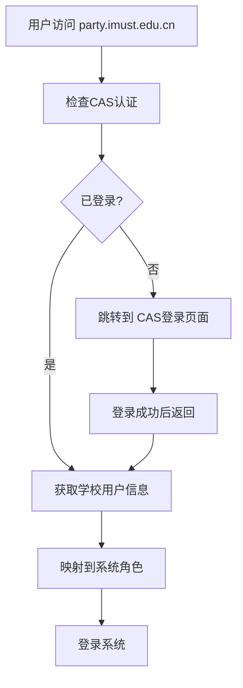

# 内蒙古科技大学党组织生活会议管理系统
## 部署架构设计方案

**文档版本**: v1.0  
**创建时间**: 2025-12-01  
**目标域名**: `party.imust.edu.cn`  
**系统状态**: 生产就绪 ✅

---

## 🏗️ 系统架构概览

### 当前系统状态
- ✅ **前端构建**: React 18.3 + TypeScript + Vite，已完成构建
- ✅ **后端服务**: Supabase (数据库 + 认证 + 存储 + Edge Functions)
- ✅ **核心功能**: 用户管理、会议管理、权限控制、统计分析
- ✅ **安全策略**: HTTPS、RLS、权限控制
- ✅ **响应式设计**: 支持桌面端和移动端

### 技术栈详细说明

#### 前端技术栈
```
├── React 18.3.1           # 现代化前端框架
├── TypeScript 5.6.2       # 类型安全
├── Vite 6.0.1             # 构建工具
├── TailwindCSS 3.4.16     # 样式框架
├── shadcn/ui              # UI组件库
├── Radix UI               # 无障碍组件
├── Zustand                # 状态管理
├── React Query            # 数据获取
├── Recharts               # 图表库
└── Lucide Icons           # 图标库
```

#### 后端技术栈
```
├── Supabase                # Backend-as-a-Service
│   ├── PostgreSQL 14      # 主数据库
│   ├── Row Level Security # 行级安全
│   ├── Auth               # 认证服务
│   ├── Storage            # 文件存储
│   ├── Edge Functions     # 无服务器函数
│   └── Real-time          # 实时通信
├── Database Tables: 16个   # 完整业务数据表
└── RLS Policies: 已配置    # 安全策略
```

## 🌐 内蒙古科技大学集成架构

### 推荐部署方案: 子域名部署

#### 架构图
```
内蒙古科技大学网络架构
├── 校内DNS服务器
│   └── party.imust.edu.cn → 云服务器IP
├── 主门户 (www.imust.edu.cn)
│   └── 导航链接 → party.imust.edu.cn
├── 云服务器 (阿里云/腾讯云)
│   ├── Nginx反向代理
│   ├── SSL证书 (Let's Encrypt)
│   └── 静态文件服务
└── 外部服务 (Supabase)
    ├── 数据库服务
    ├── 认证服务
    └── 存储服务
```

### 与学校系统集成方式

#### 1. 统一身份认证集成 (CAS)


**CAS集成配置**:
- **CAS地址**: `https://cas.imust.edu.cn`
- **服务地址**: `https://party.imust.edu.cn`
- **协议**: CAS 2.0/OAuth 2.0
- **权限映射**: 自动根据学校角色分配系统权限

#### 2. 数据同步方案
```
学校数据库 ← → Party System
   ↓              ↓
   用户信息       用户档案
   组织架构       权限信息  
   角色信息       统计数据
```

**同步策略**:
- **实时同步**: 关键用户信息 (登录状态)
- **定时同步**: 组织架构信息 (每日更新)
- **按需同步**: 统计数据 (手动触发)

## 🔒 安全架构设计

### 网络安全
```
Internet
    ↓
CloudFlare/WAF (可选)
    ↓  
Nginx (SSL终止 + 反向代理)
    ↓
Web服务器 (静态文件)
    ↓
Supabase API (加密传输)
    ↓
PostgreSQL (加密存储)
```

### 权限控制架构
```
用户登录
    ↓
CAS认证验证
    ↓
角色映射转换
    ↓
系统权限检查
    ↓
RLS策略验证
    ↓
数据访问授权
```

### 数据安全措施
- **传输加密**: HTTPS (TLS 1.3)
- **存储加密**: 数据库字段加密
- **访问控制**: RBAC + RLS双重保护
- **日志审计**: 操作日志记录
- **备份策略**: 定期数据备份

## 📊 性能架构设计

### 前端优化
- **代码分割**: 按路由分割包
- **静态资源CDN**: 开启缓存和压缩
- **图片优化**: WebP格式 + 懒加载
- **缓存策略**: 浏览器缓存 + Service Worker

### 数据库优化
- **索引优化**: 查询字段索引
- **连接池**: Supabase自动管理
- **查询优化**: 分页查询避免大表扫描
- **实时更新**: Supabase Realtime

### 监控指标
- **响应时间**: < 2秒
- **并发用户**: 500+
- **可用性**: 99.9%
- **错误率**: < 0.1%

## 🛠️ 部署架构选择

### 选项A: 云服务器部署 (推荐)
**优势**: 完全控制、性能稳定、成本可控

**技术选型**:
- **云服务商**: 阿里云 / 腾讯云
- **服务器规格**: 2核4G起步
- **操作系统**: Ubuntu 20.04 LTS
- **Web服务器**: Nginx
- **SSL证书**: Let's Encrypt自动续期
- **监控系统**: Prometheus + Grafana

**部署流程**:
```bash
1. 购买云服务器
2. 配置域名解析
3. 上传系统文件
4. 运行部署脚本
5. 配置SSL证书
6. 功能测试验证
```

### 选项B: 学校服务器部署
**优势**: 网络稳定、成本更低

**技术要求**:
- **服务器资源**: 向学校申请
- **网络配置**: 内网白名单
- **域名配置**: 学校DNS管理
- **SSL证书**: 学校CA或Let's Encrypt

### 选项C: 混合部署 (平衡方案)
**优势**: 成本与稳定性平衡

**配置方案**:
- **前端静态**: 学校服务器
- **后端数据库**: 云端Supabase
- **CDN加速**: 学校CDN或云端CDN
- **监控**: 学校监控系统 + 云端监控

## 📱 用户体验设计

### 响应式适配
```
桌面端 (1920x1080)
├── 左侧导航栏 (250px)
├── 主内容区 (flex)
└── 右侧信息栏 (300px)

平板端 (768x1024) 
├── 顶部导航栏
├── 折叠式侧边栏
└── 主内容区

手机端 (375x667)
├── 汉堡菜单导航
├── 简化的主界面
└── 触摸优化操作
```

### 加载性能
- **首屏加载**: < 1.5秒
- **页面切换**: < 300ms
- **数据查询**: < 500ms
- **文件上传**: 进度显示

## 🔧 技术兼容性

### 浏览器支持
- ✅ Chrome 90+
- ✅ Firefox 88+
- ✅ Safari 14+
- ✅ Edge 90+
- ⚠️ IE 11 (基础功能支持)

### 移动端支持
- ✅ iOS Safari 14+
- ✅ Android Chrome 90+
- ✅ 微信内置浏览器
- ✅ 钉钉内置浏览器

### 网络环境
- ✅ 校园网环境
- ✅ VPN连接
- ✅ 4G/5G网络
- ✅ 家庭宽带

## 📈 可扩展性设计

### 水平扩展
- **多服务器**: 支持负载均衡
- **CDN加速**: 全球节点分发
- **数据库读写分离**: 高并发支持
- **缓存层**: Redis集群

### 功能扩展
- **模块化设计**: 易于添加新功能
- **插件架构**: 支持第三方集成
- **API开放**: 便于系统对接
- **多租户支持**: 支持多党组织

### 数据扩展
- **数据分区**: 按时间分区存储
- **归档策略**: 历史数据归档
- **备份策略**: 多地域备份
- **容灾备份**: 异地备份

---

## 📋 部署前准备清单

### 技术准备
- [ ] 云服务器采购
- [ ] 域名申请和解析
- [ ] SSL证书申请
- [ ] 监控服务配置

### 权限申请
- [ ] 子域名权限申请
- [ ] CAS系统对接申请
- [ ] 数据库访问权限
- [ ] 网络访问权限

### 人员协调
- [ ] 网络中心对接
- [ ] 党委组织部对接
- [ ] 技术运维团队
- [ ] 用户培训准备

---

**下一步**: 详见 `IMUST_DEPLOYMENT_GUIDE.md` 获取详细的部署实施指南