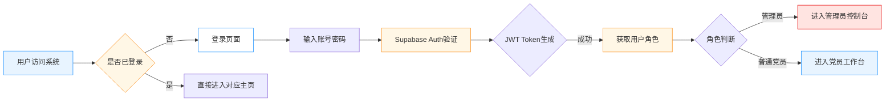
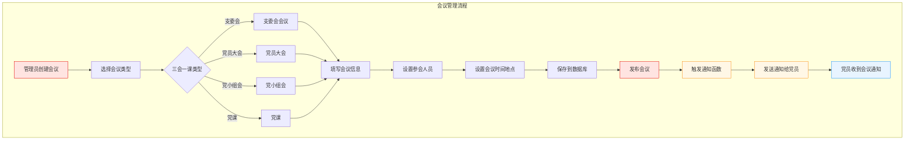
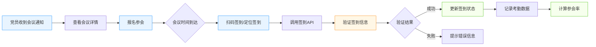
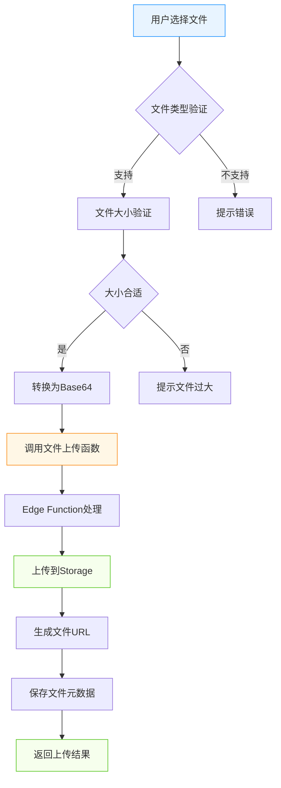
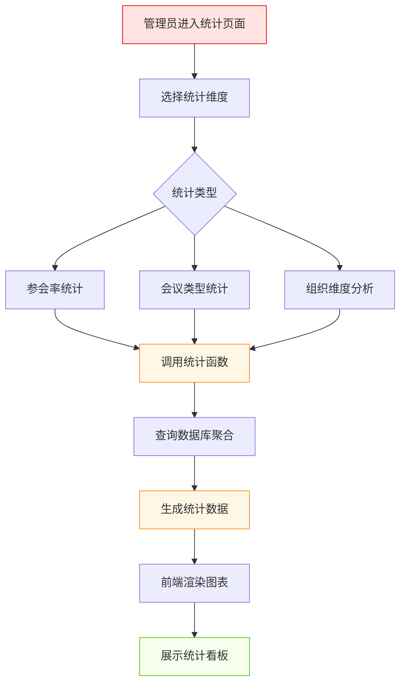
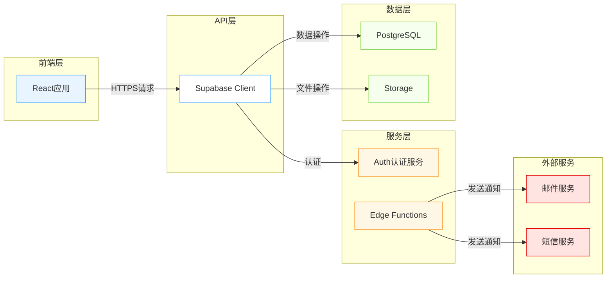

# 党组织生活会议管理系统 - 系统架构流程图

## 整体架构流程图

```mermaid
flowchart TB
    subgraph 客户端层["客户端层 - React前端"]
        direction TB
        A1[PC端/移动端 Web] --> A2[登录/鉴权模块]
        A2 --> A3{角色分流}
        A3 -->|管理员| A4[管理员控制台]
        A3 -->|普通党员| A5[党员工作台]
        
        A4 --> A41[会议管理]
        A4 --> A42[人员管理]
        A4 --> A43[统计分析]
        A4 --> A44[审批中心]
        A4 --> A45[系统设置]
        
        A5 --> A51[我的会议]
        A5 --> A52[扫码签到]
        A5 --> A53[会议记录]
        A5 --> A54[资料下载]
        A5 --> A55[通知中心]
    end
    
    subgraph 服务层["服务层 - Supabase"]
        direction TB
        B1[Supabase Client<br/>REST/Realtime] --> B2[Auth Service<br/>JWT认证]
        B2 --> B3[RLS Policies<br/>行级安全]
        
        B1 --> B4[Edge Functions<br/>边缘函数]
        B4 --> B41[会议管理函数]
        B4 --> B42[文件上传函数]
        B4 --> B43[通知发送函数]
        B4 --> B44[统计分析函数]
        B4 --> B45[用户管理函数]
    end
    
    subgraph 数据层["数据层 - 存储与外部服务"]
        direction TB
        C1[PostgreSQL数据库] --> C11[users用户表]
        C1 --> C12[organizations组织表]
        C1 --> C13[meetings会议表]
        C1 --> C14[meeting_participants参会人员表]
        C1 --> C15[attendance签到记录表]
        C1 --> C16[files文件表]
        C1 --> C17[notifications通知表]
        C1 --> C18[statistics统计数据表]
        
        C2[Storage Bucket文件存储] --> C21[Images图片文件]
        C2 --> C22[PDFs文档文件]
        
        C3[外部服务] --> C31[邮件服务]
        C3 --> C32[短信服务]
    end
    
    A1 --> B1
    B1 --> C1
    B1 --> C2
    B4 --> C3
    
    B3 --> C1
    
    style 客户端层 fill:#E8F4FF,stroke:#1890FF,stroke-width:2px
    style 服务层 fill:#FFF7E6,stroke:#FA8C16,stroke-width:2px
    style 数据层 fill:#F6FFED,stroke:#52C41A,stroke-width:2px
    
    style A1 fill:#FFFFFF,stroke:#1890FF,stroke-width:2px
    style A2 fill:#FFFFFF,stroke:#1890FF,stroke-width:2px
    style A3 fill:#FFF7E6,stroke:#FA8C16,stroke-width:2px
    style A4 fill:#FFE4E1,stroke:#E60000,stroke-width:2px
    style A5 fill:#E8F4FF,stroke:#1890FF,stroke-width:2px
    
    style B1 fill:#FFFFFF,stroke:#1890FF,stroke-width:2px
    style B2 fill:#FFF7E6,stroke:#FA8C16,stroke-width:2px
    style B3 fill:#FFF7E6,stroke:#FA8C16,stroke-width:2px
    style B4 fill:#FFF7E6,stroke:#FA8C16,stroke-width:2px
    
    style C1 fill:#F6FFED,stroke:#52C41A,stroke-width:2px
    style C2 fill:#F6FFED,stroke:#52C41A,stroke-width:2px
    style C3 fill:#FFE4E1,stroke:#E60000,stroke-width:2px
```



## 核心业务流程图

### 1. 用户认证流程



### 2. 会议管理流程



### 3. 会议签到流程



### 4. 文件上传流程



### 5. 统计分析流程



## 系统数据流图



## 核心数据库表关系

```mermaid
erDiagram
    USERS ||--o{ USER_PROFILES : has
    ORGANIZATIONS ||--o{ USERS : contains
    ORGANIZATIONS ||--o{ MEETINGS : hosts
    MEETINGS ||--o{ MEETING_PARTICIPANTS : includes
    MEETING_PARTICIPANTS ||--o{ ATTENDANCE : records
    USERS ||--o{ ATTENDANCE : has
    MEETINGS ||--o{ FILES : contains
    USERS ||--o{ NOTIFICATIONS : receives
    MEETINGS ||--o{ STATISTICS : generates
    
    USERS {
        uuid id PK
        string email
        timestamp created_at
    }
    
    USER_PROFILES {
        uuid user_id PK
        string full_name
        string role
        uuid org_id FK
    }
    
    ORGANIZATIONS {
        uuid id PK
        string name
        string type
    }
    
    MEETINGS {
        uuid id PK
        string title
        string type_code
        uuid org_id FK
        timestamp meeting_date
        string status
    }
    
    MEETING_PARTICIPANTS {
        uuid id PK
        uuid meeting_id FK
        uuid participant_id FK
        string status
    }
    
    ATTENDANCE {
        uuid id PK
        uuid participant_id FK
        uuid meeting_id FK
        timestamp checkin_time
        string checkin_status
    }
    
    FILES {
        uuid id PK
        string file_name
        string mime_type
        uuid related_id FK
    }
    
    NOTIFICATIONS {
        uuid id PK
        uuid recipient_id FK
        string title
        string status
    }
